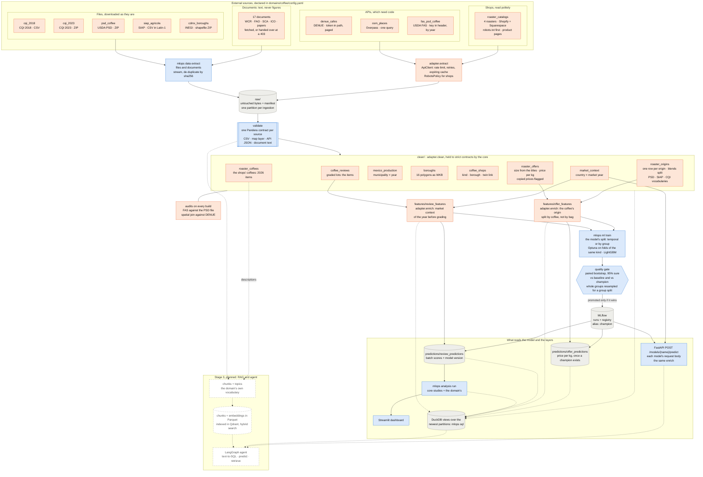
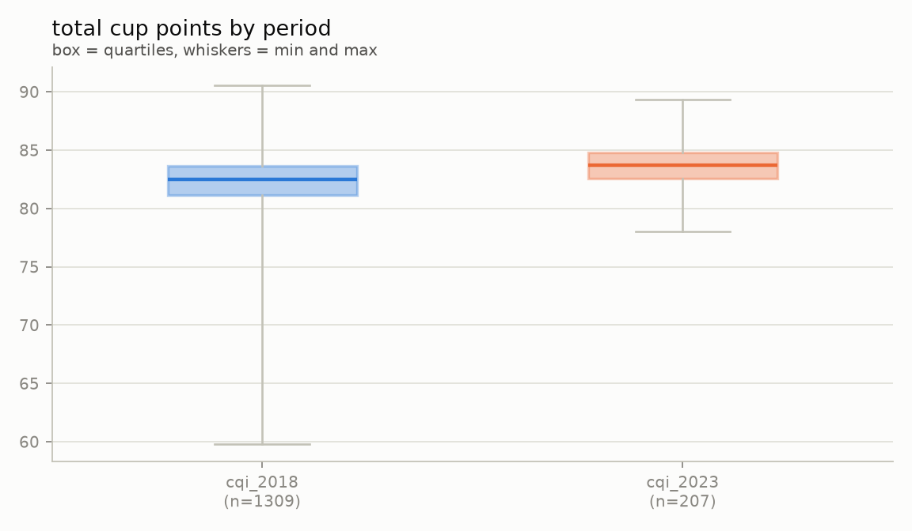
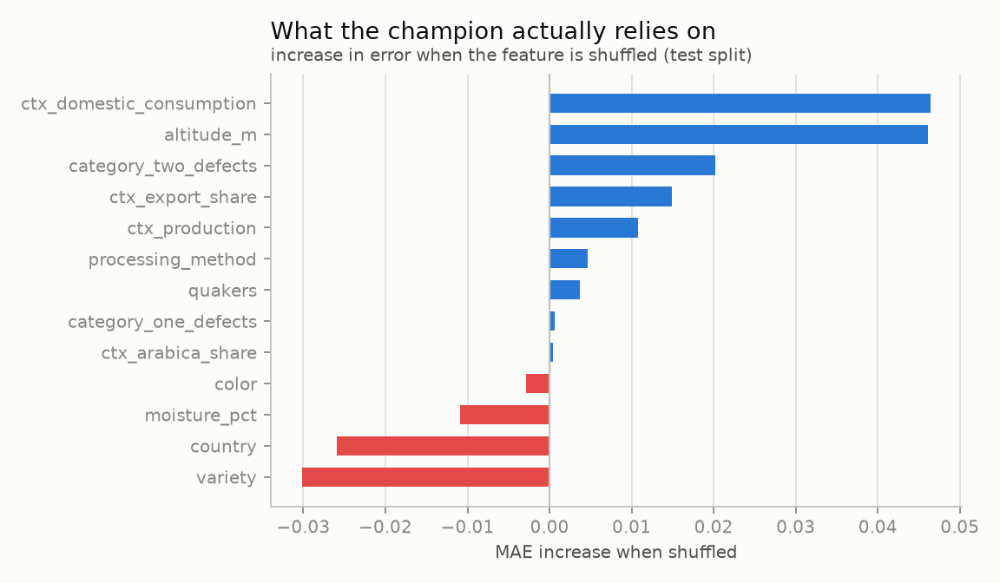
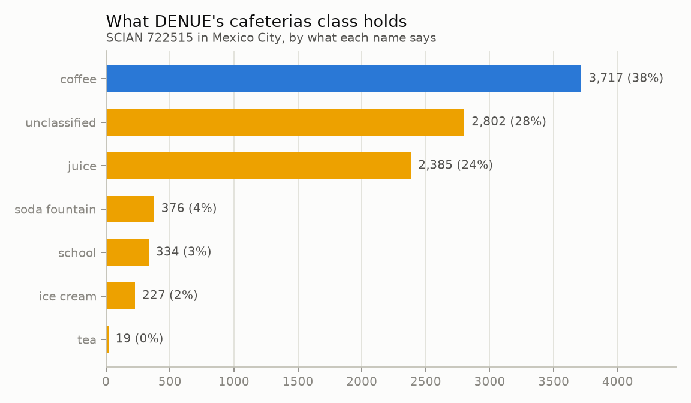
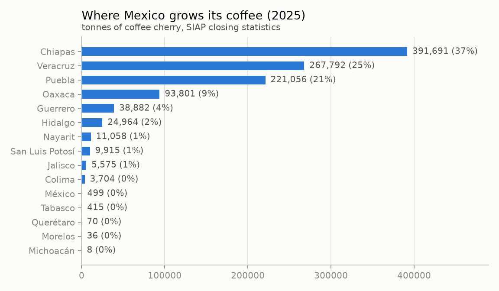
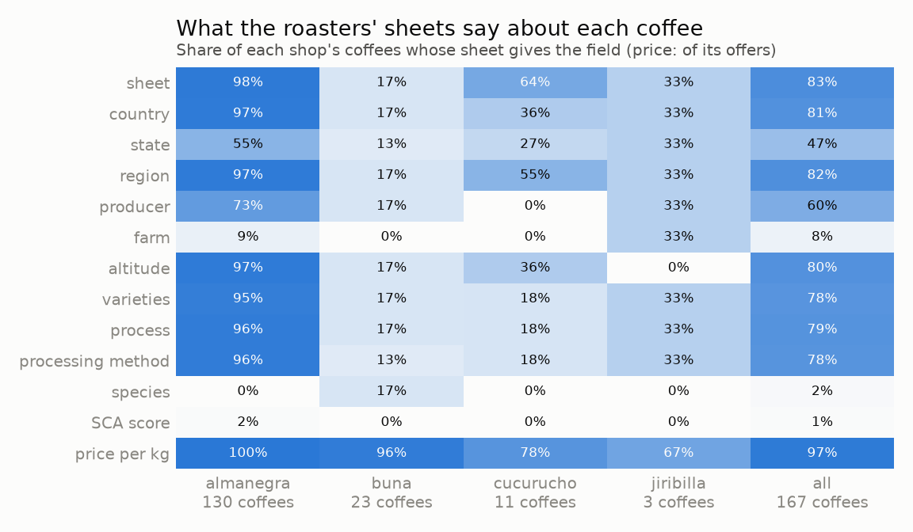

# coffee-mlops

End-to-end ML/AI engineering platform — extraction → validation → cleaning →
features → training → batch & online inference → agent/RAG — bootstrapped on the
**coffee** domain (quality, world market, distribution in Mexico City).

It is a **domain-reusable framework**: a generic core (`mlops_core`) runs the whole
cycle, and a domain is a package under `domains/` that answers what the core cannot
know. Pointing it at a new domain (video games is next) should cost one adapter plus
one config file, and never an edit to the core - see [Adding a domain](#adding-a-domain).

Everything runs locally. No cloud, no recurring costs.

## Status

**Stage 3 — scraping, RAG and the agent (in progress).** Stages 1 and 2 are complete.

| Stage | New source type | Capability the platform gains |
|---|---|---|
| 1 | Static CSV / ZIP | File extraction, schema contracts, raw → clean layers |
| 2 | Token-auth, paginated APIs + geospatial | API extraction, retries, rate limiting, secrets, spatial joins |
| 3 | Web scraping | Semi-structured parsing, a corpus of documents, RAG, agent, its tools over MCP |
| 4 | Time series | Temporal partitioning, incremental backfill, drift, retraining |

## Data sources (stage 1)

| Source | What | Rows | Access |
|---|---|---|---|
| [CQI 2018 snapshot](https://github.com/jldbc/coffee-quality-database) | Arabica quality reviews (origin, altitude, variety, process, cup scores) | 1,311 | GitHub raw, MIT |
| [CQI 2023 snapshot](https://www.kaggle.com/datasets/fatihb/coffee-quality-data-cqi) | Same entity, re-scraped, different schema | 207 | Kaggle public download |
| [USDA PSD coffee](https://apps.fas.usda.gov/psdonline/downloads/psd_coffee_csv.zip) | Production, trade, consumption, stocks by country and market year | 87,704 | Direct download |
| [DENUE](https://www.inegi.org.mx/servicios/api_denue.html) (stage 2) | Every coffee shop, soda fountain and ice-cream parlour in Mexico City, geolocated | 9,860 | INEGI API, free token |
| [OpenStreetMap](https://overpass-api.de/) (stage 2) | Every place tagged `amenity=cafe` (1,125) or `ice_cream` (232) in Mexico City | 1,357 | Overpass API, no credential |
| [USDA FAS Open Data](https://apps.fas.usda.gov/opendataweb/) (stage 2) | The same PSD coffee balance, by market year, through an API | 87,704 | API key in a header, free |
| [SIAP cierre agrícola](https://nube.agricultura.gob.mx/datosAbiertos/Agricola.php) (stage 2) | Every crop in every Mexican municipality, 2025; coffee cherry in 489 of them | 35,902 | Direct download, Latin-1 |
| Roasters' shops (stage 3): Almanegra, Buna, Café con Jiribilla, Cucurucho | Every coffee they sell, as their own shops list it: 168 coffees in 528 offers (a product in one size) | 528 | Shopify / Squarespace catalog JSON, product pages where needed, robots.txt first |
| [INEGI Marco Geoestadístico](https://www.inegi.org.mx/temas/mg/) (stage 2) | The 16 borough polygons of Mexico City, official boundaries | 16 | Direct download, 83 MB |

> **The CQI data is not current.** Both snapshots are scrapes of the Coffee Quality
> Institute database; the newest is frozen at **May 2023** and no newer public
> version exists (the original database requires a login). CQI is a *bootstrap*
> dataset for the modelling pipeline, not a source of recency. Recency comes in
> stage 3, from scraping 2026 Mexican specialty roasters with the same schema.

> **Two sources for the same shops, on purpose.** DENUE is the official register, but
> its SCIAN class 722515 also counts soda fountains and ice-cream parlours; OSM carries
> what people actually mapped, with richer tags and no licence friction. Crossing them
> is what stage 2 needs to tell a cafe from a neveria. OSM data is ODbL: the licence
> notice is stored inside every ingestion, and `data/` is never committed.

> **Two roads to the same balance, and a check between them.** The FAS API returns
> exactly what the PSD file does: 87,704 rows, the same keys, not one value different.
> `market_context` is still built from the file - one request, no key, so any clone
> rebuilds the same table - and the API is reconciled against it on every build, the
> way the spatial join is scored against DENUE. The API pays for itself in stage 4,
> where refreshing only the market years a circular revises beats re-downloading all.

> **Target leakage.** `Total Cup Points` is the exact sum of the ten sensory
> scores (aroma, flavor, aftertaste, …). Those columns are excluded from the
> features, and a test enforces it.

## Architecture

The whole flow, from each source to what reads the model. Blue is the generic core
(`mlops_core`), orange is what the coffee domain supplies (its config, its adapter and
the tables it defines), grey is where data is stored, and dashed is the rest of stage 3.
Every step is its own command; Dagster runs the same functions as one graph per domain.



Two decoupled pipelines and a set of services. Nothing runs "all at once" unless you
ask it to: every step is its own command, reading the previous step's output from disk.

| Pipeline | Commands | Reads | Produces |
|---|---|---|---|
| **data** (ETL) | `extract`, `validate`, `clean`, `run` | external sources | `clean.coffee_reviews`, `clean.market_context`, `clean.boroughs`, `clean.coffee_shops`, `clean.mexico_production`, `clean.roaster_coffees`, `clean.roaster_origins`, `clean.roaster_offers` |
| **ml** | `features`, `train`, `predict`, `run` | the clean tables | tracked runs, a registered `champion` model, batch predictions |
| **serving** | the API container | clean tables + the `champion` model | online predictions |
| **analysis** | `run`, `dashboard` | every layer + the champion | study tables (Parquet + CSV), figures, a dashboard |
| **ai** (stage 3) | `index`, `ask` | clean tables + documents | RAG index, agent |

The boundary is enforced, not just documented: `ml` never imports `data` (a test fails
if it does), each installs on its own (`uv sync --extra data`), and the coupling between
them is Parquet on disk plus an HTTP call to the prediction API.

Layers are immutable Parquet partitions; DuckDB exposes each one as a view over the
newest complete partition, so a writer never blocks the readers.

**Orchestration** (Dagster) is a thin layer over the same functions: every layer is an
asset, the Pandera contracts run as asset checks, and each installed domain generates
its own graph and its own `<domain>_data` / `<domain>_ml` jobs. Nothing needs it — the
CLI runs every step on its own.

### The core and the domains

```
src/
├── mlops_core/          # generic: never imports a domain, never even names one
│   ├── adapter.py       # the contract: DomainAdapter, found by name at runtime
│   ├── data/            # file + API extraction, validation routing, geo, clean driver
│   ├── ml/              # features, the model's split, tuning, gate, registry, batch
│   ├── serving/         # FastAPI: the request body is whatever the domain declares
│   ├── analysis/        # profiles, drift, feature evidence, residuals, dashboard
│   └── orchestration/   # one Dagster graph per installed domain
└── domains/
    └── coffee/          # config.yaml, sources, contracts, clean, enrich, own studies
```

What is **data** lives in the domain's YAML: sources, analysis settings, and `models`:
one model per question the domain asks of its data. Each declares what one item is
(`items`: its table, id, time and period columns), its features and leakage list
(`spec`), how it is trained - including its split: `temporal` when the items have a time
axis worth predicting across, `group` when they come in families that must not straddle
train and test - and the target bands its errors are reported by. Its tables, MLflow
experiment, registered model, API route and studies are all named after it
(`review_features`, `/models/review/predict`, `review_residuals`). What needs **code**
is the adapter's:

| The core asks | Coffee answers |
|---|---|
| `raw_contracts`, `json_readers` | a Pandera contract per source; how each API's stored JSON flattens |
| `extract` | DENUE (paged, token in the path), Overpass (a query), FAS (key in a header) |
| `clean`, `clean_contracts` | eight tables, each with a strict contract and its lineage |
| `context_tables`, `enrich` (per model) | the point-in-time market context: a lot graded in Y sees market year Y-1 |
| `request_model` (per model) | `Lot`: what a buyer knows before the cupping |
| `studies`, `figures` | the world-market studies only a commodity has |
| `credentials` | its own keys, under its own prefix (`COFFEE_*`) |

`enrich` is the piece that matters most: the batch feature table and every API request
go through that one function, so online and batch cannot compute a feature
differently (a test holds them to it). Tests also hold the core to its claim: it never
imports a domain, and no file in it may contain a domain's vocabulary.

The contract changed once in stage 3, on purpose, before it freezes: it held one model
per domain, and stage 3 asks coffee a second question (what a kilo costs) of a second
item table, whose items have no time axis to split on. So a domain now declares named
models, and the split is part of each model's config. Changing it now is the rule in
action - a third archetype shows what the contract lacked - rather than a patch after
the freeze.

### Adding a domain

1. Create `src/domains/<name>/` with a `config.yaml` and an `adapter()` function
   returning an object that satisfies `mlops_core.adapter.DomainAdapter`.
2. Run anything with `--domain <name>` (or set `MLOPS_DOMAIN`). Dagster picks it up.

What that costs today, as a baseline for the next domain (code lines: no blanks,
comments or docstrings):

| | Files | Code lines |
|---|---:|---:|
| `mlops_core` (shared by every domain) | 30 | 2,173 |
| `domains/coffee` | 13 | 1,101 |
| ↳ the adapter's own glue (`adapter.py`, `__init__.py`, `request.py`, `features.py`) | 4 | 111 |

Most of coffee's lines are knowledge no framework can supply: six sources, their
contracts, and how two CQI scrapes that disagree about spelling become one table. The
number to watch is the second domain's, and whether `mlops_core` had to change for it.

## Quickstart

Requirements: [uv](https://docs.astral.sh/uv/), GNU make
(Windows: `winget install ezwinports.make`), Docker (for services).

```bash
make install                  # venv + all extras + git hooks
make check                    # lint + typecheck + tests

make data                     # ETL: download, validate, clean
make services-up PROFILE=ml   # MLflow at http://localhost:5000
make ml                       # features + tuned training + batch predictions, every model
make train MODEL=review       # one model only (also: features, predict, ml)

make sql Q="SELECT p.snapshot, round(avg(p.prediction - f.total_cup_points), 3) AS bias \
  FROM predictions.review_predictions p JOIN features.review_features f USING (review_id) \
  GROUP BY 1"
```

Run `make help` for every target, or `uv run mlops --help` for the CLI.

## What the data says

`make analysis` rebuilds every table and figure below from the layers, writing each one
as Parquet (queryable: `SELECT * FROM analysis.review_feature_recommendation`) and as CSV, next
to the figure drawn from it. `make dashboard` opens them with the partition they came
from stamped on screen.



The two CQI snapshots are not the same experiment. The 2023 sample is **truncated**:
nothing below 78 points, while 2010-2018 reaches 59.8. The later lots are not better
coffee so much as a narrower selection — which is what the model is then asked to
predict.



Permutation importance on the test split, not the tree's split counts. Altitude and the
origin country's market context carry the model; shuffling `country`, `variety` or
`moisture_pct` makes it **better**, so those three cost more than they contribute on
2023 data. This is the table the model spec is revised from — after a look, never automatically.
Both times it has been followed up, the obvious reading was wrong: the market-context
features have no correlation of their own yet removing them hurt, and dropping `country`
and `variety` only helped until the reduced model was given the same tuning budget
(1.656 vs 1.648, 38% confidence). Evidence starts an experiment; the gate ends it.


The domestic-market story behind the Mexico City thesis: Mexico exports most of what it
grows and imports the equivalent of 77-85% of what it drinks.

## Where the coffee is (stage 2)

`clean.coffee_shops` puts both registers of Mexico City's coffee shops in one table and
places every one of them in a borough, with a point-in-polygon join against INEGI's
official boundaries (DuckDB's `spatial` extension, polygons reprojected once from the
layer's Lambert conformal projection to WGS84).

```sql
SELECT b.borough, round(b.area_km2, 1) AS km2,
       count(*) FILTER (s.source = 'denue') AS denue,
       count(*) FILTER (s.source = 'osm')   AS osm,
       round(count(*) FILTER (s.source = 'denue') / b.area_km2, 1) AS denue_per_km2
FROM clean.boroughs b LEFT JOIN clean.coffee_shops s USING (borough_id)
GROUP BY 1, 2 ORDER BY denue_per_km2 DESC;
```

| Borough | km² | DENUE | OSM | per km² |
|---|---:|---:|---:|---:|
| Cuauhtémoc | 32.3 | 1,577 | 388 | 48.8 |
| Benito Juárez | 26.5 | 882 | 187 | 33.2 |
| Venustiano Carranza | 33.7 | 691 | 29 | 20.5 |
| … | | | | |
| Milpa Alta | 296.7 | 73 | 2 | 0.2 |

**The join is audited, not trusted.** A wrong projection or a swapped axis order does not
crash: it quietly puts shops in the wrong borough. DENUE states each establishment's own
borough code, so the join is scored against it — it agrees **9,860 times out of 9,860**.
OpenStreetMap states no borough, which is precisely why it needs the join.

**The two registers do not see the same city.** OSM holds 11% as many places as DENUE
overall, but 25% in Cuauhtémoc against 3% in Iztapalapa: volunteers map the central and
wealthier boroughs, while the official register covers all sixteen. Density from OSM
alone would measure where mappers live. Both sources are kept side by side, unmerged,
with a `source` column — deciding which one to believe is analysis, not cleaning.

**What DENUE's "cafeterías" class actually holds.** SCIAN 722515 is "cafeterias, soda
fountains, ice-cream parlours, juice bars and similar", so counting it counts much more
than coffee. Each place is labelled with a `kind` read from its name by ordered rules in
the domain config (a school tuck shop called "cafetería escolar" is a school; a name
that says coffee is a place that sells coffee):



Juice stands are a quarter of the class; the ice-cream parlours the class is named after
are 2%. **The rule is scored, not trusted.** OSM's `amenity` tag was set by someone
standing in front of the place, independently of how DENUE spells its name, so on the
183 places both registers list (within 60 m, names at least 0.88 alike, each the other's
best match) the two can be compared:

| Name rule vs OSM tag, on shared places | Value |
|---|---|
| Precision: the rule says coffee, OSM agrees | **142 of 142** |
| Recall: OSM says cafe, the rule found it | 142 of 180 (79%) |

The misses are names that say nothing a rule can read - *Tierra Garat*, *Camino a
Comala* - and they live in `unclassified`, which is why it is drawn grey rather than as
"not coffee": 3,717 named coffee places is a floor, not a count. The rule was written
before it was scored; the only edits afterwards were spelling variants of words already
in it (*cafecito*, *caffee*), and brand names found only among the misses were left out
on purpose, since adding them would raise the recall measured on those same places by
construction. Shared places are also mostly named, mapped and central, so the scores
say how the rule does where it can be checked, not everywhere. Too few ice-cream
parlours are in both registers (3) to score that rule at all.

Nothing is dropped: filter `kind = 'coffee'` for the coffee view, and use
`matched_shop_id` to count a place both registers list only once.

## Where Mexico grows it (stage 2)

`clean.mexico_production` is SIAP's definitive 2025 figures for coffee cherry, one row
per municipality. The chain from farm to cup now spans the project: who grows it here,
what the world market does with it (PSD), and where the city drinks it (DENUE, OSM).



Four states grow 91% of it - Chiapas 37%, Veracruz 25%, Puebla 21%, Oaxaca 9% - but they
are not paid alike. Value over volume, a tonne of cherry fetched **$13,970 in Puebla and
$5,482 in Chiapas**: the largest producer earns the least per tonne.

SIAP weighs cherry as picked; PSD counts green coffee ready to export. Set side by side
(`analysis.production_crosscheck`), 1.07 million tonnes of cherry against PSD's 235,680-
244,800 t of green coffee means 4.4-4.5 t of cherry per tonne of green, depending on
whether PSD's market year is aligned with SIAP's year or with the one before. That is
the factor the two would need for both to be right; it is shown, not assumed.

## What the roasters sell (stage 3)

The CQI stops in 2023. Four Mexico City roasters - Almanegra, Buna, Café con Jiribilla
and Cucurucho - sell the same kind of item today, and their shops describe it: where it
grew, at what altitude, which varieties, how it was processed, and what a kilogram costs.
Three clean tables hold it, because a shop describes three different things:

- `clean.roaster_coffees`: 167 coffees, one per product, with the shop's own text.
- `clean.roaster_origins`: 142 origins. Most coffees name one; a blend lists each
  component, and gets a row for each (Buna's Guarumbo: two arabicas and a robusta).
- `clean.roaster_offers`: 527 offers, a coffee in one size, with its price per kilogram.

Every canonical value speaks the vocabulary of a table that already exists: countries
as PSD names them, Mexican states as SIAP does, processing methods and varieties as the
CQI spells them. A 2026 bag from Oaxaca joins its state's harvest and its country's
market balance, and sits next to a graded 2018 lot, with no mapping table in between.

Reading the sheets is a core capability (`mlops_core.data.sheets`), because every shop
has one of two shapes: "Label: value" lines in a description, or a heading over a
paragraph on the product page. Two traps are handled there, not per shop: labels run
together without a line break (*"YemenRegión: Haraz"*), and a blend repeats its labels
for each component. What the labels mean, in Spanish, is the domain's config.



What the shops say is uneven, and the table says so rather than hiding it
(`analysis.roaster_coverage`). Almanegra's sheets are nearly complete and it lists 130 of
the 167 coffees; Buna keeps a sheet on 4 of its 23 product pages; Cucurucho scatters a
few labels through prose (a country for 4 of its 11 coffees).
**A price model trained on these will learn Almanegra's pricing** - that is the first
thing to say about it. 85 of the 142 origins are Mexican.

Nothing is guessed, and three things were found by not guessing:

- **The platform's weight is wrong** in 77 offers: Café con Jiribilla sells "1 kg" with
  250 g in the weight field, Almanegra "1.25 kg" with 313 g. The size comes from the
  titles ("5/16 kg (312.5 gr)", "Caja de 12 Bolsas ... de 340grs"), or it stays empty.
- **Three prices were copied from another size**: a 156 g bag at the 1.25 kg price
  ($8,640 a kilo), and two 1.25 kg bags at the price of the small one. They are kept as
  listed - it is what the shop charges - and flagged `price_outlier` for being more than
  3x off their product's other offers. The legitimate spread between different lots
  sold as variants of one product stays within 0.5-1.7x.
- **Process labels are free text**, from "Lavado" to "Fermentación Láctica con bacilos
  autóctonos". They map to the CQI's methods by ordered rules; experiments and lots sold
  two ways are "other", as the CQI rules file them, and a label no rule knows
  (*Mycoprism*) is `unclassified`, counted, not forced into a method.

Unlike the CQI's frozen labels, these shops change weekly, so these rules are open: a
new country or process does not stop the pipeline. It is logged by name, left empty in
the canonical column (a process keeps its label as written beside it), and it shows up
in the coverage table.

## What the agent will read (stage 3)

The tables answer how much and how many. What a variety is, why a washed coffee tastes
the way it does, what "sweetness" means on a cupping form: that is what the corpus is
for. 17 documents, 1.33 million characters, in the same raw layer as every other source -
manifest, sha256, one partition per ingestion - and each read into parts before anything
uses it (a page of a PDF, a section of an article).

| Documents | Publisher | Topics |
|---|---|---|
| Arabica and Robusta variety catalogues | World Coffee Research | varieties, cultivation |
| Arabica coffee manual (2005) | FAO | cultivation, processing, varieties |
| Wet processing, roast aroma, extraction kinetics | Frontiers, Molecules, J. Math. Industry (via Europe PMC) | processing, roasting, chemistry, brewing |
| Roasting conditions, coffee flavour, postharvest aroma | MDPI Beverages, IJFST | roasting, chemistry, cupping |
| CVA forms and standards SCA-102 to SCA-105 | Specialty Coffee Association | cupping |
| Market report, Coffee Development Report, WMT circular | ICO, USDA FAS | market, sustainability |

Four rules the ingestion follows, each of them a decision:

- **Text, never figures.** A PDF's tables come out of extraction scrambled, and an answer
  built from them is confidently wrong. Numbers are answered from the tables with SQL;
  documents explain.
- **A refusal is respected.** Nine documents are served to anyone and fetched. Eight sit
  behind a 403 that no licence overrides (MDPI, Oxford Academic, the SCA), so they are
  downloaded by hand into `data/<domain>/inbox/documents/` and named in the config with
  the URL they came from. `make extract` says which are missing and where to put them;
  nothing is scraped around the refusal.
- **Provenance travels with the text.** Publisher, year, licence, language and topics are
  config, and every chunk will carry them, so an answer can say where it got that.
- **Topics are metadata, not folders.** Nine of them - cultivation, varieties, processing,
  roasting, chemistry, cupping, brewing, market, sustainability - each with the terms a
  question is routed by. Almost no document is about one subject (the FAO manual covers
  three), so a folder per subject would be the wrong grain.

Two traps are handled where they are found: the SCA's standards are encrypted with
permissions rather than a password (an empty one opens them), and Europe PMC's article
XML is read by section, top level only, because a nested section's text is inside its
parent's and both would index every paragraph twice.

## What a kilo costs (stage 3): the gate said no

The second model, `offer`, asks what a kilo of roasted coffee costs on a Mexico City
shelf, from what its shop and its sheet say: shop, country, state, process, variety,
altitude, and the bag's size (a bigger bag is cheaper per kilo). One item is one coffee
in one size; 510 offers of 157 coffees have a price to learn from (no size, a kit, or a
price copied from another size are not examples).

Two things are different from the cup-score model, and both are in the core now:

- **The split is by coffee, not by bag.** The sizes of one coffee share almost
  everything; with some in train and the rest in test the model would be graded on
  memory. A seeded quarter of the *coffees* is held out, and tuning uses `GroupKFold`.
- **The gate resamples coffees, not bags.** Four sizes of one mispriced coffee are one
  mistake, not four pieces of evidence; resampling rows would make every interval too
  narrow and the gate too easy (a cluster bootstrap).

| Held-out coffees (39 of 157, 129 offers) | Value |
|---|---|
| Model MAE | 319.5 MXN/kg (95% CI 217 - 413) |
| Best baseline: every bag at its shop's mean | 325.6 MXN/kg |
| Paired difference vs baseline | -6.1 (95% CI -42.9 to 32.1), **60% sure** |
| R² | -0.01 |
| Cross-validated MAE inside training | 196.2 |

**Not promoted, and correctly so.** On coffees it has not seen, the model does not
price better than "what this shop usually charges" - 60% sure is a coin flip, and the
gate asks for 95%. The gap between cross-validation (196) and the held-out coffees (319)
is the split's draw as much as the model: the held-out Almanegra coffees are dearer
(median 1,298 MXN/kg against 1,117 in training), and 39 coffees are few enough for one
draw to matter.

The data does carry signal the model cannot yet turn into held-out accuracy: price per
kilo rises with altitude (correlation 0.42), falls with bag size (-0.23), and imported
origins sit above Mexico's (Yemen 1,464 and Rwanda 1,373 MXN/kg against 1,094). What is
missing is mostly coffees: 128 of the 157 are one shop's, and a variety summarised as
"multiple" hides the Gesha in a coffee sold as several lots. Stage 4 re-reads the shops
over time, which is also where a second period gives these studies drift to measure.

Until a version passes the gate, `/models/offer/predict` answers 503 and `/health`
reports `"partial"`: the cup-score model keeps serving.

## Results (stage 1)

Predicting `Total Cup Points` from origin, altitude, variety, process and the origin
country's market context, trained on gradings up to 2018 and evaluated on 2022-2023:

| Test (2023 snapshot, n=207) | Value |
|---|---|
| Model MAE | **1.648** (95% CI 1.496 - 1.806) |
| Best baseline MAE (training mean) | 1.894 |
| Paired difference vs baseline | -0.246 (95% CI -0.346 to -0.147), certain |
| Bias | -1.19 |
| **MAE after recalibration** | **1.359** (from 1.710 on the same rows) |

The model beats the baseline, and the paired bootstrap says so with certainty. But the
error is dominated by a level shift: the 2023 lots were graded ~1.5 points higher than
the 2010-2018 ones, and no feature can anticipate that. Estimating a single offset from
the first 30 lots of the new period and applying it to the remaining 177 cuts the error
by 21% — more than any feature work did. That is the case for stage 4 in one number.

The evaluation is built to survive a small test set:

- **Every comparison is a paired bootstrap** on the same rows. A version is promoted to
  `champion` only if it wins in at least 95% of resamples against both the best baseline
  and the current champion, so a better average alone never ships a model. For a model
  split by group, whole groups are resampled.
- **Metrics are stratified** by country and logged with each group's weight in train vs
  test. That is how the real story surfaced: Taiwan went from 5.7% of training to 29.5%
  of test, so the temporal split mixes drift with a different population.

## Documentation

- [Model card](docs/model-card.md) — what the model is for, how it performs, where it
  fails and what it must not be used for.
- `experiments/` — one-off studies that answer a question and get logged to MLflow, kept
  out of the pipelines. See "Alternatives tried" in the model card.
- [Data dictionary](docs/data-dictionary.md) — every column of every layer, with units.
  A test fails if a column stops being documented.

## Development

- Python 3.12, dependencies managed with `uv` (`uv.lock` is committed).
- Every MLflow run is tagged with the git commit that produced it, and whether the tree
  was dirty: a run from uncommitted code is not reproducible and should not pretend to be.
- `ruff` (lint + format), `mypy --strict`, `pytest`.
- `pre-commit` runs ruff and **gitleaks** on every commit, so credentials never reach history.
- Secrets live in `.env` (gitignored); `.env.example` documents each variable and where
  to get it. Copy it to `.env`, paste the values, and check them with
  `uv run mlops secrets`, which reports what is configured without printing it.
  Credentials are typed as `SecretStr`, so a repr, a log line or a traceback shows
  `**********` and reading one takes an explicit `.get_secret_value()`.
- `data/` is gitignored: every dataset is rebuilt by running the pipeline. The boundary
  archive alone is 83 MB, so `make prune` matters more from stage 2 on.
- The geospatial step needs DuckDB's `spatial` extension, which downloads once on first
  use and is cached in `~/.duckdb`. It is confined to `data/geo.py`: the layers stay
  plain Parquet with geometry as WKB, so nothing downstream has to load it to read a
  borough.
- API sources go through one polite client: a rate limit, retries that tell a 503 from
  a 404, and an on-disk cache so a re-run does not fetch 99 pages again. The cache
  expires (`cache_hours`, required per source): cached forever, a live register becomes
  a snapshot that keeps reporting "unchanged" because nothing was ever asked. Credentials
  never reach a cache key, a manifest or a log line — DENUE carries its token in the URL
  path, so request URLs are never logged, and that safeguard lives with the client
  rather than in one entry point.
- Shops are read politely, and the rules for that live in the core, not in a scraper:
  every page is checked against the site's robots.txt for this project's agent first
  (`mlops_core.data.robots`), a `Crawl-delay` is honoured, and requests are at least 3 s
  apart. A robots.txt that is missing allows everything, but one a failing server cannot
  serve closes the site (RFC 9309): silence is not permission. A refusal skips that shop
  out loud; it is never read around. The platform's own catalog JSON is read rather than
  the rendered pages, which change with every theme; a product page is read only where
  the attributes live nowhere else.
- `make extract` runs the file sources always and an API source when it can: Overpass
  needs no credential, DENUE and FAS are skipped out loud without theirs, so a fresh clone
  still builds all of stage 1. Which sources exist and what each one needs lives in one
  function that both the CLI and Dagster call -- a step that only runs when a human
  types the command is a step the orchestrator silently skips.
- CI runs lint, types and tests, scans the whole history for secrets, and builds the API
  image so a broken Dockerfile fails here instead of during a demo. A weekly job checks
  that the upstream sources still answer.
- `.vscode/settings.json` keeps the editor's watcher and indexer out of `.venv`, `data/`
  and `.dagster/`; watching them costs CPU for nothing.
- Layers keep their history (that is how a past prediction stays explainable) but not
  forever: `make prune` keeps the newest partitions per table and drops builds that
  crashed long ago.
- The API image installs `mlflow-skinny`, not full MLflow: a client only loads models,
  while the full package ships the tracking server (1.48 GB instead of 2.26 GB).
- The image has no httpx, DuckDB or matplotlib, so a domain's adapter imports what its
  data pipeline needs inside the methods that use it. CI runs the API's tests in exactly
  that environment; it caught `validate.py` pulling DuckDB in at import time.
- `POST /models/<name>/predict` answers `{"target", "prediction", "context",
  "model_version", ...}`: the response names what it predicted instead of assuming it,
  and `context` holds every feature the domain looked up for the request. Each model has
  its own route because each has its own request body, which FastAPI validates and
  documents only when the route knows its type. `/health` reports every model's version,
  and `/reload` reloads them all, saying which failed and why.
- Settings are `MLOPS_*` (data dir, MLflow URI, which domain); a domain's credentials
  use its own prefix, so the core never holds another project's keys.

## Roadmap

See the stage table above. The core was extracted at the end of stage 2, once the file
and API archetypes existed - abstracting before having working cases produces the
wrong interfaces - and the contract freezes at the end of stage 3, once a third
archetype (scraping) has been through it. Video games follows, and its line count goes
in the table above.
