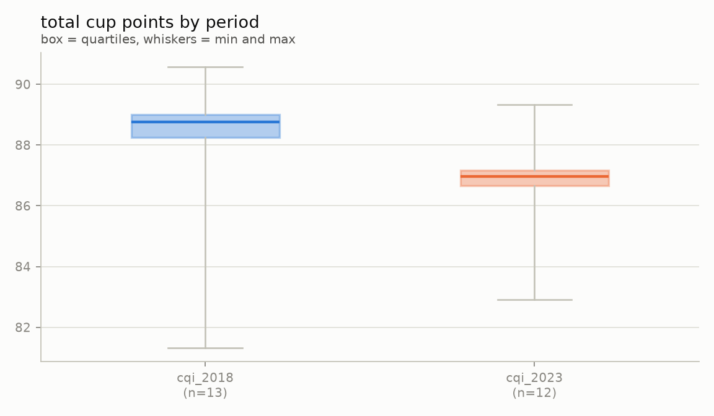
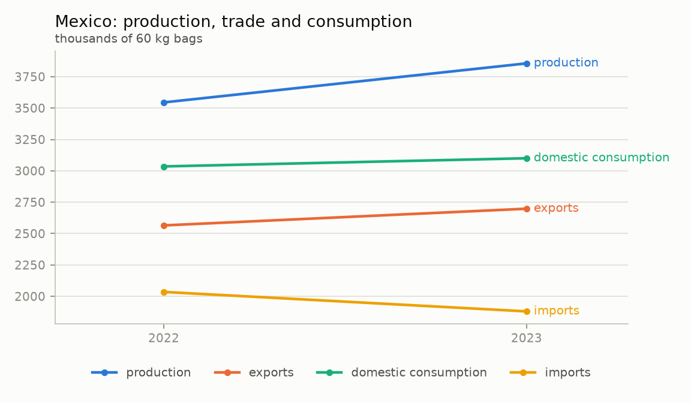

# coffee-mlops

End-to-end ML/AI engineering platform — extraction → validation → cleaning →
features → training → batch & online inference → agent/RAG — bootstrapped on the
**coffee** domain (quality, world market, distribution in Mexico City).

The long-term goal is a **domain-reusable framework**: pointing it at a new domain
(video games is next) should cost one adapter plus one config file, not a new project.
That abstraction is deliberately *not* built yet — see [Roadmap](#roadmap).

Everything runs locally. No cloud, no recurring costs.

## Status

**Stage 1 — static sources (in progress).**

| Stage | New source type | Capability the platform gains |
|---|---|---|
| 1 | Static CSV / ZIP | File extraction, schema contracts, raw → clean layers |
| 2 | Token-auth, paginated APIs + geospatial | API extraction, retries, rate limiting, secrets, spatial joins |
| 3 | Web scraping | Semi-structured parsing, RAG documents, agent |
| 4 | Time series | Temporal partitioning, incremental backfill, drift, retraining |

## Data sources (stage 1)

| Source | What | Rows | Access |
|---|---|---|---|
| [CQI 2018 snapshot](https://github.com/jldbc/coffee-quality-database) | Arabica quality reviews (origin, altitude, variety, process, cup scores) | 1,311 | GitHub raw, MIT |
| [CQI 2023 snapshot](https://www.kaggle.com/datasets/fatihb/coffee-quality-data-cqi) | Same entity, re-scraped, different schema | 207 | Kaggle public download |
| [USDA PSD coffee](https://apps.fas.usda.gov/psdonline/downloads/psd_coffee_csv.zip) | Production, trade, consumption, stocks by country and market year | 87,704 | Direct download |
| [DENUE](https://www.inegi.org.mx/servicios/api_denue.html) (stage 2) | Every coffee shop, soda fountain and ice-cream parlour in Mexico City, geolocated | 9,860 | INEGI API, free token |
| [OpenStreetMap](https://overpass-api.de/) (stage 2) | Every place tagged `amenity=cafe` in Mexico City, with a point for each | 1,125 | Overpass API, no credential |
| [USDA FAS Open Data](https://apps.fas.usda.gov/opendataweb/) (stage 2) | The same PSD coffee balance, by market year, through an API | 87,704 | API key in a header, free |
| [INEGI Marco Geoestadístico](https://www.inegi.org.mx/temas/mg/) (stage 2) | The 16 borough polygons of Mexico City, official boundaries | 16 | Direct download, 83 MB |

> **The CQI data is not current.** Both snapshots are scrapes of the Coffee Quality
> Institute database; the newest is frozen at **May 2023** and no newer public
> version exists (the original database requires a login). CQI is a *bootstrap*
> dataset for the modelling pipeline, not a source of recency. Recency comes in
> stage 3, from scraping 2026 Mexican specialty roasters with the same schema.

> **Two sources for the same shops, on purpose.** DENUE is the official register, but
> its SCIAN class 722515 also counts soda fountains and ice-cream parlours; OSM carries
> what people actually mapped, with richer tags and no licence friction. Crossing them
> is what stage 2 needs to tell a cafe from a neveria. OSM data is ODbL: the licence
> notice is stored inside every ingestion, and `data/` is never committed.

> **Two roads to the same balance, and a check between them.** The FAS API returns
> exactly what the PSD file does: 87,704 rows, the same keys, not one value different.
> `market_context` is still built from the file - one request, no key, so any clone
> rebuilds the same table - and the API is reconciled against it on every build, the
> way the spatial join is scored against DENUE. The API pays for itself in stage 4,
> where refreshing only the market years a circular revises beats re-downloading all.

> **Target leakage.** `Total Cup Points` is the exact sum of the ten sensory
> scores (aroma, flavor, aftertaste, …). Those columns are excluded from the
> features, and a test enforces it.

## Architecture

Two decoupled pipelines and a set of services. Nothing runs "all at once" unless you
ask it to: every step is its own command, reading the previous step's output from disk.

| Pipeline | Commands | Reads | Produces |
|---|---|---|---|
| **data** (ETL) | `extract`, `validate`, `clean`, `run` | external sources | `clean.coffee_reviews`, `clean.market_context`, `clean.boroughs`, `clean.coffee_shops` |
| **ml** | `features`, `train`, `predict`, `run` | the clean tables | tracked runs, a registered `champion` model, batch predictions |
| **serving** | the API container | clean tables + the `champion` model | online predictions |
| **analysis** | `run`, `dashboard` | every layer + the champion | study tables (Parquet + CSV), figures, a dashboard |
| **ai** (stage 3) | `index`, `ask` | clean tables + documents | RAG index, agent |

The boundary is enforced, not just documented: `ml` never imports `data` (a test fails
if it does), each installs on its own (`uv sync --extra data`), and the coupling between
them is Parquet on disk plus an HTTP call to the prediction API.

Layers are immutable Parquet partitions; DuckDB exposes each one as a view over the
newest complete partition, so a writer never blocks the readers.

**Orchestration** (Dagster) is a thin layer over the same functions: every layer is an
asset, the Pandera contracts run as asset checks, and each `configs/<domain>.yaml`
generates its own graph and its own `<domain>_data` / `<domain>_ml` jobs. Nothing needs
it — the CLI runs every step on its own.

## Quickstart

Requirements: [uv](https://docs.astral.sh/uv/), GNU make
(Windows: `winget install ezwinports.make`), Docker (for services).

```bash
make install                  # venv + all extras + git hooks
make check                    # lint + typecheck + tests

make data                     # ETL: download, validate, clean
make services-up PROFILE=ml   # MLflow at http://localhost:5000
make ml                       # features + tuned training + batch predictions

make sql Q="SELECT p.snapshot, round(avg(p.prediction - f.total_cup_points), 3) AS bias \
  FROM predictions.review_predictions p JOIN features.review_features f USING (review_id) \
  GROUP BY 1"
```

Run `make help` for every target, or `uv run mlops --help` for the CLI.

## What the data says

`make analysis` rebuilds every table and figure below from the layers, writing each one
as Parquet (queryable: `SELECT * FROM analysis.feature_recommendation`) and as CSV, next
to the figure drawn from it. `make dashboard` opens them with the partition they came
from stamped on screen.



The two CQI snapshots are not the same experiment. The 2023 sample is **truncated**:
nothing below 78 points, while 2010-2018 reaches 59.8. The later lots are not better
coffee so much as a narrower selection — which is what the model is then asked to
predict.


Permutation importance on the test split, not the tree's split counts. Altitude and the
origin country's market context carry the model; shuffling `country`, `variety` or
`moisture_pct` makes it **better**, so those three cost more than they contribute on
2023 data. This is the table the model spec is revised from — after a look, never automatically.
Both times it has been followed up, the obvious reading was wrong: the market-context
features have no correlation of their own yet removing them hurt, and dropping `country`
and `variety` only helped until the reduced model was given the same tuning budget
(1.656 vs 1.648, 38% confidence). Evidence starts an experiment; the gate ends it.



The domestic-market story behind the Mexico City thesis: Mexico exports most of what it
grows and imports the equivalent of 77-85% of what it drinks.

## Where the coffee is (stage 2)

`clean.coffee_shops` puts both registers of Mexico City's coffee shops in one table and
places every one of them in a borough, with a point-in-polygon join against INEGI's
official boundaries (DuckDB's `spatial` extension, polygons reprojected once from the
layer's Lambert conformal projection to WGS84).

```sql
SELECT b.borough, round(b.area_km2, 1) AS km2,
       count(*) FILTER (s.source = 'denue') AS denue,
       count(*) FILTER (s.source = 'osm')   AS osm,
       round(count(*) FILTER (s.source = 'denue') / b.area_km2, 1) AS denue_per_km2
FROM clean.boroughs b LEFT JOIN clean.coffee_shops s USING (borough_id)
GROUP BY 1, 2 ORDER BY denue_per_km2 DESC;
```

| Borough | km² | DENUE | OSM | per km² |
|---|---:|---:|---:|---:|
| Cuauhtémoc | 32.3 | 1,577 | 388 | 48.8 |
| Benito Juárez | 26.5 | 882 | 187 | 33.2 |
| Venustiano Carranza | 33.7 | 691 | 29 | 20.5 |
| … | | | | |
| Milpa Alta | 296.7 | 73 | 2 | 0.2 |

**The join is audited, not trusted.** A wrong projection or a swapped axis order does not
crash: it quietly puts shops in the wrong borough. DENUE states each establishment's own
borough code, so the join is scored against it — it agrees **9,860 times out of 9,860**.
OpenStreetMap states no borough, which is precisely why it needs the join.

**The two registers do not see the same city.** OSM holds 11% as many places as DENUE
overall, but 25% in Cuauhtémoc against 3% in Iztapalapa: volunteers map the central and
wealthier boroughs, while the official register covers all sixteen. Density from OSM
alone would measure where mappers live. Both sources are kept side by side, unmerged,
with a `source` column — deciding which one to believe is analysis, not cleaning.

> DENUE's class 722515 is wider than coffee: it counts soda fountains and ice-cream
> parlours too. Nothing is filtered by name yet, because no filter has been measured.

## Results (stage 1)

Predicting `Total Cup Points` from origin, altitude, variety, process and the origin
country's market context, trained on gradings up to 2018 and evaluated on 2022-2023:

| Test (2023 snapshot, n=207) | Value |
|---|---|
| Model MAE | **1.648** (95% CI 1.496 - 1.806) |
| Best baseline MAE (training mean) | 1.894 |
| Paired difference vs baseline | -0.246 (95% CI -0.346 to -0.147), certain |
| Bias | -1.19 |
| **MAE after recalibration** | **1.359** (from 1.710 on the same rows) |

The model beats the baseline, and the paired bootstrap says so with certainty. But the
error is dominated by a level shift: the 2023 lots were graded ~1.5 points higher than
the 2010-2018 ones, and no feature can anticipate that. Estimating a single offset from
the first 30 lots of the new period and applying it to the remaining 177 cuts the error
by 21% — more than any feature work did. That is the case for stage 4 in one number.

The evaluation is built to survive a small test set:

- **Every comparison is a paired bootstrap** on the same rows. A version is promoted to
  `champion` only if it wins in at least 95% of resamples against both the best baseline
  and the current champion, so a better average alone never ships a model.
- **Metrics are stratified** by country and logged with each group's weight in train vs
  test. That is how the real story surfaced: Taiwan went from 5.7% of training to 29.5%
  of test, so the temporal split mixes drift with a different population.

## Documentation

- [Model card](docs/model-card.md) — what the model is for, how it performs, where it
  fails and what it must not be used for.
- `experiments/` — one-off studies that answer a question and get logged to MLflow, kept
  out of the pipelines. See "Alternatives tried" in the model card.
- [Data dictionary](docs/data-dictionary.md) — every column of every layer, with units.
  A test fails if a column stops being documented.

## Development

- Python 3.12, dependencies managed with `uv` (`uv.lock` is committed).
- Every MLflow run is tagged with the git commit that produced it, and whether the tree
  was dirty: a run from uncommitted code is not reproducible and should not pretend to be.
- `ruff` (lint + format), `mypy --strict`, `pytest`.
- `pre-commit` runs ruff and **gitleaks** on every commit, so credentials never reach history.
- Secrets live in `.env` (gitignored); `.env.example` documents each variable and where
  to get it. Copy it to `.env`, paste the values, and check them with
  `uv run mlops secrets`, which reports what is configured without printing it.
  Credentials are typed as `SecretStr`, so a repr, a log line or a traceback shows
  `**********` and reading one takes an explicit `.get_secret_value()`.
- `data/` is gitignored: every dataset is rebuilt by running the pipeline. The boundary
  archive alone is 83 MB, so `make prune` matters more from stage 2 on.
- The geospatial step needs DuckDB's `spatial` extension, which downloads once on first
  use and is cached in `~/.duckdb`. It is confined to `data/geo.py`: the layers stay
  plain Parquet with geometry as WKB, so nothing downstream has to load it to read a
  borough.
- API sources go through one polite client: a rate limit, retries that tell a 503 from
  a 404, and an on-disk cache so a re-run does not fetch 99 pages again. The cache
  expires (`cache_hours`, required per source): cached forever, a live register becomes
  a snapshot that keeps reporting "unchanged" because nothing was ever asked. Credentials
  never reach a cache key, a manifest or a log line — DENUE carries its token in the URL
  path, so request URLs are never logged, and that safeguard lives with the client
  rather than in one entry point.
- `make extract` runs the file sources always and an API source when it can: Overpass
  needs no credential, DENUE and FAS are skipped out loud without theirs, so a fresh clone
  still builds all of stage 1. Which sources exist and what each one needs lives in one
  function that both the CLI and Dagster call -- a step that only runs when a human
  types the command is a step the orchestrator silently skips.
- CI runs lint, types and tests, scans the whole history for secrets, and builds the API
  image so a broken Dockerfile fails here instead of during a demo. A weekly job checks
  that the upstream sources still answer.
- `.vscode/settings.json` keeps the editor's watcher and indexer out of `.venv`, `data/`
  and `.dagster/`; watching them costs CPU for nothing.
- Layers keep their history (that is how a past prediction stays explainable) but not
  forever: `make prune` keeps the newest partitions per table and drops builds that
  crashed long ago.
- The API image installs `mlflow-skinny`, not full MLflow: a client only loads models,
  while the full package ships the tracking server (1.48 GB instead of 2.26 GB).

## Roadmap

See the stage table above. The generic `core/` package and `DomainAdapter`
contract are extracted **at the end of stage 2**, once two extractor archetypes
exist — abstracting before having working cases produces the wrong interfaces.
