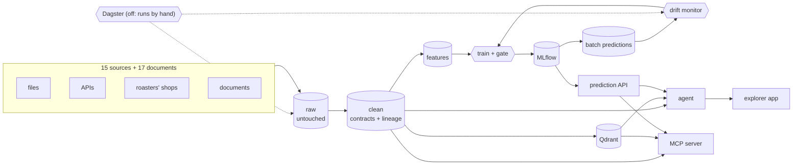

# coffee-mlops

A domain-reusable MLOps framework, built end to end on one domain: coffee, from the
farm to the cup, and to the shops of Mexico City.

A generic core (`mlops_core`) runs the whole cycle: extraction, validation, cleaning,
features, training behind a statistical gate, batch and online inference, drift
monitoring, and an agent that answers from the tables, the models and a library of
documents. A domain is a package that answers what the core cannot know - its sources,
its contracts, its vocabulary. Pointing the framework at a second domain should cost an
adapter and a YAML file, never an edit to the core; tests hold the core to never import,
or even name, a domain.

Everything runs locally, on a laptop with a 6 GB GPU. No cloud, no recurring costs.

**The full story, stage by stage - every source, decision, result and mistake - is in
[docs/development_plan.md](docs/development_plan.md).**

## What it does

- **Reads 15 sources of four kinds** - static files (CQI cupping scores, USDA's world
  coffee balance, SIAP's harvests, INEGI's borough polygons and 2020 Census, World Bank and ICO prices,
  FAOSTAT's producer prices, PROFECO's shelf prices, FRED's exchange rate), token-authenticated and paginated APIs
  (INEGI's business register, OpenStreetMap, USDA FAS), four roasters' online shops read
  politely (robots.txt first) - their tasting notes read into the SCA's flavour
  categories - and 17 documents for the agent to read.
- **Keeps every download untouched and forever** in a content-addressed raw layer:
  running again only adds what is new, never overwrites. Every source and every clean
  table is held to a Pandera contract that stops the pipeline when broken.
- **Trains three models**, each promoted only if a paired bootstrap is 95% sure it beats
  both the baselines and the current champion; every run and model is in MLflow.
- **Monitors drift** between periods with Evidently, and retrains once per new version
  of the data - letting the gate decide whether the new model ships.
- **Answers questions** with an agent (LangGraph, local `qwen3.5:4b`) over three tools:
  locked-down text-to-SQL, the prediction API, and dense retrieval in Qdrant. Every
  figure in an answer is checked against its evidence before it is shown, and when the
  tools find nothing it says so instead of writing an answer. Free tiers of hosted models
  (Gemini, Groq, Mistral, OpenRouter) can answer first, each set aside when its quota runs
  out; the local model is always the last, so the agent never runs dry.
- **Serves it three ways**: a FastAPI prediction service, an MCP server for Claude
  Desktop, Claude Code or an IDE (the agent's tools with its own checks, the explorer's
  slices and maps without SQL, the findings, studies and model cards as resources, each
  result linked to the explorer), and an explorer app - the price ladder at a glance, a
  deck.gl map of the city, questions to the agent with a chart of every answer, the
  tables sliced by hand, the findings, and each model's evidence.

## Results

| | Result | Against |
|---|---|---|
| Cup score (CQI, trained on 2010-2018, tested on 2022-2023) | MAE **1.648** points | 1.894, the best baseline; certain |
| Price per kilogram of a roaster's bag (out of fold, 510 offers) | MAE **229.9** pesos/kg | 252.7, each shop's mean; 96% sure |
| Next month's green coffee price change | **not promoted** | a random walk is hard to beat: 80% sure, short of 95% |
| Retrieval, 108 questions | nDCG@10 **0.608** (dense) | 0.468 (BM25); hybrid did not beat dense |
| The agent, 48 questions end to end | **79%** correct, 98% verified | 73% before the fixes of 29 September |
| The agent, 25 held-out questions written before those fixes | **88%** correct, 100% verified | 52% before them; +12 measured blind, the rest optimistic (see the plan) |

The numbers come with their limits, stated where they are measured: the cup-score error
is mostly a level shift (2023 lots were graded 1.5 points higher), the price model learns
mostly from one shop, and the evaluation sets were written by models - the retrieval
questions by the local one, the SQL and routing cases by an assistant - and not reviewed
by a person. Model cards: [cup score](docs/model-card.md), [price per kilo](docs/model-card-price.md).

## What the data says


- Mexico's coffee harvest halved between 2004 and 2016, from 1.7 to 0.82 million tonnes
  of cherry (SIAP, every closing year since 2003), and was 1.07 million in 2025.
- A kilogram of cherry earns a Mexican grower 8 pesos; the same weight of green coffee
  costs 136 at the port, plain ground coffee 380 on a supermarket shelf, and a specialty
  roaster's coffee 1,080 - each step its own product, no conversion assumed. Elsewhere,
  growers kept 51-87% of the port price of their own mix in 2024 (FAOSTAT: Peru 51%,
  Colombia 66%, Brazil 72%, Kenya 87%).
- Green coffee fell 27% in pesos from its February 2025 peak, but only 12% in dollars:
  for a Mexican roaster, the exchange rate moved the cost more than the market did. On
  the supermarket shelf, meanwhile, ground coffee rose 39% and instant 49% from January
  2024 to July 2026 (PROFECO).
- Of the 9,860 places INEGI registers as "cafeterías" in Mexico City, 38% are named as
  coffee shops; a quarter sell juice. Per resident, they follow schooling: 12.5 per
  10,000 people in Cuauhtémoc, 1.9 in La Magdalena Contreras (Spearman 0.93 with the
  average years of schooling, 16 boroughs). Per job - DENUE's workplaces of every
  activity - the boroughs are three times more alike: much of the centre's density is
  where people work.
- Read into the SCA's flavour categories, the roasters' own tasting notes call Mexican
  coffees floral half as often as imported ones (26% against 53%) - and no flavour word
  makes a bag dearer once its shop and size are accounted for.

## The explorer

`make explore` opens it at http://localhost:8502: the map, questions to the agent, a table
sliced by hand, the findings and every study, and each model's evidence and monitor
verdict. Everything it draws is a read-only query; every answer shows the query behind it.


## Architecture


```mermaid
flowchart LR
    subgraph SOURCES["15 sources + 17 documents"]
        files["files"]
        apis["APIs"]
        shops["roasters' shops"]
        documents["documents"]
    end
    raw[("raw<br/>untouched")]
    clean[("clean<br/>contracts + lineage")]
    features[("features")]
    gate{{"train + gate"}}
    mlflow[("MLflow")]
    predictions[("batch predictions")]
    api["prediction API"]
    monitor{{"drift monitor"}}
    qdrant[("Qdrant")]
    agent["agent"]
    mcp["MCP server"]
    explorer["explorer app"]
    dagster{{"Dagster (off: runs by hand)"}}

    SOURCES --> raw --> clean --> features --> gate --> mlflow
    mlflow --> api & predictions
    predictions --> monitor --> gate
    clean --> qdrant
    clean & qdrant & api --> agent --> explorer
    clean & qdrant & api --> mcp
    dagster -.-> raw & monitor
```

Parquet is the source of truth for every layer and DuckDB the query engine over it.
The complete diagram, every source and table in it, is in the
[development plan](docs/development_plan.md#architecture).

## Quickstart

Requirements: [uv](https://docs.astral.sh/uv/), GNU make
(Windows: `winget install ezwinports.make`), Docker. The agent needs
[Ollama](https://ollama.com) with `qwen3.5:4b` and `qwen3-embedding:0.6b`
(`ollama pull` each). Disk: about 350 MB of downloads, 2 GB with the environment. On
Windows, clone to a short path (MLflow ships files whose names push a deep one past the
260-character limit) or enable long paths.

**1. Install.**

```bash
make install                  # venv + every extra + git hooks
make check                    # lint + types + tests: offline, no services needed
```

**2. Credentials: optional.** Without them everything builds except DENUE's register of
establishments and the USDA API's cross-check of the PSD file; `make extract` says which it
skipped and why. The hosted models' keys are optional too: without them the agent runs on
the local model; `uv run mlops agent providers` shows which are set and who is out of quota.

```bash
cp .env.example .env          # then fill in what you have (the file says where to get each)
uv run mlops secrets          # which are loaded, without printing them
```

**3. Documents a publisher will not serve to a script: optional.** MDPI, Oxford Academic
and the SCA answer 403, so eight of the corpus's 17 documents are downloaded by hand into
`data/coffee/inbox/documents/`, under the names below; without them the corpus has nine,
and `make extract` names each missing one with its address.

| Save as | From |
|---|---|
| `beverages-06-00029-v2.pdf` | https://www.mdpi.com/2306-5710/6/2/29 |
| `beverages-06-00044-v3.pdf` | https://www.mdpi.com/2306-5710/6/3/44 |
| `ijfs16261.pdf` | https://academic.oup.com/ijfst/article/58/3/1007/7807986 |
| `CVA+Cupping+Forms+(EN).pdf`, `AW_SCA-102_Sample-Preparation_28.10.24_Secured.pdf`, `AW_SCA-103_Descriptive-Assessment_Sept2024_Secured.pdf`, `AW_SCA-104_Affective-Assessment_Sept2024_Secured.pdf`, `SCA_Standard_105-Extrinsic-Assessment_SECURED+(2).pdf` | https://sca.coffee/value-assessment |

**4. Build and use.**

```bash
make data                     # download, validate, clean (about 10 minutes)
make services-up PROFILE=ml   # MLflow at http://localhost:5000
make ml                       # features, training through the gate, batch predictions
make analysis                 # the studies and figures

make services-up PROFILE=ai   # Qdrant
make index                    # embed the documents
make services-up PROFILE=api  # the prediction API
make ask Q="Which borough has the most coffee shops per square kilometre?"
make explore                  # the map, the agent, the findings, the models: http://localhost:8502

make status                   # what is ready, and the command for what is not
```

A source whose host is down is named and the rest are stored: run `make extract` again
later, and only what is missing is fetched. Everything runs by hand: `make extract` again
keeps the history of the sources that only show the present (the ICO's page shows the
current month; run it before a month ends). `make help` lists every target.

## Stack

| | |
|---|---|
| Data | Polars, DuckDB over Parquet, Pandera, httpx |
| Orchestration | Dagster (one graph per installed domain) |
| Models | scikit-learn, LightGBM, Optuna, MLflow (tracking and registry) |
| Serving | FastAPI (Docker), batch predictions as Parquet |
| Monitoring | Evidently |
| Agent | Ollama (`qwen3.5:4b`, `qwen3-embedding:0.6b`), free tiers of hosted models first, LangGraph, Qdrant, MCP |
| Explorer | Streamlit, deck.gl (pydeck), Vega-Lite |
| Quality | uv, ruff, mypy --strict, pytest (100% coverage), pre-commit + gitleaks, GitHub Actions |

## Documentation

- [Development plan](docs/development_plan.md): the detailed record, stage by stage.
- [Data dictionary](src/domains/coffee/data_dictionary.md): every column of every table,
  with units; the agent writes its SQL against it.
- Model cards: [cup score](docs/model-card.md) and [price per kilo](docs/model-card-price.md).
- [Cloud plan](docs/cloud-plan.md): why it does not run on Vercel as it is, and three
  steps to run it online.

## Status

| Stage | New kind of source | What the framework gained | |
|---|---|---|---|
| 1 | Static files | Contracts, raw and clean layers, the first model and its gate | done |
| 2 | APIs + geospatial | Retries, rate limits, secrets, spatial joins; the core extracted | done |
| 3 | Scraping | Semi-structured parsing, RAG, the agent, MCP | done |
| 4 | Time series | Accumulating sources, forecasting, drift, retraining, the explorer | done: v1.0 |

A second domain (video games) comes once coffee is finished: it is the test of whether
the framework is reusable, and its cost in new lines will be published here.

> **The CQI data is not current.** Both public snapshots of the Coffee Quality
> Institute's database end in May 2023, and no newer public version exists. It bootstraps
> the cup-score model; recency comes from the roasters' 2026 catalogues. Data is never
> committed: every table is rebuilt by running the pipeline, OpenStreetMap's ODbL notice
> travels with its data, and results from Google Places are never stored.
