# coffee-mlops: the development plan, stage by stage

The detailed record of how this project was built: every source and what was verified
about it, every design decision and the reason for it, every result and how it was
measured, and what went wrong on the way. The [README](../README.md) is the summary; this
is where each feature is written up as it lands.

End-to-end ML/AI engineering platform — extraction → validation → cleaning →
features → training → batch & online inference → agent/RAG — bootstrapped on the
**coffee** domain (quality, world market, distribution in Mexico City). It is a
**domain-reusable framework**: a generic core (`mlops_core`) runs the whole cycle, and a
domain is a package under `domains/` that answers what the core cannot know - see
[Adding a domain](#adding-a-domain). Everything runs locally. No cloud, no recurring
costs.

## Status

**Stages 1 to 4 are done: v1.0 of the coffee domain (29 September 2026).** Every source
is in and keeps its history, three models stand behind the gate and the monitor, the
agent answers from the tables, the models and the documents, and the explorer shows all
of it; the recipe was run from a fresh clone ([From a fresh clone](#from-a-fresh-clone)).
Next is the second domain, the test of whether the framework is reusable.

| Stage | New source type | Capability the platform gains |
|---|---|---|
| 1 | Static CSV / ZIP | File extraction, schema contracts, raw → clean layers |
| 2 | Token-auth, paginated APIs + geospatial | API extraction, retries, rate limiting, secrets, spatial joins |
| 3 | Web scraping | Semi-structured parsing, a corpus of documents, RAG, agent, its tools over MCP |
| 4 | Time series | Temporal partitioning, incremental backfill, drift, retraining |

## Data sources (stage 1)

| Source | What | Rows | Access |
|---|---|---|---|
| [CQI 2018 snapshot](https://github.com/jldbc/coffee-quality-database) | Arabica quality reviews (origin, altitude, variety, process, cup scores) | 1,311 | GitHub raw, MIT |
| [CQI 2023 snapshot](https://www.kaggle.com/datasets/fatihb/coffee-quality-data-cqi) | Same entity, re-scraped, different schema | 207 | Kaggle public download |
| [USDA PSD coffee](https://apps.fas.usda.gov/psdonline/downloads/psd_coffee_csv.zip) | Production, trade, consumption, stocks by country and market year | 87,704 | Direct download |
| [DENUE](https://www.inegi.org.mx/servicios/api_denue.html) (stage 2) | Every coffee shop, soda fountain and ice-cream parlour in Mexico City, geolocated | 9,860 | INEGI API, free token |
| [OpenStreetMap](https://overpass-api.de/) (stage 2) | Every place tagged `amenity=cafe` (1,125) or `ice_cream` (232) in Mexico City | 1,357 | Overpass API, no credential |
| [USDA FAS Open Data](https://apps.fas.usda.gov/opendataweb/) (stage 2) | The same PSD coffee balance, by market year, through an API | 87,704 | API key in a header, free |
| [SIAP cierre agrícola](https://nube.agricultura.gob.mx/datosAbiertos/Agricola.php) (stage 2) | Every crop in every Mexican municipality, every closing year 2003-2025; coffee cherry in 444-489 of them a year | 23 files of ~36,000 | A download a year, Latin-1 |
| Roasters' shops (stage 3): Almanegra, Buna, Café con Jiribilla, Cucurucho | Every coffee they sell, as their own shops list it: 168 coffees in 528 offers (a product in one size) | 528 | Shopify / Squarespace catalog JSON, product pages where needed, robots.txt first |
| [INEGI Marco Geoestadístico](https://www.inegi.org.mx/temas/mg/) (stage 2) | The 16 borough polygons of Mexico City, official boundaries | 16 | Direct download, 83 MB |
| [World Bank Pink Sheet](https://www.worldbank.org/en/research/commodity-markets) (stage 4) | Monthly price of other mild Arabicas and Robustas (the ICO's group indicators), 1960 to last month, $/kg | 800 months | Workbook found by its link on the page, which changes with each release |
| [ICO indicator prices](https://ico.org/documents/I-CIP.pdf) (stage 4) | Daily I-CIP and its four group indicators, US cents/lb, **the current month only** | 18 days so far | A one-page PDF table, read and checked against its own averages; every download kept |
| [FRED, Mexican pesos to one US dollar](https://fred.stlouisfed.org/series/DEXMXUS) (stage 4) | The Federal Reserve's daily noon buying rate in New York (H.10), since November 1993 | 8,239 days | CSV, no key |
| [PROFECO, Quién es Quién en los Precios](https://datos.profeco.gob.mx/datos_abiertos/qqp.php) (stage 4) | Shelf prices of packaged instant and ground coffee in supermarkets, convenience stores, markets and pharmacies across Mexico, fortnight by fortnight, January 2024 to July 2026 | 281,380 | A 195 MB ZIP of fortnightly CSVs (2.5 GB unpacked), found by its link's text; coffee kept |

> **The CQI data is not current.** Both snapshots are scrapes of the Coffee Quality
> Institute database; the newest is frozen at **May 2023** and no newer public
> version exists (the original database requires a login). CQI is a *bootstrap*
> dataset for the modelling pipeline, not a source of recency. Recency comes in
> stage 3, from scraping 2026 Mexican specialty roasters with the same schema.

> **Two sources for the same shops, on purpose.** DENUE is the official register, but
> its SCIAN class 722515 also counts soda fountains and ice-cream parlours; OSM carries
> what people actually mapped, with richer tags and no licence friction. Crossing them
> is what stage 2 needs to tell a cafe from a neveria. OSM data is ODbL: the licence
> notice is stored inside every ingestion, and `data/` is never committed.

> **Two roads to the same balance, and a check between them.** The FAS API returns
> exactly what the PSD file does: 87,704 rows, the same keys, not one value different.
> `market_context` is still built from the file - one request, no key, so any clone
> rebuilds the same table - and the API is reconciled against it on every build, the
> way the spatial join is scored against DENUE. The API pays for itself in stage 4,
> where refreshing only the market years a circular revises beats re-downloading all.

> **Target leakage.** `Total Cup Points` is the exact sum of the ten sensory
> scores (aroma, flavor, aftertaste, …). Those columns are excluded from the
> features, and a test enforces it.

## Architecture

The whole flow, from each source to what reads the model. Blue is the generic core
(`mlops_core`), orange is what the coffee domain supplies (its config, its adapter and
the tables it defines), grey is where data is stored, and dashed is the rest of stage 3.
Every step is its own command; Dagster runs the same functions as one graph per domain.

```mermaid
flowchart TD
    subgraph SOURCES["External sources, declared in domains/coffee/config.yaml"]
        direction LR
        subgraph FILES["Files, downloaded as they are"]
            direction TB
            cqi_2018["cqi_2018<br/>CQI 2018 · CSV"]
            cqi_2023["cqi_2023<br/>CQI 2023 · ZIP"]
            psd_coffee["psd_coffee<br/>USDA PSD · ZIP"]
            siap_agricola["siap_agricola<br/>SIAP · a CSV a year since 2003, Latin-1<br/>a closed year downloaded once"]
            cdmx_boroughs["cdmx_boroughs<br/>INEGI · shapefile ZIP"]
            census_2020["census_2020<br/>INEGI · 2020 Census, CSV in a ZIP"]
        end
        subgraph APIS["APIs, which need code"]
            direction TB
            denue_cafes["denue_cafes<br/>DENUE · token in path, paged<br/>every read kept"]
            osm_places["osm_places<br/>Overpass · one query<br/>every read kept"]
            fas_psd_coffee["fas_psd_coffee<br/>USDA FAS · key in header, by year"]
        end
        subgraph SHOPS["Shops, read politely"]
            direction TB
            roaster_catalogs["roaster_catalogs<br/>4 roasters · Shopify + Squarespace<br/>robots.txt first · product pages"]
        end
        subgraph PRICES["Prices over time (stage 4)"]
            direction TB
            world_bank_prices["world_bank_prices<br/>World Bank · workbook, monthly since 1960<br/>found by its link on the page"]
            ico_prices["ico_prices<br/>ICO · one-page PDF, this month only<br/>every download kept: accumulate"]
            fred_usd_mxn["fred_usd_mxn<br/>FRED · pesos per dollar, daily since 1993"]
            profeco_prices["profeco_prices<br/>PROFECO · ZIP of fortnightly CSVs, 195 MB<br/>found by its link's text · coffee kept"]
            profeco_prices_2024["profeco_prices_2024<br/>PROFECO · 2024, closed · a RAR 5<br/>opened with bsdtar"]
            profeco_prices_2025["profeco_prices_2025<br/>PROFECO · 2025, closed · a RAR 5<br/>opened with bsdtar"]
        end
        subgraph CORPUS["Documents: text, never figures"]
            direction TB
            corpus_sources["17 documents<br/>WCR · FAO · SCA · ICO · papers<br/>fetched, or handed over at a 403"]
        end
    end

    extract_files["mlops data extract<br/>files and documents<br/>stream, de-duplicate by sha256"]
    extract_apis["adapter.extract<br/>ApiClient: rate limit, retries, expiring cache<br/>RobotsPolicy for shops"]
    raw[("raw/<br/>untouched bytes + manifest<br/>one partition per ingestion")]
    validate[["validate<br/>one Pandera contract per source<br/>CSV · workbook · map layer · API JSON · document text<br/>the domain's PDF table · every download of a window"]]

    subgraph CLEAN["clean/ : adapter.clean, held to strict contracts by the core"]
        direction LR
        coffee_reviews["coffee_reviews<br/>graded lots: the items"]
        market_context["market_context<br/>country × market year"]
        mexico_production["mexico_production<br/>municipality × year"]
        boroughs["boroughs<br/>16 polygons as WKB"]
        coffee_shops["coffee_shops<br/>kind · borough · twin link<br/>each register's newest read"]
        coffee_shop_history["coffee_shop_history<br/>every read of DENUE and OSM: place × read"]
        roaster_coffees["roaster_coffees<br/>the shops' coffees: 2026 items"]
        roaster_origins["roaster_origins<br/>one row per origin · blends split<br/>PSD · SIAP · CQI vocabularies"]
        roaster_offers["roaster_offers<br/>size from the titles · price per kg<br/>copied prices flagged"]
        roaster_offer_history["roaster_offer_history<br/>every read of the shops: offer × read"]
        roaster_origin_history["roaster_origin_history<br/>every read's sheets"]
        roaster_flavors["roaster_flavors<br/>tasting notes from the shops' words<br/>SCA-103 flavour categories"]
        price_indicators["price_indicators<br/>indicator × day or month, US cents/lb<br/>a day's latest reading wins"]
        exchange_rates["exchange_rates<br/>pesos per dollar × business day"]
        consumer_prices["consumer_prices<br/>a shelf price · per kg · sweetened · decaf<br/>the city's in the borough they declare"]
        documents["documents<br/>built by the core: citation metadata<br/>and what cleaning kept"]
        document_chunks["document_chunks<br/>built by the core: prose only, ≤1,200 chars<br/>one page or section · topics"]
    end
    audits["audits on every build<br/>FAS against the PSD file<br/>spatial join against DENUE and PROFECO<br/>World Bank months against ICO days"]

    review_features["features/review_features<br/>adapter.enrich: market context<br/>of the year before grading"]
    offer_features["features/offer_features<br/>adapter.enrich: the coffee's origin<br/>split by coffee, not by bag"]
    green_price_features["features/green_price_features<br/>adapter.enrich: the months before it<br/>target: the month's change, %"]
    train["mlops ml train<br/>the model's split: temporal or by group<br/>Optuna on folds of the same kind · LightGBM"]
    gate{{"quality gate<br/>paired bootstrap, 95% sure<br/>vs baseline and vs champion<br/>whole groups resampled for a group split"}}
    monitor{{"mlops monitor · Evidently<br/>each model's newest period vs the ones before<br/>features · target · predictions · error"}}
    monitoring_tables[("monitoring/&lt;model&gt;_drift<br/>+ Evidently report · MLflow run")]
    mlflow[("MLflow<br/>runs + registry<br/>alias: champion")]

    subgraph USE["What reads the model and the layers"]
        direction LR
        review_predictions[("predictions/review_predictions<br/>batch scores + model version")]
        offer_predictions[("predictions/offer_predictions<br/>price per kg, once a champion exists")]
        green_price_predictions[("predictions/green_price_predictions<br/>once a version beats the baselines<br/>v1 did not")]
        api["FastAPI POST /models/{name}/predict<br/>each model's request body<br/>the same enrich"]
        analysis["mlops analysis run<br/>core studies + the domain's"]
        catalog[("DuckDB views over the<br/>newest partitions: mlops sql")]
    end

    subgraph AI["Stage 3: RAG and agent"]
        direction LR
        questions[("evals/retrieval_questions.jsonl<br/>108 questions drafted by qwen3.5:4b<br/>excerpts checked, not reviewed")]
        embed["mlops rag index<br/>qwen3-embedding:0.6b via Ollama"]
        chunk_embeddings[("embeddings/chunk_embeddings<br/>Parquet: the source of truth")]
        qdrant[("Qdrant, alias coffee-chunks<br/>dense vector + BM25 weights<br/>rebuilt from Parquet, swapped atomically")]
        ladder{{"mlops rag evaluate<br/>BM25 → dense → hybrid<br/>each paired against the ones before it"}}
        retrieval_runs[("evaluations/retrieval_*<br/>per question · one MLflow run each")]
        agent["mlops agent ask: LangGraph workflow: free hosted tiers first, qwen3.5:4b last<br/>route + second opinion · SQL · predict · retrieve<br/>gate: no evidence, no answer · answer · verify · a trace each"]
        mcp["mlops mcp: MCP server on stdio<br/>query_tables · predict_&lt;model&gt; · search_documents · draw<br/>dictionary://tables · guardrails server-side"]
        explorer["mlops explore: Streamlit + deck.gl<br/>headline numbers · map · ask · segments · findings · models<br/>each answer's rows as a chart you can change"]
        agent_eval{{"mlops agent evaluate<br/>40 questions: route · tools · SQL · passage · item<br/>paired against the previous run"}}
        agent_answers[("evaluations/agent_answers<br/>per question · one MLflow run, a trace each")]
    end

    FILES & PRICES & CORPUS --> extract_files
    APIS --> extract_apis
    SHOPS --> extract_apis
    extract_files & extract_apis --> raw
    raw --> validate --> CLEAN
    CLEAN --- audits
    coffee_reviews & market_context --> review_features
    roaster_offer_history & roaster_origin_history --> offer_features
    price_indicators --> green_price_features
    review_features & offer_features & green_price_features --> train --> gate
    gate -- "promoted only if it wins" --> mlflow
    review_features & mlflow --> review_predictions
    offer_features & mlflow --> offer_predictions
    green_price_features & mlflow -.-> green_price_predictions
    review_features & offer_features & green_price_features & review_predictions & offer_predictions --> monitor --> monitoring_tables
    monitor -- "due: retrain, the gate decides" --> train
    schedule{{"Dagster: coffee_daily_data (cron in the YAML)<br/>sensors: coffee_new_data · coffee_retrain<br/>keyed by data version: one change, one run<br/>coffee_reads: a partition per day a source was read<br/>all off unless MLOPS_AUTOMATE=true: by hand"}}
    schedule -.-> extract_files & extract_apis
    schedule -.-> monitor
    mlflow --> api
    market_context --> api
    review_predictions --> analysis -- "Findings · Models" --> explorer
    roaster_flavors -- "profiles · price · clusters" --> analysis
    CLEAN & review_features & review_predictions & analysis -.-> catalog
    offer_features & offer_predictions -.-> catalog

    document_chunks -- "mlops rag draft / review" --> questions
    document_chunks --> embed --> chunk_embeddings --> qdrant
    qdrant & questions --> ladder --> retrieval_runs
    ladder -- "dense passes the gate" --> mlflow
    qdrant -- "dense passages" --> agent
    catalog & qdrant & api --> mcp
    roaster_coffees -. "descriptions" .-> qdrant
    catalog -- "locked-down SQL" --> agent
    api -- "predictions" --> agent
    agent & questions --> agent_eval --> agent_answers
    agent & catalog --> explorer

    classDef core fill:#dbe9fb,stroke:#2a78d6,color:#111
    classDef domain fill:#fde6d8,stroke:#eb6834,color:#111
    classDef store fill:#eeeeea,stroke:#898781,color:#111
    classDef planned fill:#ffffff,stroke:#898781,color:#555,stroke-dasharray: 5 5
    class extract_files,validate,train,gate,api,analysis,documents,document_chunks core
    class extract_apis,review_features,offer_features,green_price_features,audits,coffee_reviews,market_context,mexico_production,boroughs,coffee_shops domain
    class green_price_predictions planned
    class roaster_coffees,roaster_origins,roaster_offers,price_indicators domain
    class roaster_offer_history,roaster_origin_history,roaster_flavors domain
    class cqi_2018,cqi_2023,psd_coffee,siap_agricola,cdmx_boroughs,census_2020,denue_cafes,osm_places,fas_psd_coffee,roaster_catalogs domain
    class world_bank_prices,ico_prices,profeco_prices_2024,profeco_prices_2025 domain
    class raw,mlflow,review_predictions,offer_predictions,catalog store
    class agent,mcp,explorer core
    class corpus_sources,questions domain
    class embed,ladder,agent_eval core
    class chunk_embeddings,qdrant,retrieval_runs,agent_answers store
    class monitor,schedule core
    class monitoring_tables store
```

Two decoupled pipelines and a set of services. Nothing runs "all at once" unless you
ask it to: every step is its own command, reading the previous step's output from disk.

| Pipeline | Commands | Reads | Produces |
|---|---|---|---|
| **data** (ETL) | `extract`, `validate`, `clean`, `run` | external sources | `clean.coffee_reviews`, `clean.market_context`, `clean.boroughs`, `clean.coffee_shops`, `clean.coffee_shop_history`, `clean.mexico_production`, `clean.roaster_coffees`, `clean.roaster_origins`, `clean.roaster_offers`, `clean.roaster_flavors`, `clean.documents`, `clean.document_chunks` |
| **ml** | `features`, `train`, `predict`, `run` | the clean tables | tracked runs, a registered `champion` model, batch predictions |
| **serving** | the API container | clean tables + the `champion` model | online predictions |
| **analysis** | `run` | every layer + the champion | study tables (Parquet + CSV), figures; the explorer shows them |
| **rag** (stage 3) | `draft`, `review`, `index`, `evaluate` | the corpus' clean tables | the questions retrieval is judged by, the vector index, each search's scores |
| **agent** (stage 3) | `benchmark`, `ask`, `evaluate`, and `mlops mcp` | every layer, the index, the prediction API | answers that cite their evidence, one MLflow trace each; the same tools over MCP |

The boundary is enforced, not just documented: `ml` never imports `data` (a test fails
if it does), each installs on its own (`uv sync --extra data`), and the coupling between
them is Parquet on disk plus an HTTP call to the prediction API.

Layers are immutable Parquet partitions; DuckDB exposes each one as a view over the
newest complete partition, so a writer never blocks the readers.

**Orchestration** (Dagster) is a thin layer over the same functions: every layer is an
asset, the Pandera contracts run as asset checks, and each installed domain generates
its own graph and its own `<domain>_data` / `<domain>_ml` jobs. Nothing needs it — the
CLI runs every step on its own. What it adds is running without anyone, when switched on:
the data pipeline on the domain's `schedule`, and the model pipeline when the data
changes (see [By hand, or on its own](#by-hand-or-on-its-own-stage-4)).

### The core and the domains

```
src/
├── mlops_core/          # generic: never imports a domain, never even names one
│   ├── adapter.py       # the contract: DomainAdapter, found by name at runtime
│   ├── data/            # file + API extraction, validation routing, geo, clean driver
│   ├── ml/              # features, the model's split, tuning, gate, registry, batch
│   ├── serving/         # FastAPI: the request body is whatever the domain declares
│   ├── analysis/        # profiles, drift, feature evidence, residuals
│   ├── rag/             # question set, BM25, dense index in Qdrant, retrieval gate
│   ├── agent/           # locked-down SQL, benchmark, LangGraph agent, MCP server
│   └── orchestration/   # one Dagster graph per installed domain
└── domains/
    └── coffee/          # config.yaml, sources, contracts, clean, enrich, own studies
```

What is **data** lives in the domain's YAML: sources, analysis settings, and `models`:
one model per question the domain asks of its data. Each declares what one item is
(`items`: its table, id, time and period columns), its features and leakage list
(`spec`), how it is trained - including its split: `temporal` when the items have a time
axis worth predicting across, `group` when they come in families that must not straddle
train and test - and the target bands its errors are reported by. Its tables, MLflow
experiment, registered model, API route and studies are all named after it
(`review_features`, `/models/review/predict`, `review_residuals`). What needs **code**
is the adapter's:

| The core asks | Coffee answers |
|---|---|
| `raw_contracts`, `json_readers` | a Pandera contract per source; how each API's stored JSON flattens |
| `extract` | DENUE (paged, token in the path), Overpass (a query), FAS (key in a header) |
| `clean`, `clean_contracts` | eight tables, each with a strict contract and its lineage |
| `context_tables`, `enrich` (per model) | the point-in-time market context: a lot graded in Y sees market year Y-1 |
| `request_model` (per model) | `Lot`: what a buyer knows before the cupping |
| `studies`, `figures` | the world-market studies only a commodity has |
| `credentials` | its own keys, under its own prefix (`COFFEE_*`) |

`enrich` is the piece that matters most: the batch feature table and every API request
go through that one function, so online and batch cannot compute a feature
differently (a test holds them to it). Tests also hold the core to its claim: it never
imports a domain, and no file in it may contain a domain's vocabulary.

The contract changed once in stage 3, on purpose, before it freezes: it held one model
per domain, and stage 3 asks coffee a second question (what a kilo costs) of a second
item table, whose items have no time axis to split on. So a domain now declares named
models, and the split is part of each model's config. Changing it now is the rule in
action - a third archetype shows what the contract lacked - rather than a patch after
the freeze.

### Adding a domain

1. Create `src/domains/<name>/` with a `config.yaml` and an `adapter()` function
   returning an object that satisfies `mlops_core.adapter.DomainAdapter`.
2. Run anything with `--domain <name>` (or set `MLOPS_DOMAIN`). Dagster picks it up.

What that costs, as a baseline for the next domain (code lines: no blanks, comments or
docstrings), when the core was extracted and at v1.0:

| | End of stage 2 (21 Sep) | | v1.0 (29 Sep) | |
|---|---:|---:|---:|---:|
| | Files | Code lines | Files | Code lines |
| `mlops_core` (shared by every domain) | 30 | 2,173 | 68 | 7,771 |
| `domains/coffee` | 12 | 968 | 21 | 3,581 |
| ↳ the adapter's own glue (`adapter.py`, `__init__.py`, `request.py`, `features.py`) | 4 | 111 | 4 | 301 |

The v1.0 count is `uv run python experiments/code_lines.py`, which reproduces the core's
and the glue's figures of 21 September exactly from that day's commit; the domain's was
first published as 1,101 lines in 13 files, counted another way, and is recounted here.
The core grew by what stages 3 and 4 gave every domain - the scraping client, the corpus
and RAG, the agent and MCP, monitoring, the explorer, `status`; the glue grew with a
second and a third model.

Most of coffee's lines are knowledge no framework can supply: six sources, their
contracts, and how two CQI scrapes that disagree about spelling become one table. The
number to watch is the second domain's, and whether `mlops_core` had to change for it.

## Quickstart

Requirements: [uv](https://docs.astral.sh/uv/), GNU make
(Windows: `winget install ezwinports.make`), Docker (for services). The README's
[Quickstart](../README.md#quickstart) also covers the optional credentials (`.env`) and the
eight documents fetched by hand; [From a fresh clone](#from-a-fresh-clone) is what running
it from zero found.

```bash
make install                  # venv + all extras + git hooks
make check                    # lint + typecheck + tests

make data                     # ETL: download, validate, clean
make services-up PROFILE=ml   # MLflow at http://localhost:5000
make ml                       # features + tuned training + batch predictions, every model
make train MODEL=review       # one model only (also: features, predict, ml)

# Retrieval (stage 3): needs Ollama with qwen3-embedding:0.6b, and Qdrant
make services-up PROFILE=ai   # Qdrant at http://127.0.0.1:6333
make index                    # embed the chunks, build the index
make retrieval                # BM25 -> dense -> hybrid, each through the gate

# The explorer: needs the layers built; its questions need Ollama, the index and the API
make services-up PROFILE=api  # the prediction API
make explore                  # http://localhost:8502: map, agent, segments, findings, models
make status                   # what is ready, and the command for what is not

make sql Q="SELECT p.snapshot, round(avg(p.prediction - f.total_cup_points), 3) AS bias \
  FROM predictions.review_predictions p JOIN features.review_features f USING (review_id) \
  GROUP BY 1"
```

Run `make help` for every target, or `uv run mlops --help` for the CLI.

## What the data says

`make analysis` rebuilds every table and figure below from the layers, writing each one
as Parquet (queryable: `SELECT * FROM analysis.review_feature_recommendation`) and as CSV, next
to the figure drawn from it. The explorer (`make explore`) shows them: the domain's under
**Findings**, each model's under **Models**, with the partitions they came from.

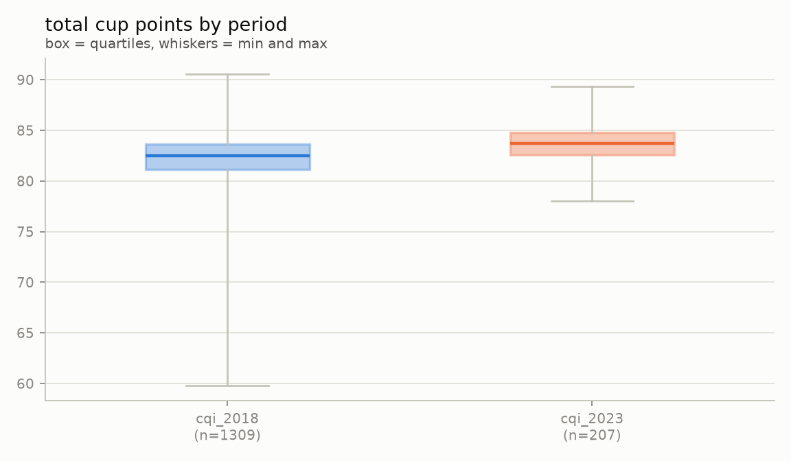

The two CQI snapshots are not the same experiment. The 2023 sample is **truncated**:
nothing below 78 points, while 2010-2018 reaches 59.8. The later lots are not better
coffee so much as a narrower selection — which is what the model is then asked to
predict.

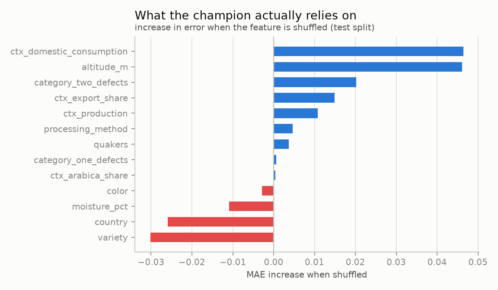

Permutation importance on the test split, not the tree's split counts. Altitude and the
origin country's market context carry the model; shuffling `country`, `variety` or
`moisture_pct` makes it **better**, so those three cost more than they contribute on
2023 data. This is the table the model spec is revised from — after a look, never automatically.
Both times it has been followed up, the obvious reading was wrong: the market-context
features have no correlation of their own yet removing them hurt, and dropping `country`
and `variety` only helped until the reduced model was given the same tuning budget
(1.656 vs 1.648, 38% confidence). Evidence starts an experiment; the gate ends it.

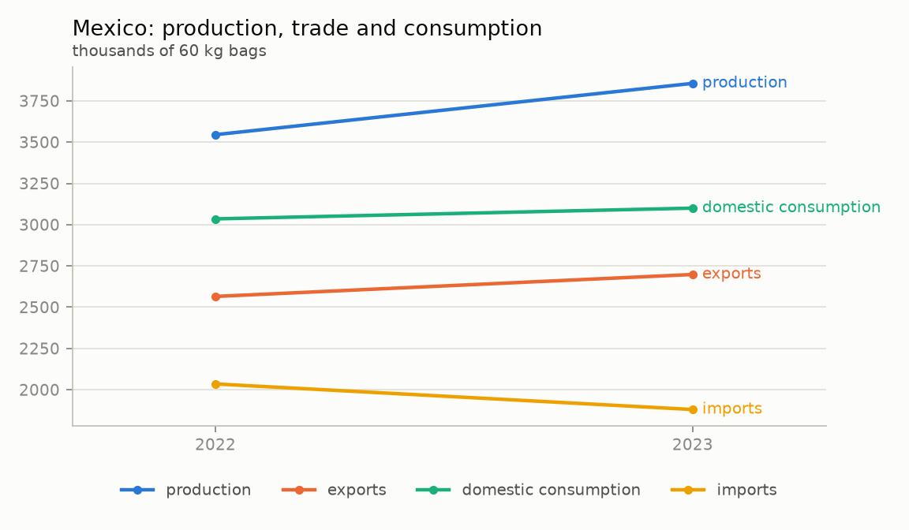

The domestic-market story behind the Mexico City thesis: Mexico exports most of what it
grows and imports the equivalent of 77-85% of what it drinks.

## Where the coffee is (stage 2)

`clean.coffee_shops` puts both registers of Mexico City's coffee shops in one table and
places every one of them in a borough, with a point-in-polygon join against INEGI's
official boundaries (DuckDB's `spatial` extension, polygons reprojected once from the
layer's Lambert conformal projection to WGS84).

```sql
SELECT b.borough, round(b.area_km2, 1) AS km2,
       count(*) FILTER (s.source = 'denue') AS denue,
       count(*) FILTER (s.source = 'osm')   AS osm,
       round(count(*) FILTER (s.source = 'denue') / b.area_km2, 1) AS denue_per_km2
FROM clean.boroughs b LEFT JOIN clean.coffee_shops s USING (borough_id)
GROUP BY 1, 2 ORDER BY denue_per_km2 DESC;
```

| Borough | km² | DENUE | OSM | per km² |
|---|---:|---:|---:|---:|
| Cuauhtémoc | 32.3 | 1,577 | 388 | 48.8 |
| Benito Juárez | 26.5 | 882 | 187 | 33.2 |
| Venustiano Carranza | 33.7 | 691 | 29 | 20.5 |
| … | | | | |
| Milpa Alta | 296.7 | 73 | 2 | 0.2 |

**The join is audited, not trusted.** A wrong projection or a swapped axis order does not
crash: it quietly puts shops in the wrong borough. DENUE states each establishment's own
borough code, so the join is scored against it — it agrees **9,860 times out of 9,860**.
OpenStreetMap states no borough, which is precisely why it needs the join.

**The two registers do not see the same city.** OSM holds 11% as many places as DENUE
overall, but 25% in Cuauhtémoc against 3% in Iztapalapa: volunteers map the central and
wealthier boroughs, while the official register covers all sixteen. Density from OSM
alone would measure where mappers live. Both sources are kept side by side, unmerged,
with a `source` column — deciding which one to believe is analysis, not cleaning.

**What DENUE's "cafeterías" class actually holds.** SCIAN 722515 is "cafeterias, soda
fountains, ice-cream parlours, juice bars and similar", so counting it counts much more
than coffee. Each place is labelled with a `kind` read from its name by ordered rules in
the domain config (a school tuck shop called "cafetería escolar" is a school; a name
that says coffee is a place that sells coffee):

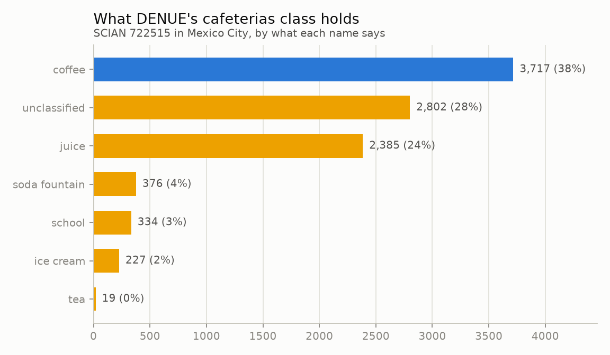

Juice stands are a quarter of the class; the ice-cream parlours the class is named after
are 2%. **The rule is scored, not trusted.** OSM's `amenity` tag was set by someone
standing in front of the place, independently of how DENUE spells its name, so on the
183 places both registers list (within 60 m, names at least 0.88 alike, each the other's
best match) the two can be compared:

| Name rule vs OSM tag, on shared places | Value |
|---|---|
| Precision: the rule says coffee, OSM agrees | **142 of 142** |
| Recall: OSM says cafe, the rule found it | 142 of 180 (79%) |

The misses are names that say nothing a rule can read - *Tierra Garat*, *Camino a
Comala* - and they live in `unclassified`, which is why it is drawn grey rather than as
"not coffee": 3,717 named coffee places is a floor, not a count. The rule was written
before it was scored; the only edits afterwards were spelling variants of words already
in it (*cafecito*, *caffee*), and brand names found only among the misses were left out
on purpose, since adding them would raise the recall measured on those same places by
construction. Shared places are also mostly named, mapped and central, so the scores
say how the rule does where it can be checked, not everywhere. Too few ice-cream
parlours are in both registers (3) to score that rule at all.

Nothing is dropped: filter `kind = 'coffee'` for the coffee view, and use
`matched_shop_id` to count a place both registers list only once.

### Who lives there (2020 Census)

Coffee shops per square kilometre measure where they are; per resident, how many each
borough has for the people who live in it. `census_2020` is INEGI's 2020 Census,
principal results by locality (ITER) for Mexico City: a total row per alcaldia, keyed
like the polygons (state + municipality = CVEGEO), so `clean.boroughs` gains its
population, adults, households, average years of schooling and economically active
people. Verified on 29 September with the real file (175 KB ZIP, UTF-8 with a BOM, small
localities' figures withheld as `*`): **the 16 alcaldias add up exactly to the state's
own total row**, 9,209,944 people, and the build checks it - a misread or missing row
would not add up, and is refused rather than stored.

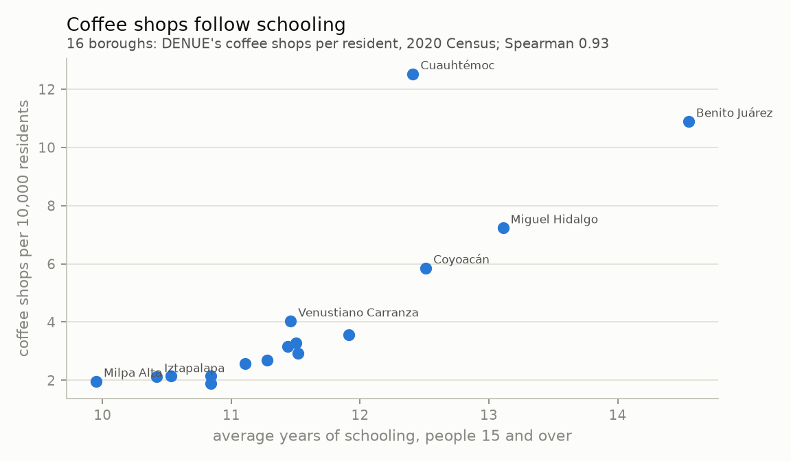

- **The city has 4.0 of DENUE's coffee shops per 10,000 residents**, from 12.5 in
  Cuauhtémoc and 10.9 in Benito Juárez to 1.9 in La Magdalena Contreras - a factor of
  six, where per km² the range is two hundredfold (Milpa Alta is mostly forest).
- **They follow schooling**: Spearman 0.93 between coffee shops per resident and the
  average years of schooling (0.76 per km²), across the 16 boroughs. Schooling stands in
  for income here; sixteen points are sixteen points, and it is a correlation.
- Read it as where coffee shops are, per resident, not as demand: the centre serves far
  more people than live there, since it is where people commute to work.
- In the explorer: a layer of coffee shops per 10,000 residents and a finding with the
  scatter (`analysis.borough_coffee_shops`).

### Every read of the registers (stage 4)

A register lists what exists when it is read, so a read that replaces the one before
loses the places that closed in between. DENUE and OSM now **accumulate** like the
roasters' shops (`accumulate` in the YAML): every download that changed is kept, and
`clean.coffee_shops` is each register's newest read while `clean.coffee_shop_history` is
each place at every read (one row per place and read day; a day read twice is its later
read; each distinct point is placed in its borough once). The helper that picks the reads
(`domains/coffee/reads.py`) is now shared with the roasters' history.

- `analysis.shop_turnover`: between two consecutive reads of a register, the places it
  listed, what appeared and what it no longer lists. Neither is an opening or a closing:
  DENUE drops a place when an update finds it gone, and an OSM mapper can replace a node
  with its building under a new id, so a disappeared place with a namesake among the new
  ones within 60 m (the twin-link radius) is counted as `redrawn`.
- **Real, 29 September:** OSM read twice (22 and 27 September), 1,357 elements each, the
  same in every field the reader keeps (the two files differ by 7 bytes elsewhere), so 0
  appeared and 0 disappeared. DENUE was read once (20
  September). The history is empty of change because it is five days old; it fills with
  each `make extract`, by hand.

**When each place entered the register.** DENUE's `Fecha_Alta` is the register's edition
a place entered (`2024-11`; twice in 9,860 written with a space, `2013 07`). It is now in
the raw contract and in `clean.coffee_shops` as `listed_since`, with a study,
`analysis.register_editions`, and a finding in the explorer:

- **92% of today's 9,860 places entered in four editions**: 2010-07, the register's first
  (23%), and those right after an economic census, 2014-12 (12%), 2019-11 (20%) and
  2024-11 (38%). An entry date says when INEGI came by, not when a place opened.
- Only survivors are counted: a place the register dropped is gone from it, so the 2,278
  of 2010 are what is left of that edition.
- Coffee shops sit later than the rest: 41% of the 3,717 entered in 2024-11 (38% of all
  places), 18% in 2010 (23%). Newer places or more turnover - one read cannot tell which;
  the history can, as it grows.

## Where Mexico grows it (stage 2)

`clean.mexico_production` is SIAP's definitive 2025 figures for coffee cherry, one row
per municipality. The chain from farm to cup now spans the project: who grows it here,
what the world market does with it (PSD), and where the city drinks it (DENUE, OSM).

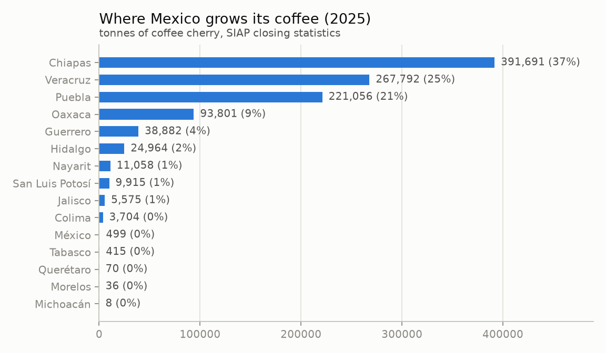

Four states grow 91% of it - Chiapas 37%, Veracruz 25%, Puebla 21%, Oaxaca 9% - but they
are not paid alike. Value over volume, a tonne of cherry fetched **$13,970 in Puebla and
$5,482 in Chiapas**: the largest producer earns the least per tonne.

SIAP weighs cherry as picked; PSD counts green coffee ready to export. Set side by side
(`analysis.production_crosscheck`), 1.07 million tonnes of cherry against PSD's 235,680-
244,800 t of green coffee means 4.4-4.5 t of cherry per tonne of green, depending on
whether PSD's market year is aligned with SIAP's year or with the one before. That is
the factor the two would need for both to be right; it is shown, not assumed.

### Every closing year since 2003

SIAP publishes one file a year at the same address but for the year, 2003 to 2025, and
the project read only the last. A core capability now reads a statistic published that
way (`SourceConfig.years`, with `{year}` in the address and the file's name): each year
is its own download and partition, a closed year - any but the last - is downloaded once
and kept, the last one is checked when `refresh_hours` says, and the years are read as
one table. A year that fails is named, and the rest are stored. Recognised by its
address, so the 2025 file already on disk counted as 2025.

Read before it was written (29 September, every year downloaded): 23 files, Latin-1, 4.6
to 6.7 MB, 457 to 501 rows of *Café cereza* in tonnes a year. And three things the one
file never showed:

- **The headers changed twice**: `Precio` until 2020, `Nomcultivo Sin Um` from 2015 to
  2020. `renamed` (a core capability) reads the older header as today's.
- **Three numbers with a thousands comma** among a million written bare (`"10,271"` in
  2021, `"3,350.00"` in 2022): `thousands` takes it out of a cell that is a number and
  nothing else, so "Frontera, Corozal" keeps its comma.
- **A spreadsheet's error in two cells** (`#¡NUM!`, the yield of two bean fields in
  2009): no value, declared as a null.

The raw layer keeps every file as SIAP served it (137 MB); only the reading changed.
`clean.mexico_production` needed nothing new - it already summed by year.

| | 2004 | 2016 | 2025 |
|---|---:|---:|---:|
| Coffee cherry, tonnes | 1,696,978 | 824,082 | 1,069,464 |
| Rural price, pesos a tonne (of each year) | 1,689 | 5,490 | 8,161 |

Mexico's harvest halved between 2004 and 2016 and has recovered by a third since; the
price is nominal (INEGI's consumer price index would deflate it, a source not yet
verified). The explorer's dataset splits by year and its findings show the series; the
agent's dictionary says a question about one harvest filters the year, and a new SQL
case asks for the year of the smallest harvest (2016).

## What the roasters sell (stage 3)

The CQI stops in 2023. Four Mexico City roasters - Almanegra, Buna, Café con Jiribilla
and Cucurucho - sell the same kind of item today, and their shops describe it: where it
grew, at what altitude, which varieties, how it was processed, and what a kilogram costs.
Three clean tables hold it, because a shop describes three different things - and a
fourth, [what they say it tastes of](#what-they-say-it-tastes-of-stage-3b):

- `clean.roaster_coffees`: 167 coffees, one per product, with the shop's own text.
- `clean.roaster_origins`: 142 origins. Most coffees name one; a blend lists each
  component, and gets a row for each (Buna's Guarumbo: two arabicas and a robusta).
- `clean.roaster_offers`: 527 offers, a coffee in one size, with its price per kilogram.
- `clean.roaster_flavors`: 557 tasting notes of 94 coffees, in the SCA's categories.

Every canonical value speaks the vocabulary of a table that already exists: countries
as PSD names them, Mexican states as SIAP does, processing methods and varieties as the
CQI spells them. A 2026 bag from Oaxaca joins its state's harvest and its country's
market balance, and sits next to a graded 2018 lot, with no mapping table in between.

Reading the sheets is a core capability (`mlops_core.data.sheets`), because every shop
has one of two shapes: "Label: value" lines in a description, or a heading over a
paragraph on the product page. Two traps are handled there, not per shop: labels run
together without a line break (*"YemenRegión: Haraz"*), and a blend repeats its labels
for each component. What the labels mean, in Spanish, is the domain's config.

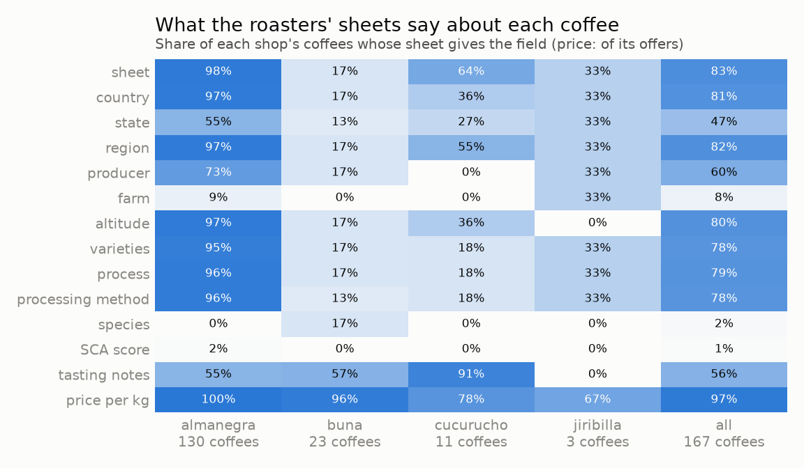

What the shops say is uneven, and the table says so rather than hiding it
(`analysis.roaster_coverage`). Almanegra's sheets are nearly complete and it lists 130 of
the 167 coffees; Buna keeps a sheet on 4 of its 23 product pages; Cucurucho scatters a
few labels through prose (a country for 4 of its 11 coffees).
**A price model trained on these will learn Almanegra's pricing** - that is the first
thing to say about it. 85 of the 142 origins are Mexican.

Nothing is guessed, and three things were found by not guessing:

- **The platform's weight is wrong** in 77 offers: Café con Jiribilla sells "1 kg" with
  250 g in the weight field, Almanegra "1.25 kg" with 313 g. The size comes from the
  titles ("5/16 kg (312.5 gr)", "Caja de 12 Bolsas ... de 340grs"), or it stays empty.
- **Three prices were copied from another size**: a 156 g bag at the 1.25 kg price
  ($8,640 a kilo), and two 1.25 kg bags at the price of the small one. They are kept as
  listed - it is what the shop charges - and flagged `price_outlier` for being more than
  3x off their product's other offers. The legitimate spread between different lots
  sold as variants of one product stays within 0.5-1.7x.
- **Process labels are free text**, from "Lavado" to "Fermentación Láctica con bacilos
  autóctonos". They map to the CQI's methods by ordered rules; experiments and lots sold
  two ways are "other", as the CQI rules file them, and a label no rule knows
  (*Mycoprism*) is `unclassified`, counted, not forced into a method.

Unlike the CQI's frozen labels, these shops change weekly, so these rules are open: a
new country or process does not stop the pipeline. It is logged by name, left empty in
the canonical column (a process keeps its label as written beside it), and it shows up
in the coverage table.

### What they say it tastes of (stage 3b)

A shop's description tells a story - the producer, the farm, the harvest - and, in a
sentence or two, what the cup tastes of: *"Un café con notas a chocolate y frambuesa"*.
`clean.roaster_flavors` keeps one row per coffee and note, each placed in a flavour
category of the SCA's descriptive assessment (SCA-103, in the corpus): floral, fruity
(berry, dried fruit, citrus fruit), sour/fermented, green/vegetative, other (musty/earthy,
woody), roasted (cereal, burnt, tobacco), nutty/cocoa, spice, sweet (vanilla, brown
sugar). Where the form is silent, the SCA's flavour wheel places a note: black tea is
floral, leather is musty.

A lexicon, not a model, on purpose: 192 notes in the domain's YAML, each with its English
name, so every row traces back to the word that put it there and the rules can be read
aloud - and there are 167 coffees, not a corpus. The reading is narrow, because a wrong
note is worse than a missing one:

- A note counts only after a cue ("notas a", "sabe a", "aroma", "en taza") and before the
  end of its sentence. *"Este compromiso con la tierra"* is not earthy.
- A cue right after a negation opens nothing (*"sin llegar a los sabores fermentados"*),
  and a negation inside a list of notes ends it.
- A capitalised word mid-sentence is a name: Juan Carlos Flores is not floral.
- A word used in another sense is excluded by pattern: in coffee, "cereza" is also the
  fruit that is picked (*"la selección de cerezas maduras"*).
- Only Cucurucho writes its notes in the title, after a hyphen (*"Chiapas- Caramelo,
  avellana y chocolate"*), so only its titles are read.
- A word matches in its plural and its other gender, word by word ("fruto rojo" is
  "frutos rojos"; "caramelizado" is "caramelizada").

How right it is, judged by the assistant, not a person: a random 60 of the prototype's
notes were all correct. A look at the risky words found the misreadings the rules now
exclude - "te" (you) read as "té" (tea), the picked cherries, the land, and "dulce" as an
adjective of anything ("especias dulces"). Words were then added for notes the prototype
missed after "notas a" (star fruit, freesia, rue, cherimoya, muscat, fennel).

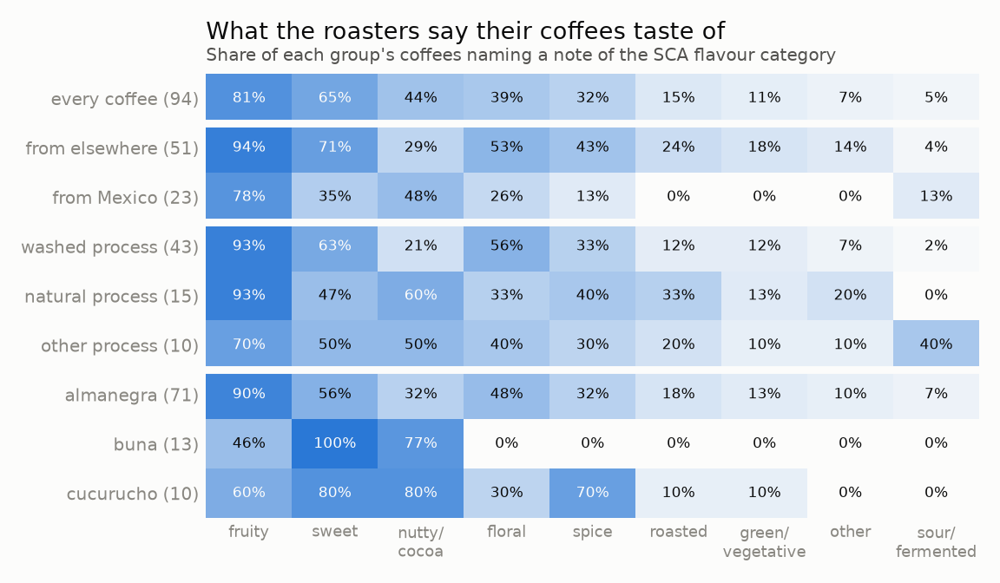

**94 of the 167 coffees name at least one note** (557 notes): Cucurucho 10 of 11,
Almanegra 71 of 130, Buna 13 of 23, Café con Jiribilla none. Fruity 81%, sweet 65%,
nutty/cocoa 44%, floral 39%, spice 32%. What sets the groups apart (`analysis.flavor_profiles`):

- **The extraction finds what cuppers already know**: the experimental fermentations
  (the process `other`) are described as fermented or boozy 40% of the time, the washed
  coffees 2%, the naturals never; washed coffees are floral 56% of the time, naturals 33%.
- **Mexican coffees are described differently**: floral 26% against 53% for the
  single-origin coffees from elsewhere, spice 13% against 43%, and never roasted, green or
  earthy; nutty/cocoa 48% against 29%.
- **Shops have a house voice**: every Buna coffee with notes is sweet, 77% nutty/cocoa,
  none floral or spiced; Cucurucho calls 70% of its coffees spiced.

**The words do not price the bag** (`analysis.flavor_prices`). Within a shop and a bag
size - each offer against the median of its shop's bags of that size - no category's
coffees cost more than the others by more than noise: nine comparisons, so each interval
is family-wise (Bonferroni, 99.4% each), and all nine include zero. Spice comes closest,
+12% (-0.3% to +26%), and it is a stand-in for origin: its coffees come from Yemen,
Rwanda, Kenya, Burundi and Indonesia. The price model's finding, from another angle:
altitude and origin price a bag, the adjectives do not.

**No clean flavour types** (`analysis.flavor_clusters`). Each coffee as the set of
categories it names, clustered with k-means for k = 2-6 and judged by the Jaccard
silhouette (presence data: two coffees that both lack roasted notes are not alike for
that). The best is k = 3 at 0.31 - *weak* on Kaufman and Rousseeuw's scale: floral and
fruity (37 coffees), nutty/cocoa and sweet (32), fruity and sweet (25). The fruit-or-
chocolate split every coffee menu makes is there, but as a continuum, not as types.
Clustering on the Jaccard distance itself was tried: average linkage peeled outliers off
two at a time (92 coffees and 2 at k = 2), complete linkage held together worse (0.22).

What it is not: a cupper's judgement. These are the shops' own claims, written to sell.

**Nor do they help the price model** (`experiments/flavor_features.py`, 29 September).
The categories went in as features - one indicator per SCA category and the number of
notes, null where a description names none - measured the way the gate measures a group
model: every coffee predicted out of fold, paired against the same model without them,
coffees resampled whole, each feature set tuned with the same budget (40 trials). On
2,558 offers of 157 coffees (1,435 of the 94 with notes): **235.2 MXN/kg with the notes,
236.4 without, -1.2 (-8.3 to +5.9), 63% sure** where the gate asks 95%. Where the notes
exist the model with them does *worse* (196.6 against 192.6); the small overall gain comes
from coffees without notes, where only the tuner's draw differs. Not adopted, so the notes
per read that a promoted version would have needed were not built. The experiment used
today's notes on every read of the offers: the leak it leaves open is a description that
changed between reads, and it could only have flattered the notes.

## What the agent will read (stage 3)

The tables answer how much and how many. What a variety is, why a washed coffee tastes
the way it does, what "sweetness" means on a cupping form: that is what the corpus is
for. 17 documents, 1.33 million characters, in the same raw layer as every other source -
manifest, sha256, one partition per ingestion - and each read into parts before anything
uses it (a page of a PDF, a section of an article).

| Documents | Publisher | Topics |
|---|---|---|
| Arabica and Robusta variety catalogues | World Coffee Research | varieties, cultivation |
| Arabica coffee manual (2005) | FAO | cultivation, processing, varieties |
| Wet processing, roast aroma, extraction kinetics | Frontiers, Molecules, J. Math. Industry (via Europe PMC) | processing, roasting, chemistry, brewing |
| Roasting conditions, coffee flavour, postharvest aroma | MDPI Beverages, IJFST | roasting, chemistry, cupping |
| CVA forms and standards SCA-102 to SCA-105 | Specialty Coffee Association | cupping |
| Market report, Coffee Development Report, WMT circular | ICO, USDA FAS | market, sustainability |

Four rules the ingestion follows, each of them a decision:

- **Text, never figures.** A PDF's tables come out of extraction scrambled, and an answer
  built from them is confidently wrong. Numbers are answered from the tables with SQL;
  documents explain.
- **A refusal is respected.** Nine documents are served to anyone and fetched. Eight sit
  behind a 403 that no licence overrides (MDPI, Oxford Academic, the SCA), so they are
  downloaded by hand into `data/<domain>/inbox/documents/` and named in the config with
  the URL they came from. `make extract` says which are missing and where to put them;
  nothing is scraped around the refusal.
- **Provenance travels with the text.** Publisher, year, licence, language and topics are
  config, written to `clean.documents` with the date each file was retrieved, and every
  chunk names its document and its page or section, so an answer can say where it got
  that.
- **Topics are metadata, not folders.** Nine of them - cultivation, varieties, processing,
  roasting, chemistry, cupping, brewing, market, sustainability - each with the terms a
  chunk is filed by and a question routed by. Almost no document is about one subject
  (the FAO manual covers three), so a folder per subject would be the wrong grain.

Two traps are handled where they are found: the SCA's standards are encrypted with
permissions rather than a password (an empty one opens them), and Europe PMC's article
XML is read by section, top level only, because a nested section's text is inside its
parent's and both would index every paragraph twice.

### From documents to chunks

`mlops data clean` turns the corpus into two tables, `clean.documents` and
`clean.document_chunks`. They are the core's, not the domain's: any domain that lists
documents gets them, cut the same way; the domain supplies only the vocabulary.

**Only prose is indexed.** Each rule below was written after reading this corpus, is
about the shape of text rather than its subject, and is counted per document in
`clean.documents` (`parts_kept`, `characters_kept`):

| Removed | Characters | Why it would hurt |
|---|---:|---|
| Reference lists | 96,985 | Titles of other works: dense in exactly the words a question uses, saying nothing |
| Runs of lines ending in a figure | 29,487 | Tables, contents pages, indexes, chart axes: figures come from SQL, not from a PDF's scrambled copy |
| Running headers, footers, page numbers | 15,524 | The same line on every page, in every chunk of the document |
| Spacing, dotted leaders, broken words | 15,328 | "fermen-tation" and "co ffee" are words no search matches |
| **Kept** | **1,172,414 of 1,329,809** | 88% |

- A reference list opens at its heading and runs on through the pages that follow
  **while they cite densely** (2.2 to 15 citations per 1,000 characters on reference
  pages, never above 1.8 on body pages) - not to the end of the document, because the
  robusta catalogue puts its references on pages 12-15 of 67, before its varieties.
- A table goes, the page it sits on stays: SCA-104 explains its cupping score and
  tabulates it on the same page, and dropping the page would drop the explanation.
- A word broken at a line end is joined unless the document writes the compound on one
  line elsewhere ("wet-processed"); a ligature split by extraction ("co ffee", 103 times
  in one review) is joined only where the document spells the word whole, so "the first"
  never becomes "thefirst".

**1,353 chunks**, median 1,056 characters (about 260 tokens), cut at the coarsest
boundary that fits - paragraph, then sentence, then line - and packed up to 1,200, each
opening with the last whole sentences of the one before (up to 200 characters). A chunk
never spans two parts, so it cites one page or one section. Size and overlap are config:
retrieval settings, to be tuned through the gate like a model's.

**A text is indexed once.** The two WCR catalogues open with the same thirteen pages, the
four SCA standards end on the same address, and one article says "Data are available from
the authors upon reasonable request" twice: 20 chunks repeated an earlier one. The first
document to have a text keeps it (in config order), `clean.documents` counts what each
lost (`chunks_repeated`), and the contract refuses two chunks with the same text. Left
in, a question about them finds the same passage twice in its five. Retrieval did not
move (dense nDCG@10 0.608 before and after): this is hygiene, not a gain.

**Each chunk is filed by the terms it uses.** A topic's terms match as whole words in
their inflections ("roast" finds roasting and roaster, "import" never finds important).
A chunk takes those of its document's topics whose terms it uses, and another topic only
with two of that topic's terms, because one word out of place is not a subject. A chunk
with no term keeps its document's topics rather than none: a topic filter that excludes
a passage does it silently. 89% of chunks are filed by their own terms, 11% by their
document (`topics_basis`), and 59% carry more than one topic.

| Topic | Chunks | Documents |
|---|---:|---:|
| cultivation | 538 | 10 |
| market | 356 | 13 |
| sustainability | 311 | 3 |
| processing | 309 | 10 |
| varieties | 253 | 7 |
| cupping | 229 | 11 |
| chemistry | 206 | 10 |
| roasting | 148 | 8 |
| brewing | 80 | 7 |

Brewing is the thin one - its only dedicated document is a paper on espresso extraction
kinetics - and that is said here rather than padded: a document is added when the
retrieval evaluation shows a question it cannot answer.

Some debris survives, knowingly: 17 chunks (1.2%) are what is left of contents pages -
the skeleton of the FAO manual's index, the SCA standards' "Contents" headings, and the
ICO report's list of figures, whose lines alternate between a title and a page number
and so never form a run. A rule aggressive enough to catch them would catch prose too;
the retrieval evaluation will say whether they cost anything.

### The questions retrieval is judged by

No search is built before the questions that judge it. Each one is a question someone
could ask, the passage that answers it, and what a person decided about it:

```bash
make questions   # the local model drafts, until every topic has 12 nobody rejected
make review      # a person accepts, edits or rejects each draft (in your own terminal)
```

- **A local model drafts; a person decides.** `qwen3.5:4b` reads a passage and writes a
  question it answers, plus a short answer in its own words, through Ollama with the
  reply constrained to a JSON schema. It was chosen by trying both installed models on
  the same five passages: `granite4.2:3b` wrote "the passage" into its questions and put
  a second question where the answer belonged.
- **Every draft is kept**, with what its reviewer did to it and when, the model's digest
  and the prompt's version. How many drafts were taken as written, fixed or thrown away
  is itself a result: how far a 4B model can be trusted to write an evaluation set.
- **Spread by design.** A topic's passages are dealt from each of its documents in turn,
  the document holding most of the topic first, so no single document writes a topic's
  questions; only passages filed under the topic by their own terms and at least 600
  characters long are asked about, and no passage is asked about twice - a rejected one
  included.
- **A label is an excerpt, not a chunk and not a page.** The drafter copies the sentence
  that answers, and a retrieved chunk is relevant when it contains it - whatever the cut.
  Chunk ids change with every cut, and chunk size is one of the settings these questions
  exist to tune; a page or a section is too coarse, since an article's section can run to
  thirty chunks and any of them would count as a hit. An excerpt is kept only if the
  passage holds it word for word (a paraphrase would label words the corpus does not
  have), it is a sentence or two, and no other page or section holds it ("brewed
  coffee." would match any search). The source excerpt is the first label, graded 2
  (answers it); when several searches run, the passages they return are judged and
  appended with their own grade - 0 included, because "judged not relevant" is not
  "never judged".
- **The reply's shape was measured too.** On the same twelve passages, asking for the
  excerpt before the question gave verbatim excerpts in 11 of 11 usable replies, against
  10 with the excerpt last and 7 with a looser rule, and lifted no more of the passage's
  words into the question (about 45% either way).
- **The checks earn their keep.** The first full run asked about 180 passages to get 108
  drafts (12 a topic): the drafter declined 18, and the checks threw out 44 excerpts that
  were not verbatim, 9 found on other pages too and 1 that was not a sentence or two. A
  4B model's drafts still wander - a "varieties" question about financial incentives, an
  excerpt that does not answer its question - which is what the review is for.
- **A known bias, stated.** A question drafted from a passage borrows its words, which
  flatters keyword search over semantic search. The prompt asks for the drafter's own
  words and the review can reword what it did not; the rest is a property of the set.

- **Used as drafted, and said so.** A draft nobody checked measures the drafter as well as
  the search, but 108 were more than the project's owner chose to review by hand. So
  every question nobody rejected is evaluated, and every run records how many a person
  checked (`questions_reviewed`: 0 today). The cost is noise in the labels, which lowers
  every search's scores alike: searches are compared on the same questions, paired, so
  the noise is shared rather than handed to one side - except the keyword bias above.
  `make review` stays; a reviewed subset would be a stronger yardstick.

The set is data the domain owns, versioned beside its code in
`src/domains/coffee/evals/retrieval_questions.jsonl`, one question per line.

### How well retrieval finds the answer

`make retrieval` searches every question with each search on a ladder - BM25, then
dense, then hybrid - grades each ranking and logs one MLflow run per search (experiment
`coffee-retrieval`); the per-question tables land in `evaluations.retrieval_<search>`, so
`make sql` can ask which questions failed. A retrieved chunk is relevant when it holds
the label's excerpt, and each label is credited once - overlapping neighbours that both
hold it are one find, not two.

**A search earns its place the way a model does.** Each one is compared with every
search before it on the same questions, paired and bootstrapped, and passes only if it
is better on nDCG@10 with 95% certainty - nDCG@10 because it counts both whether the
answer is found and how high, in the ten chunks an answer can be built from.

| 108 questions, 1,373 chunks | Recall@1 | Recall@5 | Recall@10 | MRR | nDCG@10 | Gate |
|---|---:|---:|---:|---:|---:|---|
| BM25 | 0.287 | 0.556 | 0.685 | 0.400 | 0.468 | the baseline |
| **Dense** | **0.426** | **0.741** | **0.796** | 0.547 | **0.608** | **passes**: +0.140 vs BM25 [+0.070, +0.215], 100% sure |
| Hybrid (RRF) | 0.407 | 0.704 | 0.769 | 0.534 | 0.591 | fails: -0.017 vs dense [-0.070, +0.036], 26% sure |

Measured again on the 1,353 chunks left once repeated texts were dropped: BM25 0.465,
dense 0.608, hybrid 0.589 nDCG@10, and the same two verdicts.

- **Dense search wins, against a set that favours its rival.** The questions borrow the
  passages' words, which helps keyword search, and still the semantic one finds the
  answer in the top five for three questions in four, against a little over half.
- **Hybrid adds nothing here.** In the top ten, BM25 finds 8 answers dense misses and
  dense finds 20 that BM25 misses (14 neither finds), but fusing the two lists with equal
  weight dilutes the better one as much as it rescues. Weighting the fusion or tuning its
  depth would be fitting the search to these 108 questions; the gate refused hybrid as
  specified, and that is the result.
- **The query instruction pays for itself.** Qwen3-Embedding's model card asks for an
  instruction on the query side ("Instruct: ... Query:") and puts leaving it out at 1-5%;
  here it is worth +0.053 nDCG@10 [+0.022, +0.087], 100% sure
  (`experiments/retrieval_checks.py`).
- **The keyword half in Qdrant is the baseline's BM25**, checked rather than assumed: on
  103 of 108 questions its top ten is the in-process top ten in order, and the other five
  differ only in how two chunks with the same score are ordered - the robusta and
  arabica catalogues shared word-for-word introduction pages (since indexed once).

| Topic (12 questions each) | BM25 Recall@10 | Dense | Hybrid |
|---|---:|---:|---:|
| varieties | 0.75 | 0.92 | 0.92 |
| cultivation | 0.83 | 0.92 | 0.83 |
| roasting | 0.58 | 0.92 | 0.75 |
| market | 0.67 | 0.83 | 0.75 |
| chemistry | 0.50 | 0.75 | 0.58 |
| cupping | 0.67 | 0.75 | 0.67 |
| sustainability | 0.67 | 0.75 | 0.83 |
| brewing | 0.83 | 0.67 | 0.75 |
| processing | 0.67 | 0.67 | 0.83 |

Each topic's figure rests on twelve questions - a standard error near 0.13 - so the
ranking of the topics is a hint, not a finding. With one label per question, MAP equals
MRR and recall at k is "was it in the top k"; the four metrics part ways once pooled
judgments add graded labels.

**How the pieces are built.**

- **BM25 as Lucene and Elasticsearch ship it**: k1 1.2, b 0.75, the Snowball English
  stemmer and Lucene's 33 stop words - a weak baseline would make semantic search look
  good for the wrong reason. Each chunk stores the term-frequency half of BM25 as a
  sparse vector (term ids are a stable hash, so no vocabulary travels with the index)
  and Qdrant applies Lucene's inverse document frequency at query time.
- **Dense**: `qwen3-embedding:0.6b` through Ollama, 1,024 dimensions, cosine; the whole
  corpus embeds in about a minute on the laptop's GPU. Ollama cuts a text longer than
  the model's context without an error; a chunk is a few hundred tokens, far below it.
- **Hybrid**: each half offers its best 50 and reciprocal rank fusion merges them by
  rank (k = 60, as in the paper that introduced it), because a cosine and a BM25 score
  are not on one scale.
- **Parquet is the source of truth, Qdrant an index built from it.** `make index` writes
  the vectors to `embeddings.chunk_embeddings`, loads them into a new collection with
  their BM25 weights and payload, and moves the alias searches use onto it in one
  request - nobody ever searches half an index - then drops the builds before it. The
  collection records the chunks it was built from - a digest of their ids and text, so a
  clean build that rewrites identical chunks does not orphan it - and an evaluation
  refuses an index built from other chunks rather than misread it.
- **A ranking has to repeat to be compared.** Fusing ranks produces exact ties, and
  Qdrant orders tied points as it likes: 17 of 108 hybrid rankings changed between two
  identical calls. Searches ask for ten more than they need, order them by score and then
  chunk id, and cut; two runs now give the same numbers. What remains is Ollama on a GPU,
  whose embedding of one query varies by up to 0.004 per component from call to call -
  each question is embedded once per run, so dense and hybrid see the same vector.
- **Tested without a server**: Qdrant's in-process mode runs the same collections,
  sparse vectors, fusion and aliases, so CI builds and searches a real index.

### The agent's SQL, locked down

The agent answers figures with SQL over the same DuckDB views `make sql` uses, and the
guardrails live in the session and a parser, never in the prompt - a prompt is a
request, and the text the agent reads (a shop's description, a document) can carry
instructions of its own. Each was checked against DuckDB 1.5.5 before it was relied on:

- External access off, the allowed directories narrowed to the published layers, the
  configuration locked: the views still read, while the raw layer, any other file, URLs,
  extension installs and setting changes are refused.
- That is not read-only: `COPY ... TO` into an allowed directory still wrote a file, and
  `CREATE` and `DROP` ran. So each statement is parsed first and anything but a single
  `SELECT` is refused before the engine sees it.
- DuckDB has no statement timeout: a timer interrupts a query after ten seconds and the
  session stays usable; results stream, and at most 50 rows come back.
- The schema the model writes against is the [data dictionary](../src/domains/coffee/data_dictionary.md),
  the sections of the tables that exist, verbatim - units, nulls and traps ("null means
  not reported, never zero") are what a model gets wrong unless it is told.
- **Many at once, no lock** (29 September). A DuckDB connection runs one query at a time,
  and the explorer's tabs, the agent and an MCP client's calls come together: the app and
  the MCP server queued them behind a lock. Every query now runs on a cursor of its own -
  another connection to the same database, with the same settings. Checked before it was
  relied on: a cursor refuses the raw layer, URLs, installs and setting changes as the
  session does, four run side by side, and interrupting one stops only its own query.
  The lock is gone; `run_select` is safe from any thread.

### Which model drives the agent

The agent's local model has to clear a floor, not win a contest: write SQL whose answer
matches a reference, and send each question to the right tool - the tables, a model's
prediction, the documents, or more than one. `make benchmark` measures it; the bar was
set before any model was measured.

| Generator (Ollama, temperature 0) | SQL right, with 2 repairs | At the first try | Routed right | Bar: 70% / 90% |
|---|---:|---:|---:|---|
| `granite4.2:3b` | 58% | 54% | 52% | misses |
| **`qwen3.5:4b`** | **88%** | 83% | **92%** | **meets** |

- **Granite was the plan and the benchmark overturned it.** Chosen on paper for its
  tool-calling scores, it never routed a question to a prediction (0 of 10) and almost
  never to more than one tool (1 of 10), and 7 of its 10 SQL failures never ran even
  after two repairs. Qwen3.5-4B, the alternative named when the choice was made, clears
  both bars; it is the agent's generator.
- **SQL is judged by execution**, as Spider and BIRD judge it: the answer, not the
  query's text. Columns the question did not ask for are tolerated, row order is not
  judged, numbers are compared to four significant figures - rounding an average is fine,
  a percentage where a share was asked is not.
- **The loop only repairs what fails.** A query that runs and answers something else
  looks right from inside the agent; the benchmark is where that shows.
- **Two question sets**, written by the assistant that built the project rather than by
  a person, and said so in every run: 24 SQL questions over nine tables, each reference
  query run and checked against figures established earlier, and 40 routing questions,
  ten per route - two of them traps that ask what a model *already* predicted, which is
  a question for the tables.
- The router is told what each tool covers in the domain's own terms, read from what the
  domain already declares - the data dictionary's headings, each model's `description`,
  the corpus topics - so a new domain gets a router without writing one.

### The agent

`make ask Q="..."` answers a question with the tables, the models and the documents,
and says where each part of the answer came from:

```text
$ make ask Q="How much per kilogram would Almanegra charge for a 250 g bag of a washed Gesha from Chiapas?"
Almanegra would charge 1324.93 MXN per kilogram for a washed Gesha from Chiapas.
[prediction] the offer model, v5
prediction (offer): {'shop': 'almanegra', 'bag_grams': 250.0, 'processing_method': 'washed', 'variety': 'gesha'}
route: prediction | trace: tr-4fbb2d0ed644b5d2fcc8d8c0a1204b13
```

- **A workflow, with autonomy only where it pays.** LangGraph runs a fixed path - route,
  plan, the tools the plan needs, answer, verify - and loops only where they help, each
  capped: a failed query goes back for repair twice, and an answer that fails
  verification is written again once. A 3-4B model with free rein picks tools badly (the
  benchmark saw it); this one is only ever asked small questions, each answered in a
  shape Ollama constrains it to.
- **A mixed question is split** into the part each tool answers ("which state produced
  the most, and why does altitude matter?" goes half to SQL, half to the documents).
- **The prediction tool is two small steps**: which of the domain's models - each
  offered with the target it predicts - then the item, in that model's own request
  body, whose JSON schema is what the reply is constrained to and whose fields, with the
  vocabulary each description gives, are written into the prompt. The request is shown
  with the answer, so an assumption is visible.
- **Every piece of evidence has an id**, and every statement cites one: `[sql]` for the
  query result, `[prediction]` for the model, `[c2]` for a passage. Sources are rendered
  by the code, not the model: publisher, title, year and page or section.
- **Verification is code, not a second model**: every figure in the answer must be one
  the tools produced (a rounding or a share restated as a percentage is allowed), and
  every citation must name evidence it was given. A failing answer is written again
  with its problems listed, and **a rewrite is kept only if it fixes more than it
  breaks** - that rule came from a trace, in which a correct answer was rewritten into a
  wrong one because the check misread `"[prediction]"` in the citation list.
- **One MLflow trace per answer** (experiment `coffee-agent`): a span per step and per
  model call, prompt and reply included, and the prompt registry versions it ran. The
  prompts live in the code; each is registered in MLflow's prompt registry when its
  content changes, and the trace points at the exact words sent.
- **Two bugs the agent surfaced, in code that was not the agent's.** The API container
  answered `/health` with "ok" while every price prediction failed - its image predated
  the variety columns the champion expects. The API now predicts each model's `example`
  (declared in the YAML) whenever it loads it, and does not serve a model that cannot:
  `/health` says "partial" and `/reload` says why. And the API took "Gesha" and "gesha"
  for different varieties: an unseen category, silently, and a price $296 lower. The
  request bodies now lower-case the closed vocabularies.
- The embedding model runs with a 512-token context for questions: at its default it
  did not fit in VRAM beside the generator, and Ollama would have swapped models on
  every question. The setting only reached Ollama from 2026-09-27: the embedding
  requests never sent their options, so the model always loaded at 4,096 (2.37 GB, not
  1.01) - found when the pair no longer fit on a busier card.

### The agent, end to end

`make agent-eval` asks the agent the 40 routing questions and checks each answer against
what is known to be right for it, where it is: the SQL set's reference query for a data
question, the retrieval set's labelled excerpt for a knowledge one (both matched by the
question's own words), and for a prediction the model it belongs to and every field the
question states, spelled as the model spells it. A mixed question must run every tool it
needs, whatever the route. An answer is **correct** when verification found nothing and
every check that applies passes. The answers land in `evaluations.agent_answers`, one
MLflow run holds the metrics and a trace per question (experiment `coffee-agent-eval`),
and each run is compared with the one before it, question by question, paired and
bootstrapped: a change to a prompt is judged as a model is.

| 40 questions | Correct | Verified | Routed right | SQL right | Passage found | Item right | Median |
|---|---:|---:|---:|---:|---:|---:|---:|
| First run | 57% | 90% | 92% | 69% | 80% | 23% | 9 s |
| **After the fixes below** | **78%** | **100%** | 95% | 69% | 80% | 85% | 5 s |

+20 points correct [+8, +35], 100% sure. What the first run found, and what fixed it:

- **The model never saw the fields it was filling.** Ollama constrains a reply to the
  JSON schema but does not show the schema to the model, so the field descriptions never
  reached it: 10 of 13 predictions arrived as the question worded them - "Indonesian",
  "semi-washed", "heirloom", "café con jiribilla" - which the model takes for categories it
  never saw, or with "from Chiapas" left out of `state`. The prompt now lists each field
  with its description, and the request bodies' descriptions give their vocabularies.
- **A question about a cup score went to the price model.** "review" does not say what
  it predicts; the model list now names each model's target.
- **The agent read a feature as a fact.** Asked for Brazil's arabica share in 2023, it
  read `features.review_features`, whose market context is the year *before* each lot's
  grading on purpose, and answered with it. The models' inputs are no longer offered to
  the agent: everything in them comes from the clean layer, where it means what it says.
- **The dictionary did not say how values are written** (`shop = 'Almanegra'` found no
  rows): it now does, and says how a state's rural price is made from its
  municipalities'.
- **The judge was wrong once.** The two averages laid out across one row (`avg_washed`,
  `avg_natural`) are the same answer as two rows; the SQL judge, the benchmark's too, now
  accepts it.

What is left is the model: a query that averages the wrong rows or takes a maximum for a
state's price (4), a hypothetical bag routed to the tables or a plan that drops its
prediction (3), and two passages the search does not find in its five. Verification
catches a made-up figure, not a wrong query, so all nine read as confident answers.

The fixes were found on these 40 questions, so the second figure is optimistic; each
fixes a cause, not a question, and none names one. The model is deterministic enough to
repeat a run exactly - not always: data-02's query changed between two runs with the
same prompts.

**Stage 4's tables get questions of their own.** Five more data questions - the city's
median shelf price of ground coffee, the borough PROFECO priced most, the national
median of instant in a fortnight, a month's peso-dollar rate, green coffee in pesos -
each with a reference query run against the real layers and matching figures already
established (380 pesos/kg, Benito Juárez, 958.33, FRED's own 17.0609 for August, 136).
Written by the assistant, like the rest of the SQL and routing sets, and declared so.
With them the benchmark is 86% SQL (25 of 29, the five new ones right) and 93% routing,
and the agent end to end **80% correct, 98% verified on 45 questions**, the five new ones
answered right; on the 40 it shares with the run before, +0 [-8, +8].

**The tasting notes get questions too, and they broke the router** (28 September). Three
SQL questions on `roaster_flavors` (94 coffees with notes; fruity, for 76; 56% of the
washed single-origin coffees floral), two of them also routing cases. The end-to-end
run fell to **68% correct, routing 85%** - 11 points down, 99% sure - and five questions
asking what a lot would score or a bag would cost went to the tables. Taken apart, three
runs each of the 20 prediction and mixed questions:

| The router's list of tables | Predictions routed right |
|---|---|
| as built, with `roaster_flavors` | 15 of 30 |
| without `roaster_flavors` | 30 of 30 |
| three other wordings of its heading | 14-15 of 30 |
| `roaster_flavors` moved to the end of the list | 27 of 30 |
| without `roaster_origin_history` instead | 22 of 30 |
| without `exchange_rates` instead | 29 of 30 |

Not a wording, then: the small model's routing moved with the length and order of the
list, and choosing the words or the order that happened to work would have been fitting
these ten questions. The router prompt listed the tables inline under `data`, before the
definition of `prediction`; it now defines the four routes first and lists the tables
last, as reference. Measured on all 47 routing questions, twice each, with three
different lists of tables: 88-90 of 94 every time, against 85 with the old layout on
today's list. End to end: **79% correct, 100% verified, routing 96%**, +11 [+2, +19] on
the run before; the benchmark's routing 96%, SQL 84% (the washed-floral share is still
answered from the wrong rows). As with every fix here, measured on the questions that
found it, so optimistic.

**At v1.0 (29 September)**, with the registers' history in the dictionary and a question
on it (48 in all): **73% correct, 94% verified, routing 94%**, median 4 s a question;
against the run above, -4 points (-13 to +4), 10% sure it is better: not a change the
48 questions can tell from the 4B model's run-to-run variation.
The new question is one of the misses: asked how many coffee shops entered the register
in November 2024, the model wrote `listed_since >= '2024-11-01'` and forgot `kind =
'coffee'` (4,059 instead of 1,528). Two predictions go to the tables, three joins return
the wrong rows, two answers carry an unverified figure - and every one of them is shown
as such in the explorer. The benchmark: SQL 79% (33 questions), routing 94%, above the
bar; granite4.2:3b still below it (48%, 69%). Not tuned further: the prompts moved to fit
these 48 questions would be the questions fitting the prompts.

### A held-out set, written before the fixes

Every change to the agent so far was found on the questions it was then measured on, so
each improvement was optimistic. Before touching the agent again (29 September), a second
set was written and committed apart - `evals/holdout/`, 25 cases the fixes are never
tuned on, run with `mlops agent evaluate --cases holdout` and `mlops agent benchmark
--cases holdout`, each set compared only with its own previous runs (its own evaluations
table). Written by the assistant, like the first; every SQL reference was run on the real
data, and every knowledge excerpt is literal in exactly one (document, part) - two first
choices were not, the SCA roasting article and the WCR catalogue repeating a sentence on
another page, and were replaced.

- 9 data questions over tables the first set asks little of (the census, the register's
  kinds, the shelf prices by borough, the peso, the harvest, the flavour notes, the ICO's
  days, the cup-score model's stored error); 5 predictions of items given by their
  attributes; 4 knowledge questions from four documents; 4 mixed.
- **3 questions with no answer** (`answerable: false`): lots from Iceland, Starbucks in the
  roasters' catalogues, and the 2022 World Cup. The right answer says there is none; the
  agent's `Reply.answered` says whether it did, and the evaluation reports how often it
  abstained right (`abstained_right`) and how often it declined a question that had an
  answer (`declined_answerable`).

**The baseline, the agent as it was: 52% correct, 84% verified, routing 92%** (the
benchmark on the same set: SQL 67% - below the 70% bar the first set clears - routing
92%). Twelve misses: three wrong queries (coffee shops counted without `kind`, a flavour
share filtered to Mexico unasked, the shop's offers), all three unanswerable questions
answered anyway (one with an invented 100), two predictions sent to the tables or never
made, one invented figure on a real prediction (2,262.70), a passage missed, and the
mixed questions' predictions never called.

**The same answers three times.** With Ollama's prompt cache off (`LLAMA_ARG_CACHE_RAM=0`
in the server's environment, set that day), the three runs of the baseline came out
identical - the same 12 misses. Before, the same prompts at temperature 0 and a fixed
seed moved by about two questions in forty between runs, which is what kept a change of
two from being told apart from noise. The cache also held up to 8 GB of host RAM and had
crashed an evaluation; the log now says "prompt cache is disabled".

### No answer, rather than a made-up one

The v1.0 misses, read one by one (29 September), had causes, and each fix went after a
cause rather than a question:

- **The dictionary's examples leaked their constants.** The worked example of a flavour
  share filtered `country = 'Mexico'`, and the model copied that filter into two questions
  that never named Mexico; the boroughs table said "`09015` is Cuauhtémoc", and the model
  filtered Benito Juárez and Coyoacán by `09015`. An example now shows the shape of a query,
  never a value: the share over all coffees with notes, the single-origin join to add only
  when a question names a group, and "filter a borough by its name".
- **A table's name said less than its rows.** `clean.coffee_shops` holds juice stands and
  ice-cream parlours as well, and "how many coffee shops" counted all of them (3,705 for
  1,528). Its heading now says what it holds, and the domain declares a guard
  (`agent.sql_guards` in the YAML, a core capability): a query of that table that never
  names `kind` goes back once with the hint. Declared for the history table too.
- **Nothing found was answered anyway.** A query that returned null became "148 MXN/kg".
  The workflow has a gate now, between the tools and the answer: a query that found no
  rows (or only nulls), a prediction the API refused and a passage less similar to the
  question than 0.45 are not evidence, and **when nothing is left the agent says it found
  no answer, and why, without calling the model to write one** (`Reply.answered` false).
  Before that, a query that found nothing goes back once with the values it filtered on
  checked against the data (`starbucks` matches no shop; the shops are almanegra, buna,
  cucurucho, jiribilla) - and the rewrite is kept only if each value it changed is a
  spelling of the same one: shown the shops, the model put `buna` in place of Starbucks
  and answered 945. The 0.45 was calibrated on the 108 retrieval questions against 20
  off-topic ones written for it (107 of 108 kept, 18 of 20 stopped), never on the held-out
  set.
- **A query that reads no table** (`SELECT 'Brazil'`, asked who won the 2022 World Cup) is
  refused like an error.
- **The route of a described item.** A second opinion asks two yes-or-no questions a small
  model answers better than it picks one route of four: does the question describe an item
  and ask what a model would predict, and does it ask for a figure computed from the
  tables. A tool is added where the answer is yes; an item described with no figure asked,
  sent to the tables, goes to the model instead. One extra call per question.
- **`answered` in the answer's schema**, false only when the evidence answers no part of
  the question.
- A reply cut short (`{"` and nothing else, once, under load) is asked for once more, and
  a question that raises is a wrong answer in the evaluation, not a lost run.

| | Held-out, 25 | Default, 48 |
|---|---:|---:|
| Before (29 September) | 52% correct, 84% verified | 73%, 94% |
| Dictionary, guards, gate, second opinion | 64%, 96% | - |
| + borough names, same-value rewrites, a query must read a table, the described item's route | **88%, 100%**, routing 96% | **79%, 98%**, routing 100% |

The first round was designed on the default set's misses and measured on the held-out one:
**+12 points there is the unbiased figure**. The second round came from reading the held-out
misses, so its 88% there is optimistic; on the default set, where none of it was designed,
it went from 73% to 79% (+6, -4 to +17). The three questions with no answer are now
answered with "no answer" (they were answered 100 and "Brazil" before). What is left: an
offer counted as a coffee, a passage the search missed, a prediction a mixed plan never
called, and averages taken over the wrong rows.

The benchmark, which asks each skill on its own: **SQL 88% on the default set (79% at
v1.0) and 78% on the held-out one (67% before, under the 70% bar), routing 96% on both**.
Repeated, the held-out evaluation gave the same answers to every question.

**Schema linking, measured and not adopted.** Showing the SQL writer only the dictionary
sections a question needs - the `k` most similar by embedding, and the tables they name -
is the usual remedy for a long schema (`agent.schema_sections`, `dictionary.SchemaLinker`,
`experiments/schema_linking.py`). On the default set's 33 SQL questions it did worse: the
whole dictionary 88%, four sections 85% (18% sure it is better), six 79%; the held-out
set's nine questions cannot tell. The setting stays unset.

### Hosted models first, the local one last

The local model stays the standard - free, private, offline, and what every result here
was measured with. But a hosted model answers more questions right, and several give a
free tier. So the agent can ask them first (`rag/providers.py`, `providers.yaml`), in
order, while their quota lasts, and fall back to the local model, which is always last
and never set aside: the chain cannot run dry, and with no key set it is the local model
alone, as a fresh clone has it.

- **Verified before written** (29 September): each endpoint answered a request without a
  key with 401 (the address is right, nothing spent), and the free limits are each
  provider's documentation of that day. Gemini (Flash and Flash-Lite; free-tier prompts
  may train Google's models outside the EU), Groq (`openai/gpt-oss-120b`: 30 requests a
  minute, 1,000 a day, 8,000 tokens a minute and 200,000 a day - about one SQL question a
  minute), Mistral (free mode), OpenRouter (50 requests a day on its free models).
  Cerebras is a 30-day trial that asks for a card. Anthropic and OpenAI are paid, and
  join only with `MLOPS_PAID_PROVIDERS=true`. NVIDIA's address answered 404, and GitHub
  Models was retired in July: not listed.
- **When a provider runs out** - a 429, or a quota named in a 402 or 403 - it is set aside
  until the moment it says (`retry-after`, Gemini's `retryDelay`), else until the next
  UTC day for a daily quota and a minute for the rest; a limit that clears within 20
  seconds is waited out once. A key refused is set aside for a day, a provider down or a
  reply of the wrong shape (twice) for ten minutes. The set-asides and the tokens each
  provider spent are written to `data/llm/providers.json`, so the next run does not ask a
  provider whose day is over. `mlops agent providers` shows the chain, whose key is set,
  who is set aside and why, and what each spent; `--check` asks each a one-word question.
- **Two APIs cover them.** The OpenAI-compatible one takes the reply's JSON schema as
  `response_format` (a provider that refuses it is asked in plain JSON mode from then
  on); Anthropic's is asked through a tool whose input is the schema. The schema is also
  in the prompt, and the reply is validated either way. A key travels in a header, never
  a URL, and is never printed: the command says only whether it is set.
- **Prompt caching, cheap because of an order already there.** 72% of what the agent
  sends is the SQL prompt, and most of it is the data dictionary, before the question. A
  provider that caches a prompt's prefix on its own (OpenAI, Gemini) reuses it; Anthropic
  is told to (`cache_control` on everything before the question). Locally, llama.cpp
  already reuses the prefix of the prompt before (measured: 6,500 tokens evaluated in 3.1 s
  cold, 0.36 s when the previous prompt shared the dictionary), so a repair or a rewrite
  of the same question costs little; between two questions the router's prompt comes in
  between and the dictionary is read again.
- **Replies kept** (`CachedGenerator`, `data/llm/replies.sqlite`, 30 days): a prompt asked
  before, for the same shape of reply, is answered from the file and costs nothing - at
  temperature 0 it would be the same answer. On for `ask`, the explorer and MCP
  (`MLOPS_REPLY_CACHE`); never for an evaluation or the benchmark, which measure a model.
- **Measurement stays one model.** `mlops agent evaluate` and `benchmark` answer with the
  local model unless told otherwise (`--generator groq`, or `chain`), with no fallback: a
  measurement of one model is of that model. Each trace's model span says who answered
  (`answered_by`: a provider, the local model, or the cache).

What it cannot do yet: no provider has been asked a real question here - there are no keys
on this machine. The requests are what each API documents, and the tests stand in for
every refusal, but whether a hosted model passes the benchmark's bar is a measurement
still to make, once the keys exist.

### The same tools over MCP

`mlops mcp` serves the agent's tools over the Model Context Protocol, on stdio, for
clients this project does not write - Claude Desktop, Claude Code, an IDE. Any MCP
client that launches stdio servers takes the same entry (Claude Desktop's config file,
a project's `.mcp.json`):

```json
{
  "mcpServers": {
    "coffee": {
      "command": "uv",
      "args": ["run", "--directory", "/path/to/coffee_mlops", "mlops", "mcp", "--domain", "coffee"]
    }
  }
}
```

| Tool / resource | What it is |
|---|---|
| `query_tables(sql)` | One read-only SELECT over the layers - the agent's locked-down session, so the guardrails hold whatever model is calling |
| `predict_review(item)`, `predict_offer(item)` | One tool per model the domain declares; the argument is the model's own request body, and its JSON schema, field descriptions included, is what the client sees and the server validates |
| `search_documents(question, k)` | Dense search over the corpus, each passage with its publisher, title and page or section |
| `draw(sql, chart)` | The result of one read-only SELECT as a chart, a PNG: bars, a line, a scatter, points on a map, or a map of the boroughs - chosen by the client's model, or by the result's shape; a small result's Vega-Lite spec comes too |
| `explore_segment(dataset, measure, by, color, filters)` | The explorer's segment tab without SQL: every name from the YAML's datasets, the same query, a summary sentence and the explorer's address for the same view |
| `map_layer(name)` | One of the explorer's map layers as a PNG map, with what it shows and its address in the explorer |
| `dictionary://tables` | The data dictionary: what the client's model writes its SQL against |
| `findings://all`, `studies://index`, `studies://{name}` | What the data already says, each with its query; every study the analysis wrote, as CSV |
| `models://{name}` | A model's card: what it predicts from what, its split, the monitor's last verdict, the partitions its studies came from |
| `status://freshness` | When each table was last built, and from which raw partitions |
| a prompt per finding | Reproduce the finding, draw it, say what it shows and what it does not |

- **A wrapper, not a second agent.** Each tool calls the function the agent calls; no
  logic is new. The client brings its own model, so the tools take what that model can
  write itself - SQL, an item, a question - instead of asking the local one to.
- **The guardrails are the server's.** A client that sends `COPY ... TO` gets the same
  refusal the agent's model gets; an item with a negative bag size is rejected by the
  schema before it reaches the API. Every tool says it is read-only.
- **Any installed domain gets a server.** The tools, their descriptions and their input
  schemas come from the domain's config and adapter; nothing in the server names coffee.
- **Checked as a client sees it**: driven over stdio with the SDK's own client - list the
  tools, read the dictionary, run a query, have a `COPY` refused, price a bag, score a
  lot, search the documents - and tested in process against the same server.
- **`draw` shows the first tool's answer; it is not a fourth source of evidence.** It runs
  its SQL in the same locked session (up to 20,000 rows: a chart is drawn, not read by a
  model) and draws the result. A chart is small and checkable - a kind, and which column
  is x, y and colour, the colour being how a result is split into segments - so the
  client's model may choose it; left out, the result's shape chooses (a date and a number
  are a line, rows with coordinates are points, a column naming a borough makes a map).
  Either way it is checked against the columns before anything is drawn: asked for bars
  whose height is a name, the tool says why not. Drawn as Vega-Lite and rendered by Vega
  itself without a browser (`vl-convert`), so the explorer below shows the same chart
  live. The boroughs' outlines come out of the area table's WKB, read in plain Python:
  the explorer needs no spatial extension to draw them.
- **The agent's checks, for every client** (29 September). The agent's own SQL gets a
  second look - a guarded table queried without the column it must filter on, a query
  that found nothing - and until now a client over MCP got the rows alone. `query_tables`
  now answers with `notes`: the domain's hint ("clean.coffee_shops holds juice stands...
  filters kind = 'coffee'"), or which filtered values the data does not have and which it
  does. Notes, not refusals: the client's model decides. Results come back structured as
  well as text (`structured_output`), so a client reading JSON gets typed rows.
- **The explorer's curated views, without SQL.** `explore_segment` and `map_layer` take
  only names from the YAML (datasets, measures, dimensions, filters, layers), run what the
  explorer runs, and return the explorer's address for the same view - `?view=segments&
  dataset=...&by=...` or `?view=map&layer=...`, and `?q=...` asks the agent. The page reads
  the link once per session and takes only names its lists have; a link can pick a view,
  never write a query. Controlling a running page from a client was decided against on 28
  September; a link a person opens is not that.
- **What a client could not see before**: the findings (and a prompt per finding to
  reproduce it), every study, each model's card with the monitor's verdict, and how fresh
  each table is - read from the same partitions and manifests the explorer reads.
- **`mlops mcp --http`** serves over streamable HTTP on 127.0.0.1 (port 8765), for a
  client that connects to a running server; stdio stays the default. Bound to this
  machine only: nothing in the server asks who is calling.
- **Not done: asking the person for a prediction's missing fields** (MCP's elicitation).
  The item's schema already says what each field is, and the client's model asks its
  person in the conversation; a server-side question depends on the client supporting it,
  and would stop a call that can answer with what it was given.

### The explorer: a map, questions and charts

`make explore` opens the project as a person would use it, at http://localhost:8502. The
first version (a map beside a chat) was, as the user found it, poor and too simple: no
chart unless the agent's query returned rows, a failed query shown as nothing but the
agent saying so, and a question box that sat under a growing column. It was rebuilt as a
band of headline numbers over five tabs (six since the analysis dashboard moved in, see
[One app](#one-app-the-dashboard-moves-into-the-explorer)); everything drawn is still a
SELECT in the agent's locked session, so the app can show nothing a question could not
ask for.

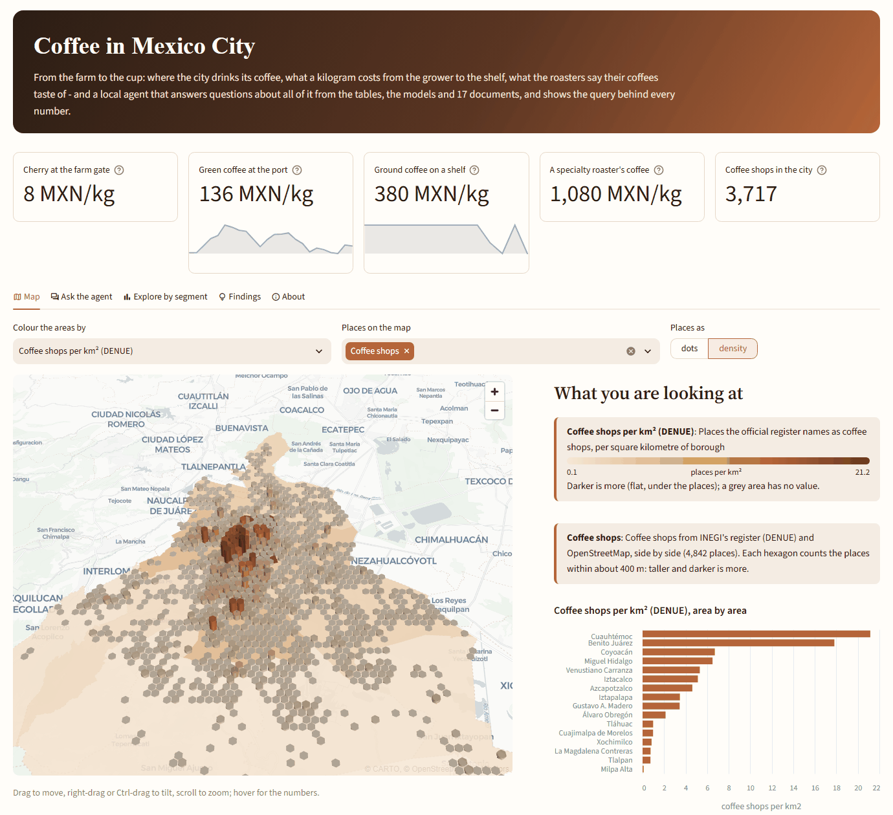

- **The headline numbers** are the price ladder - a kilogram of cherry at the farm gate,
  green coffee at the port, ground coffee on a shelf, a roaster's bag - and the city's
  coffee shops, with a sparkline where there is a series (`explore.metrics`: one SELECT
  for the value, one for its history).
- **Map.** deck.gl through Streamlit's pydeck, on Carto's light basemap (left to
  Streamlit, a custom theme got the dark one and the ramp's dark end vanished into it).
  The areas are coloured and raised by the layer the viewer picks - coffee shops per km²,
  the median shelf price of ground coffee - and lie flat when places are drawn over them.
  Places are dots coloured by register, or counted in 400 m hexagons, raised and darkened
  by count. The hexagons are binned in Python (axial coordinates on a local flat
  projection, rounded in cube space), not by deck.gl's HexagonLayer: the map has one
  tooltip template, and HexagonLayer's objects cannot carry a `tooltip` line. Beside the
  map: what each layer is, its legend with the range and unit, and the areas ranked.
- **Ask the agent.** The question box stays at the top, the newest answer under it, and
  every answer is a card: how it was answered (the tables, a model, the documents), how
  long it took, whether every figure was checked; its rows drawn as a chart (one value as
  a number, a prediction with the item it was made for); a query that did not run shown
  with its error, the query, and where the same numbers are a few clicks away; sources;
  and the query itself. Kind, x, y and colour can be changed, each choice checked against
  the columns before it is drawn, and places or areas can be put on the map. The
  examples are pills that ask once and can be asked again.
- **Explore by segment** is the same numbers without a model: a table, a measure, what
  to split it by, what to colour it by, and filters, each picked from the domain's lists
  (`explore.datasets`: seven tables, from the coffee shops to the world market). The
  query is assembled from those names (`explore.segments`), a picked value goes in only
  as a quoted literal, and it is shown under the chart with the rows to download. A split
  by time is a line; the 25 largest of more segments are shown, and one sentence says
  what the chart shows ("Highest places: Cuauhtémoc (2,019); lowest: Milpa Alta (75)").
- **Findings**: six results the domain wants seen unasked (`explore.findings`, each a
  title, a sentence and a query), drawn live from the analysis layer - the price ladder,
  the flavour profiles, shelf prices through 2026, green coffee in pesos, the density of
  coffee shops, who grows Mexico's coffee.
- **About**: the sources and their limits, in the domain's words, the models' own
  descriptions, and how an answer is made.

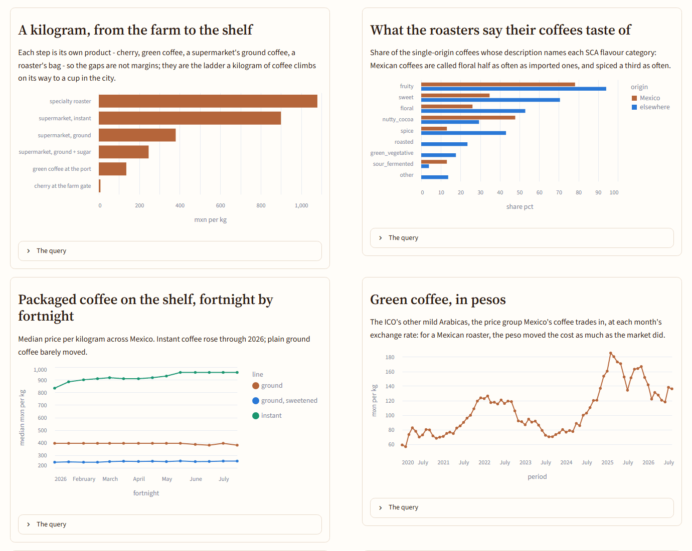

Charts are the core's `explore.charts`, shared with MCP's `draw`: bars lie down when
their names are long or many (the upright ones skipped every other borough and cut the
rest), axes read "price per kg", not `price_per_kg`, and a line's axis starts near its
data - from zero, instant coffee's 15% rise in 2026 was a flat line. The theme - warm,
caramel to dark roast, serif headings - is one file (`explore.style`) that `mlops
explore` writes and hands Streamlit as `--theme.base <path>`: on the command line a
list option arrives as a string (checked with `streamlit config show`), and the series
colours are lists.

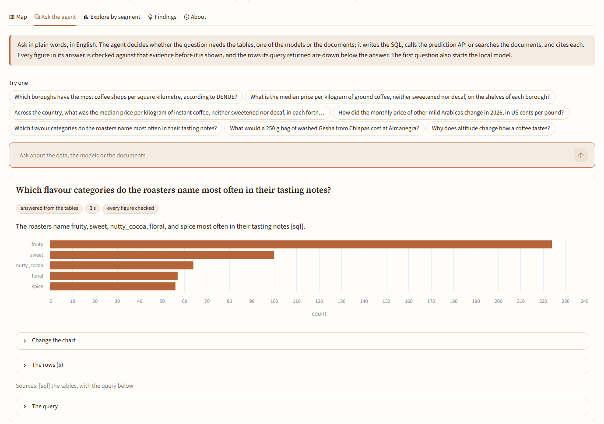

Checked in a real browser (headless Chromium through Playwright, run from outside the
project) as well as by AppTest: three questions in a row, each answered below the box
that stays open. The failure the user saw - "a parser error regarding the column
'price_mxn_per_kg'" for the fortnightly price of instant coffee - came from the model's
SQL, which varied between runs; one run quoted the whole view name as one identifier,
`"clean.consumer_prices"`, which DuckDB reads as a table of that name in no schema, and
both repairs kept the quotes. `write_sql` now unquotes a quoted name that is exactly one
of the session's views before running it (`sql.unquoted_views`); a quoted alias with a
dot stays as written. The same question then answered 833 to 958 MXN/kg, fortnight by
fortnight - the figures the analysis already had.

What it still shows about the agent: asked for the densest boroughs, the model counted
every place in DENUE's class, juice stands included (48.8 per km² for Cuauhtémoc against
21.2 for coffee shops), and cited a column instead of its evidence; the answer carries
"not fully verified", and the query is there to read. The 4B model's limits are shown,
not hidden.

### One app: the dashboard moves into the explorer

Two Streamlit apps on two ports - the analysis dashboard (`make dashboard`, 8501) and the
explorer (8502) - was one too many for a person to find their way around (decision of 29
September: one app). The dashboard's content is now the explorer's:

- A **Models** tab: pick a model, read its description, the partitions its studies came
  from, and the monitor's last verdict ("nothing due", or why a retraining is); then its
  target period by period, what each feature is worth (permutation importance, with the
  reminder that `suggested_action` prompts a look, never acts), the numeric features in
  detail, and its error by period, the newest period first. Figures beside their tables,
  every table downloadable as the CSV the pipeline wrote.
- Under **Findings**, **every study** the domain's analysis wrote, picked from a list, and
  every figure it drew: the findings are a curated few, the rest is one click away.
- Nothing is recomputed: the tables come through the agent's locked session
  (`analysis.*`), the figures from the newest drawing on disk (`explore/studies.py`).
  The stamp names the partitions of the model's own features and predictions, and a
  box plot of more than four periods cycles the house colours (the fifth read of the
  shops fell back to matplotlib's own style).

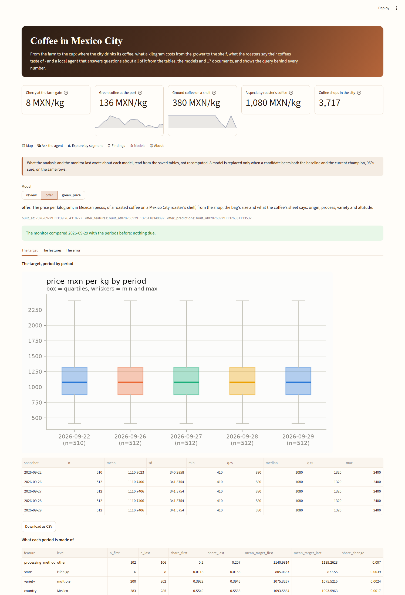

`make dashboard`, `mlops analysis dashboard` and `analysis/dashboard.py` are gone, and
Streamlit moved from the `analysis` extra to `explore`: the analysis pipeline draws with
matplotlib and never needed a web server, so the orchestrator's environment no longer
installs one.

**A bug the move found:** the dashboard never showed a figure. A figures partition had no
manifest - the file that says a partition is complete - and the dashboard, like every
reader, takes the newest *complete* partition, so it found none and quietly showed the
tables alone. The analysis now writes the manifest after the last PNG (the partitions of
each table it read as its inputs), and the catalog skips a folder with no Parquet in it,
so the figures never become a view.

### What some choices got wrong

A sweep of every choice the explorer offers, over the real data (29 September): 515
combinations of a table, a measure, a split and a colour; 32 of the map's layers and
styles; the 19 studies; every model and every period; and an answer the agent could not
give. None raised, and these were wrong all the same:

- **An answer with no evidence was badged as checked**: "answered from the tables · every
  figure checked" over "I found no answer". The page reads `answered` now and says "no
  answer found".
- **Years counted as whole numbers were cut like names.** The world market by `market_year`
  showed the 25 years with the largest value, as bars sorted by height. A year is time
  (`charts.is_period`, the rule the charts already used): a line, never cut.
- **Picking the empty value of a filter found nothing**, because `x IN (NULL)` is never
  true: 83 of the roasters' offers have no country, 105 no process. It is asked for as
  `IS NULL`.
- **A bar called "null"**, 137 combinations, and in one it was most of the rows: PROFECO's
  prices by borough put the whole country outside the city in a borough with no name. A
  dataset names what an empty value means (`null_labels`: "outside Mexico City", "origin
  not stated"); other text is "(no value)", and rows empty in a number are counted out.
- The Models tab told `green_price`, which has no champion and so no predictions, to run
  `make data`, under a raw catalog error; an answer put on the map could not be taken
  off; bars of grams stood sorted by height; rows past the map's limit were dropped
  without a word. Each fixed, each with a test.

## The price of green coffee (stage 4)

`clean.price_indicators` holds the international price of green coffee, one row per
indicator and day or month, in US cents per pound:

| Indicator | Daily, ICO | Monthly, World Bank |
|---|---|---|
| `i_cip` - the ICO composite | this month so far | - |
| `colombian_milds`, `brazilian_naturals` | this month so far | - |
| `other_milds` | this month so far | 1960 to last month |
| `robustas` | this month so far | 1960 to last month |

- **Two publishers of one series.** The World Bank's "Coffee, Arabica" is the ICO's
  other mild Arabicas indicator and its "Coffee, Robusta" the Robustas one, averaged by
  month and republished in dollars per kilogram; they are converted to the ICO's unit
  (1 $/kg = 45.36 cents/lb, so its two published decimals are worth ±0.23 cents/lb).
  Where a month is in both, every build compares them and says how far apart they are,
  as it does the PSD file against the FAS API.
- **The ICO publishes only the current month**, as a one-page PDF (the page that used to
  hold its history answers 500 since the site moved). So its history is every download,
  kept: the source is declared `accumulate`, and the clean layer reads every ingestion,
  each against its contract, with the time it was read. A day read twice keeps its
  latest reading, since a correction can only come later. This is the stage's first
  capability: a source whose each read is a window builds its own history.
- **A PDF table is the one kind of figure this project refuses elsewhere** (the corpus
  answers how and why, never how much). This one is admitted because it checks itself:
  the page prints its own Average, High and Low, and a reading whose days do not average,
  top and bottom out to them is refused rather than stored - as is a page whose columns
  are not the five the reader knows, in that order. The check had one wrong assumption,
  found on 28 September: that the ICO averages the prices it shows. It averages the
  unrounded ones: robustas' 19 days, as printed, average 167.7547 and the page says
  167.76. The mean of rounded days can be half a cent off, and the printed average half a
  cent more, so the average now agrees within a cent; high and low, a day's own price,
  still within half.
- **The World Bank's file moves.** Its address carries an id per release, so the source
  names the page and a pattern for the link (`link:`), and the file is found on the
  page each time. The file's host also cut the connection twice in a row on the first
  real download: a dropped connection is now tried again, up to three times, while an
  HTTP error is still an answer.
- **One source down no longer stops the rest** (29 September). A fresh clone's first
  `make extract` stopped at the fifth source: SIAP's host (`nube.agricultura.gob.mx`)
  timed out on every attempt that day, and the nine file sources after it, the APIs and
  the documents were never tried. Each file source is now tried on its own: what the
  network or the page can cause (an HTTP error, a link that moved, an empty body) is
  logged and named, everything else is stored, and the command fails at the end naming
  what it could not reach; run again, it downloads only what is not fresh. A bug is not
  caught: it still stops the run where it happens. Dagster's `raw_sources` fails the same
  way, after the rest is stored.
- **The World Bank is asked weekly, not daily** (`refresh_hours` 20 → 168). The file is
  released monthly; a daily ask found nothing new. On 29 September its host began
  resetting this client's TLS handshake after the fresh clone's burst of retries, while
  curl with the same user agent still got the file: a refusal aimed at this client, which
  is not worked around (no browser impersonation). The stored months stay the ones the
  build reads, and the failure is named.

**In pesos.** `clean.exchange_rates` holds the peso-dollar rate, the Federal Reserve's
daily noon buying rate in New York through FRED (no key; Banxico's official FIX needs a
token, and a clean clone should build without one). A month's price goes with the mean of
its month's rates, which is how FRED computes its own monthly series: the two agree to four
decimals in all 394 months. `analysis.green_coffee_in_pesos` has every month since
November 1993.

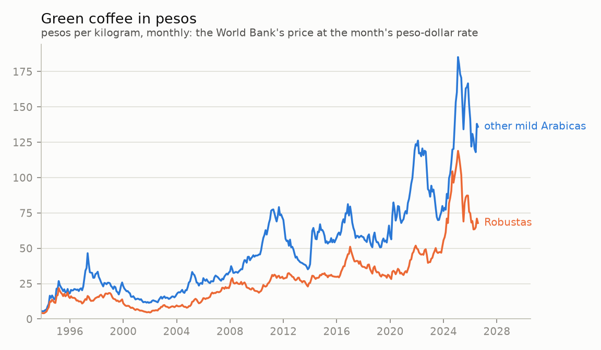

A kilogram of other mild Arabicas, the ICO group Mexico's coffee is priced in, cost 136
pesos in August 2026, against 72 on average in 2020. From its peak of 185 in February
2025 it fell 27% in pesos but only 12% in dollars: the peso went from 20.47 to 17.06 to
the dollar in between. For a Mexican roaster buying at the world price, the exchange rate
moved the cost of green coffee more than the market did.

The agent sees the new table as well (the data dictionary gives it the conversion as a
query). Its evaluation after this change: 78% correct, 100% verified, against 82% before.
The two questions that differ are two that flip between runs of the same prompts; routed
on their own three times over, with the table offered and without it, the 20 price and
data questions go where they should every time the table is there.

### Where the price goes next month

`green_price` is the third model: the change, in percent, of the World Bank's monthly
other mild Arabicas or Robustas price from one month to the next. One item is one
indicator in one month; everything it may know is the history up to the month before -
the last price, its last three changes, the change over twelve months, the distance from
the twelve-month mean, the last six months' volatility, and Arabicas against Robustas -
looked up by date, so a gap leaves a feature empty instead of making it about another
month. The target is the change and not the price because a tree never predicts above
the highest value it learned from, and 2025-2026 sit above nearly all of them.

It is judged on January 2021 to August 2026 (68 months of two indicators, 136 items, the
2024-2026 run-up included), against three baselines - the training mean change (+0.46% a month),
each indicator's mean, and **no change at all**, the random walk; `baseline_constant` is
the core's new way for a model to name one.

| Test, 2021-2026 | MAE, percentage points |
|---|---:|
| No change (random walk) | 5.25 |
| The training mean change | 5.18 |
| **Model v1** | 5.08 [4.40, 5.78] |

**The gate did not promote it**: 0.11 points better than the mean drift, but only 80%
sure (−0.36 to +0.15). The tuner itself chose a model that barely leaves the mean - 56
trees of four leaves. A market price's own history says little about its next month,
which is what an efficient market would lead one to expect, and it is the answer, not a
problem to tune away on the test months. So nothing is served for it: the API reports it
unloaded, `make predict` says it was not scored, and the Dagster asset records why
instead of failing. The pipeline retrains it as months arrive; the gate decides.

The target's distribution by decade shows why sixty years is not one market: in the
1960s, under the International Coffee Agreement's export quotas, half of all months
moved less than 1% either way; since the 1970s the same band is about 4%. Training on
the quota era teaches a calmer market than the one tested - a hypothesis for an
experiment, to be settled on the training folds, not on the test.

## Drift and retraining (stage 4)

`make monitor` (`mlops monitor`) compares each model's newest period with every one
before it - the periods its config names: a CQI snapshot, a catalogue read, a decade -
column by column: every feature, the target, and the champion's predictions, with
Evidently's statistical tests (Wasserstein or K-S for numbers, Jensen-Shannon or
chi-squared for categories, chosen by sample size, at Evidently's own thresholds). A
model is **due for retraining** when half of its features drifted (`monitoring:
drift_share` in the YAML - Evidently's own line for a drifted dataset), when its target
drifted, or when its error on the newest period is above the interval the gate accepted
its champion with. `make retrain` then rebuilds the models that are due - features,
training, batch scores - and **the gate decides** whether the candidate is served: a
monitor that promoted models on its own would be a gate that looks at no evidence.

Each comparison lands in `monitoring.<model>_drift` (`make sql Q="SELECT * FROM
monitoring.review_drift"`), with Evidently's HTML report beside it, and in an MLflow run
(experiment `coffee-monitoring`); in Dagster, each model gets a `<model>_drift` asset.

First run, on the real layers:

| Model | Compared | Features drifted | Target | Verdict |
|---|---|---:|---|---|
| `review` | the 2023 CQI snapshot against 2018 | 100% | drifted | due |
| `green_price` | the 2020s against 1960-2019 | 80% | drifted | due |
| `offer` | one catalogue read so far | - | - | nothing to compare yet |

- **The monitor finds the drift this README already describes by hand.** 2023's lots
  were graded 1.5 points higher, from a different mix of countries; every feature and
  the target moved. Retraining produced v5, identical to the champion on the same test
  (MAE 1.648 both), and the gate kept v1: 0% sure it is better. Retraining on the same
  data cannot learn a level shift; labels from the new period can - recalibrating on 30
  lots of it cut the error by a fifth (1.710 to 1.359). The CQI is frozen, so that
  data will not come.
- **The price's 2020s are outside anything before them**: its level (Wasserstein 1.8)
  and the Arabica/Robusta ratio (1.1) most of all. Retrained, `green_price` still does
  not beat the mean drift, and still is not served.
- **A frozen source keeps its drift**, so the monitor flags it on every run. A retraining
  is keyed to the data it learns from (see below): the first `make retrain` retrained
  both models, the second said "already trained on this data" and did not.
- `review`'s champion predates the test-MAE interval in training runs, so its error is
  not checked - and the log says so rather than skipping it silently.
- Evidently's UI and collector send usage events unless `DO_NOT_TRACK` is set; the
  report path used here does not import them, and the monitor sets it anyway. Evidently
  brings some twenty packages, so it is an extra of its own (`monitoring`).

### By hand, or on its own (stage 4)

**The project runs by hand** (decided 2026-09-28): nothing is left running to collect
history, and every run is one someone started.

```bash
make extract     # read every source that is due: run it before a month ends, or the
                 # ICO's page takes that month's days with it; each run is also one read
                 # of the shops' catalogues
make data        # extract, validate and clean
make ml          # features, training through the gate, batch scores
make monitor     # drift per model; make retrain retrains what it calls for
```

Everything can also run on its own. `make dagster` starts Dagster with one schedule and
three sensors per domain, **all off** unless `MLOPS_AUTOMATE=true` - so opening the UI to
look at the partitions starts no download and no retraining. Switched on (in the UI, one
by one, or all with the variable):

| | When | What runs |
|---|---|---|
| `coffee_daily_data` | every day at 07:00, Mexico City (the YAML's `schedule:`) | extract and clean: the ICO's page is read each day, so its month builds up |
| `coffee_new_data` | a model's clean inputs come from new data | its features, its champion's scores, and the drift report |
| `coffee_retrain` | the drift report calls for retraining, on data no training run has used | training - the gate decides - then scores and drift again |
| `coffee_reads` | a source whose history is its downloads was read again | that day's partition of `<source>_reads`: each of the day's reads checked against its contract |

- **New data means new raw data, not a new build.** Every clean build writes new
  partitions, identical or not, so "a partition appeared" says nothing. A model's **data
  version** is a hash of the raw partitions behind its tables - and raw partitions are
  content-addressed: a download identical to the last one stores nothing. Training runs
  record the version they learned from (`data_version` tag), drift reports the version
  they compared, and the sensors key their runs by it: one change, one run.
- **Retraining happens once per version of the rows a model learns from.** A frozen
  source keeps drifting in the monitor's eyes; retraining it again on the same data would
  give the same candidate and the same verdict from the gate. `make retrain` follows the
  same rule. The version a training run records, and a drift report compares, is a hash
  of the model's feature rows (`storage.rows_version`, in any order they were written),
  not of the raw data behind its tables. It was the raw version until 29 September, when
  a day of the ICO's prices - read into the same table as the World Bank's months, which
  are all `green_price` learns from - retrained `green_price` on rows it had already
  learned from (v5, rejected like v4). Which tables to rebuild still follows the raw
  data: rebuilding is cheap, retraining is not.
- **The verdict asks about the rows first, then about drift** (29 September). The
  monitor's verdict used to say "due for retraining" whenever it saw drift, and `make
  retrain` then declined for rows already learned from - so the monitor, the status and
  the explorer went on asking for a retraining that would never happen. Now the monitor
  first asks whether a training run already learned from exactly these rows
  (`provenance.trained_on`, moved out of `ml` so the monitor can ask without importing
  the trainer); only on new rows does drift make a retraining due. The drift is still
  measured and recorded (`reasons`), and the verdict names the run (`trained_run`). Real
  data, that day: review and green_price drifted as always, on the rows runs had learned
  from, so nothing is due; offer's newest read has new rows and no drift.
- **Sources have a pace.** A daily run should not fetch the 83 MB boundary file that
  last changed in 2020, nor the 62 MB corpus: `refresh_hours` on a source (and on the
  corpus) skips it until due. When a source was last *checked* is kept beside its
  partitions (`checked_at`), because an unchanged download leaves no partition to date
  it. The API sources already had their cache.
- **The first real check found work to do:** the roasters changed their catalogues
  between 22 and 26 September, so the offer model's data is newer than its features -
  and the sensor would rebuild them.
- **A source whose history is its downloads gets a partition a day.** `ico_prices_reads`
  and `roaster_catalogs_reads` are daily-partitioned assets: a partition is a day the
  source was read, in the schedule's timezone (a read at 8 pm in Mexico City is already
  tomorrow in UTC), and materializing it checks what the source showed that day against
  the contract, read by read. The partitions show what a flat asset could not: which
  days were read and which were not. For these sources a missed day is history that can
  never be asked for again - the shops show only today's catalogue, the ICO only the
  current month - so a backfill re-checks the days that were read (after a contract
  change, say) and fails on a day nobody read, saying why, instead of pretending to fill
  it. Not a cache: checking a read takes 0.06 s, so the clean layer still stacks every
  read.
- **"Not read" is not "nothing new".** A download identical to the last one stores
  nothing, so the partitions alone would count a quiet day as a missed one: the ICO's
  page was read on 27 September, a Sunday, and had no new prices. Every download is now
  logged beside the source's partitions (`checks.jsonl`: when, the read it left or
  found, whether it was new), and a partition is a day with any download. For the days
  before the log, what is known is what was kept: the downloads that changed something,
  and the last check. By that record the roasters were read on 3 days of 8 and the ICO's
  page on 2 of 4, because nothing ran the daily schedule on the others.

### The roasters' catalogues, read after read

`roaster_catalogs` now keeps every read (`accumulate:` in the YAML - one list for file and
API sources alike - and never pruned). The clean layer builds the catalogue **as it is
now** - `roaster_coffees`, `roaster_origins`, `roaster_offers`, unchanged for the agent and
the analysis - and **as it was at each read**: `roaster_offer_history` and
`roaster_origin_history`, one row per offer (or origin) per read; a day read twice is its
later read. The offer model learns from the history: an item is one offer in one read
(`observation_id`), the same offer across reads is its `entity` (`offer_id`), and a price
is explained by the sheet of its own read, because a sheet can change.

The monitor now has periods to compare for this model, and something more honest to
measure: the error only on the offers a read brings new (`items.entity`), since the
ones read again are ones the model may have learned.

| Reads so far | Offers | New | Withdrawn | Re-priced |
|---|---:|---:|---:|---:|
| 22 September | 527 | | | |
| 26 September | 529 | 4 | 2 | 0 |

- Drift between the two reads: 4% of the features, the target not at all; the error on
  the four new offers is 390 pesos/kg, inside the 398 its champion was accepted with. No
  reason to retrain - and none was forced.
- Retrained on both reads, the candidate (v6) was 94% sure against the shop-average
  baseline, just short of the line; the gate kept v5. The two reads are nearly the same
  rows twice; the bootstrap resamples whole coffees, so the repetition does not inflate
  the evidence.
- **`make prune` never touches a source whose history is its downloads.** It kept the
  newest three partitions of every table, `raw/` included; for the ICO's page that would
  have deleted days that can never be fetched again.
- **Then it stopped touching `raw/` at all** (2026-09-28). The raw layer is the record:
  every download that brought something new, as it came, never overwritten - a download
  identical to the last one stores nothing, and one that differs is a new partition
  beside the old. Running the pipeline again only ever adds. `make prune` now clears old
  builds of the derived layers, which are rebuilt from raw, and nothing else: a download
  cannot always be made again (a page that shows only this month, a catalogue that shows
  only today, a file its publisher has replaced).
- **But a read of the shops was always "new"** (found 29 September, on a fresh clone that
  read them twice two minutes apart and stored two 6 MB partitions). Buna's product pages
  came back with other blank lines and indentation on every request and nothing else
  different, so the content-addressed raw layer saw a change each time: 7 partitions in 8
  days in the real data, some of them the same catalogue. The pages are now stored
  without their layout whitespace (every line trimmed, blank lines dropped; `steady` in
  `sources/roasters.py`), the precedent being OSM's answer stored without its per-minute
  timestamp. Checked on the newest real read: the six clean tables built from the trimmed
  pages are identical to those from the pages as served, and the document is 17% smaller.
  The partitions already stored stay as they are; the next read starts the trimmed ones.

## What a kilogram costs on the shelf (stage 4)

`clean.consumer_prices` holds every price of packaged coffee PROFECO's staff recorded in
2026 so far: 64,451 of them from January to July, across the country; 15,426 in Mexico
City, from 120 stores in 13 of its 16 boroughs. National brands of instant and
roasted-and-ground coffee - Nescafé, Legal, Internacional, Los Portales, store brands -
put per kilogram, with what the presentation declares (a blend with sugar or caramel,
decaf). It is the rung the tables were missing between the grower and the specialty
roaster:

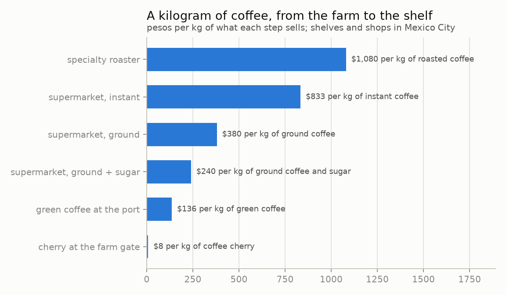

| A kilogram | Pesos | Of what | Measured as |
|---|---:|---|---|
| Cherry at the farm gate (Mexico, 2025) | 8 | coffee cherry | value over volume, 489 municipalities (SIAP) |
| Green coffee at the port (other milds, August 2026) | 136 | green coffee | the month's price at its mean peso-dollar rate (World Bank, FRED) |
| Supermarket shelf, ground with sugar | 246 | coffee and sugar | median of 3,353 prices |
| Supermarket shelf, ground | 380 | ground coffee | median of 1,358 prices |
| Supermarket shelf, instant | 900 | instant coffee | median of 5,295 prices |
| Specialty roaster's shop | 1,080 | roasted coffee | median of 512 offers |

- **Each rung is its own product**, and the table does not pretend otherwise: it takes
  several kilograms of cherry to make one of green coffee, roasting takes away more of
  its weight, and a kilogram of instant makes several times the cups a kilogram of ground
  coffee does. No conversion between them is assumed.
- **The margin, as far as the data reaches:** a kilogram of roasted coffee from a
  specialty roaster costs 7.9 times a kilogram of green coffee at the port, and the
  supermarket's plain ground coffee 2.8 times - before the weight roasting takes away,
  the roaster's work, freight, duties and the shop. What each of those costs is not in
  any source here.
- **A specialty bag costs 2.8 times the supermarket's plain ground coffee per kilogram**,
  and only a fifth more than instant.
- **Where you buy matters less than what you buy.** The chains price nationally: plain
  ground coffee's median is between 380 and 423 pesos/kg in every state. In the city's
  boroughs it runs from 330 to 423, and the two cheapest rest on one store each. The
  growers of those states were paid from 4.8 (Morelos) and 5.5 (Chiapas, the largest)
  to 14.5 (Querétaro) pesos per kilogram of cherry.
- **Instant got dearer, ground did not.** The national median of plain instant went from
  833 to 958 pesos/kg between January and July (+15%); plain ground stayed at 380-395.

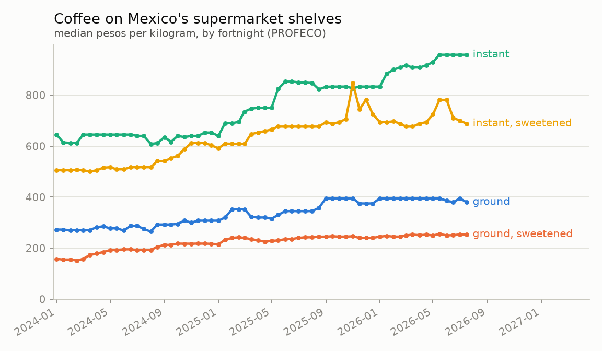

What it took to read, and what the core gained:

- **Every read is kept, and a new year does not replace the old one.** The archive is
  the year so far, so each release holds the ones before it - until January, when 2027's
  archive no longer holds 2026. The source accumulates (every read validated on its own
  and stacked), and each fortnight's rows come from the latest read that carries its file:
  a correction can only come later, and a fortnight no newer read carries stays from the
  read that had it. Reading an archive takes about 10 s, so a year of monthly reads adds
  some two minutes to a clean build.
- **A link found by what it says** (`link_text:`). The page's addresses are opaque tokens
  (`file.php?t=9d62...`), and it lists 2025 before 2026, so "the first year it shows" is
  last year: the YAML names the year, and a new year is a one-line change. 2024 and 2025
  are RAR archives, which Python does not open without an outside tool; they are not read.
- **Fifteen documented columns out of files that do not agree with each other.** The
  archive is 2.5 GB of fortnightly CSVs; the domain's reader walks them inside the ZIP
  and keeps coffee. May's two files are cp1252 and the rest UTF-8, June's add three
  undocumented columns, May writes dates day-first - and every date is checked to fall
  in the fortnight its file is named for, so a day and a month swapped cannot pass.
  Coffee is found by product name, because the category is spelled "Cafe" in some
  months and "Café" in others; anything else filed under coffee is said in the log.
- **Letters lost to "?"** (June's "Nescafé. Cl?sico", "Naucalpan de Ju?rez") are put back
  only where the same column spells the value whole and only one spelling fits: 45
  values, none left.
- **The borough is the one the store declares, and the coordinates are audited against
  it** - the other way round from DENUE, whose coordinates agree with its own boroughs
  9,860 times out of 9,860. Here 114 of 120 stores agree; of the six that do not, two
  sit within 200 m of the line and four land 1.5 to 12 km away, in the wrong borough (a
  market known to be in Azcapotzalco, placed in Iztacalco). There the coordinates are
  what is wrong.
- **A DuckDB bug, caught by a guard that was already there.** DuckDB 1.5.5's spatial
  LEFT JOIN turned these 64,451 points into 67,810 rows: some emitted twice, once
  matched and once with nulls, and 327 lost. The row-count check refused it (with a
  misleading message, "the areas overlap"). Points are now matched with an inner join,
  which agrees with `ST_Within` over every pair, and attached back to their rows; a test
  with 20,000 points pins it.
- **The agent reads the table too, and its heading is what the router sees.** Worded
  first as "one price PROFECO recorded on a shelf", it drew questions about what a
  roaster *would* charge for a bag to the tables instead of the price model: 75% correct.
  Said as what it is - mass-market packaged coffee - the evaluation is back to **82%
  correct, 98% verified, routing 95%** (80% and 98% before PROFECO). The wording was fixed
  because it was ambiguous, but it was measured on the same 40 questions that exposed it,
  so read the 82% as optimistic.

### The years the survey has closed

PROFECO publishes 2024 and 2025 whole, as RAR 5 archives - which Python cannot open.
libarchive's `bsdtar` can, and ships with Windows 10+ and macOS as their own `tar`
(`libarchive-tools` on Linux): a core module (`data/archives.py`) opens a ZIP with
Python and a RAR with bsdtar, telling them apart by their first bytes. On this machine
the first `tar` on the path was Git's GNU tar, which cannot; every `tar` is asked what it
is, and Windows' own is tried last. A 173 MB fortnight streams out in under half a
second.

Checked before it was read (29 September), every fortnight of both years through the
reader's own checks: 24 files a year, named `05-2025_01.csv` rather than `_Q1` (the
reader takes both), UTF-8 with a mark, the fifteen documented columns, every date inside
its fortnight - 117,981 coffee prices in 2024 and 98,948 in 2025. One thing more, found
when the city's shelves came out empty: **until November 2025 the files write seven
states and a chain without their accents** ("Ciudad de Mexico", "Yucatan"), so the city
was not the city. A value takes the accented spelling the same column also has, when
exactly one fits - the rule the lost letters already follow.

Each closed year is a source of its own (`consumer_prices.closed_years`), read with the
reads of the year in course as one stack, so a fortnight still comes from the latest read
that carries it. With three years in, where a figure is one price rather than a series
it is the last twelve months' (`recent_shelves`: the price ladder, the boroughs, the
states, the explorer's map); the fortnightly series keeps everything:

| Median per kilogram, across Mexico | January 2024 | July 2026 | |
|---|---:|---:|---:|
| Plain ground coffee | 272.5 | 380.0 | +39% |
| Instant coffee | 645.0 | 958.3 | +49% |

In the city, over the last twelve months: ground 380, ground with sugar 240, instant 833
(the ladder said 900 for instant over January-July 2026 alone). The shelf kept rising
while green coffee fell 27% in pesos from February 2025: what a supermarket charges is
not the bean's price passed on.

## What a kilo costs (stage 3)

The domain's second model, `offer`, prices a kilo of roasted coffee on a Mexico City
shelf from what a buyer can know before paying: the shop, the bag's size, and what the
shop's sheet says about the coffee - country, state, process, variety, altitude, and a
column per variety the catalogues list often, because a coffee that names three says
"multiple" and its Gesha would otherwise be invisible. One item is one coffee in one
size; 510 offers of 157 coffees have a price to learn from.

Two things about it are different from the cup-score model, and both are now the core's:

- **The split is by coffee, not by bag**, since the sizes of one coffee share almost
  everything, and **the gate resamples coffees, not bags**: four sizes of one coffee
  priced wrong are one mistake, not four.
- **A group model is judged out of fold.** Holding out a quarter of the coffees throws
  away three quarters of the evidence, so every coffee is scored by a model fitted
  without its group. Not a softer test - nothing is ever scored by a model that saw it -
  the same test on four times as much data.

| Out of fold, 510 offers of 157 coffees | Value |
|---|---|
| Model MAE | **229.9 MXN/kg** |
| Baseline: every bag at its shop's mean | 252.7 MXN/kg |
| Paired difference, resampling coffees | -22.8 (95% CI -46.9 to +2.9), **96% sure** |

Promoted at the same 95% bar as the other model. Getting there was not a matter of a
bigger model or a different one, and the way it was found is the point:

- **The estimator was not the problem.** Ridge on one-hot columns, a random forest and a
  log target were measured against the same baseline on the same split
  (`experiments/price_estimators.py`): none beat the tuned LightGBM by enough to matter.
- **The tuner was.** Choosing hyperparameters by five folds over 118 coffees is choosing
  by a noisy number: it picked a learning rate of 0.011 over 174 trees - a model so slow
  it barely left the mean - and a `min_frequency` of 27, which on 381 rows grouped nearly
  every variety and state into "infrequent", deleting the features the model is for.
  Drawing those folds four times over, and narrowing the search to what a few hundred
  rows can support, gave a small model (110 trees, 4 leaves) that generalises.

What the model is **not** allowed to claim, and the README says it so the model card is
not the only place it appears:

- Against a baseline that also knows the size - what any label shows - the edge is
  **-9.9 MXN/kg at 78%**, short of the bar. Part of what the model knows is the discount
  a bigger bag gets.
- The edge comes from the coffees that say where they grew (-26.8 MXN/kg against the shop
  mean). On the 75 offers whose coffee has no sheet it matches the baseline exactly, as
  it should: there is nothing to know about them.
- 128 of the 157 coffees are one shop's, so "what a kilo costs" is mostly what Almanegra
  charges. More roasters, and the re-reads of stage 4, are what widens that.

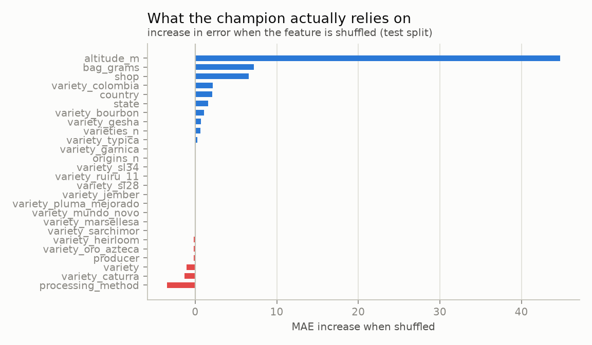

Altitude carries it, by far (shuffled, the error grows by 45 MXN/kg), then the bag's size
and the shop (about 7 each). The per-variety columns add little - Gesha 0.7 - which is
less than they seemed to when they were added (redrawn 2026-09-28, on the history of the
catalogues).

## Results (stage 1)

Predicting `Total Cup Points` from origin, altitude, variety, process and the origin
country's market context, trained on gradings up to 2018 and evaluated on 2022-2023:

| Test (2023 snapshot, n=207) | Value |
|---|---|
| Model MAE | **1.648** (95% CI 1.496 - 1.806) |
| Best baseline MAE (training mean) | 1.894 |
| Paired difference vs baseline | -0.246 (95% CI -0.346 to -0.147), certain |
| Bias | -1.19 |
| **MAE after recalibration** | **1.359** (from 1.710 on the same rows) |

The model beats the baseline, and the paired bootstrap says so with certainty. But the
error is dominated by a level shift: the 2023 lots were graded ~1.5 points higher than
the 2010-2018 ones, and no feature can anticipate that. Estimating a single offset from
the first 30 lots of the new period and applying it to the remaining 177 cuts the error
by 21% — more than any feature work did. That is the case for stage 4 in one number.

The evaluation is built to survive a small test set:

- **Every comparison is a paired bootstrap** on the same rows. A version is promoted to
  `champion` only if it wins in at least 95% of resamples against both the best baseline
  and the current champion, so a better average alone never ships a model. For a model
  split by group, whole groups are resampled.
- **Metrics are stratified** by country and logged with each group's weight in train vs
  test. That is how the real story surfaced: Taiwan went from 5.7% of training to 29.5%
  of test, so the temporal split mixes drift with a different population.

## Documentation

- Model cards — what each model is for, how it performs, where it fails and what it must
  not be used for: [cup score](model-card.md) and [price per kilo](model-card-price.md).
- `experiments/` — one-off studies that answer a question and get logged to MLflow, kept
  out of the pipelines. See "Alternatives tried" in the model card.
- [Data dictionary](../src/domains/coffee/data_dictionary.md) — every column of every layer, with units; the agent's SQL is written against it.
  A test fails if a column stops being documented.

## Development

### From a fresh clone

On 29 September the repository was cloned from GitHub into an empty directory and the
recipe run from zero, as a stranger would: no `.env` (no DENUE token, no FAS key), none of
the eight documents fetched by hand, its own SQLite MLflow and its own Qdrant container,
so nothing could lean on the working copy.

- **Found and fixed:** `make extract` stopped at the fifth source, SIAP's host timing out
  that day, and never tried the other nine files, the APIs or the documents - now each
  source is tried on its own and the command fails at the end naming what it could not
  reach. A read of the shops stored a new partition every time, Buna's pages changing
  their whitespace between requests - now stored without it. Without the DENUE register
  the per-borough study counted zero coffee shops everywhere and published a figure of
  zeros over the committed one - now the counts are unknown and nothing is drawn. `make
  status` listed the optional credentials and the hand-fetched documents as tasks
  forever - now they are notes.
- **Not fixed, because it is not ours:** `thedocs.worldbank.org` began resetting the TLS
  handshake of Python's client that morning (curl, with the same user agent, got the
  file; the working copy had downloaded it hours before). It is named as a failed source
  and not worked around. For the rest of the run, SIAP's and the World Bank's stored
  downloads were copied in, as a later successful retry would have left them.
- MLflow could not open its SQLite store from a clone deep in a temporary folder: one of
  its migration files has a 90-character name, and the path passed Windows' 260-character
  limit. The README says to clone to a short path or enable long paths.
- **Reproduced from zero:** validation of every source; the 17 clean tables without the
  token (OSM's places only, 3 minutes); the cup-score model's MAE 1.648 against 1.894,
  identical to the working copy's; the price model 228.7 against 257.5 out of fold, 99%
  sure, on one read of the shops (512 offers); the green-coffee forecast not promoted,
  80% sure, identical; the index (1,030 chunks of nine documents) and the retrieval
  ladder, dense passing the gate (nDCG@10 0.424 against 0.370; lower than with all 17
  documents, since questions point at the missing eight); the analysis and the monitor.
  About 350 MB of downloads and 1.4 GB of environment.

- **`make status`** (`mlops status`) says what is ready and what is left to do, each with
  the command that makes it ready, in the order to run them: the keys (set or missing,
  never shown), every source's last download and whether it is due again, the documents
  read and the ones to hand over, whether each layer was built after the data it reads,
  each model's champion and a retraining the monitor asked for, and the services - the
  registry, the prediction API with the models it serves, the vector index against the
  chunks on disk, and the local models pulled. It exists because the explorer and the
  agent stand on all of them at once, and a missing one used to surface elsewhere as an
  unrelated error. A service that is down is a finding, not a crash (`mlops_core/status.py`).
- **The upstream sources are checked every Monday** (`.github/workflows/sources.yml`,
  `uv run pytest -m network`): every file source, Overpass's selectors, every document a
  publisher serves, and each roaster's catalogue - one request a shop, checking the
  catalogue still has the key it is read from. On 29 September SIAP's server did not
  accept connections (the 2025 figures were already kept) and everything else answered.
- **A setting under the wrong name is said, not ignored.** Pydantic skips a variable no
  setting reads, so a `.env` still carrying `COFFEE_DATA_DIR` from before the core had its
  own prefix left the data dir at its default - which happened to be right. `mlops
  secrets` now names every variable that looks like a setting and is read by nothing: an
  `MLOPS_*` that is no setting, or a core setting under the domain's prefix.
- **Dependencies are declared where they are imported**: `numpy` (the shared bootstrap)
  and `click` in the base, `pydeck` in `explore` - found by `deptry`, since each was only
  there as another package's dependency. Its other findings are packages used without an
  import (`skops` saves the models, `uvicorn` serves the API, `cryptography` opens the
  SCA's encrypted PDFs, `vl-convert-python` is imported as `vl_convert`).
- Python 3.12, dependencies managed with `uv` (`uv.lock` is committed).
- Every MLflow run is tagged with the git commit that produced it, and whether the tree
  was dirty: a run from uncommitted code is not reproducible and should not pretend to be.
- `ruff` (lint + format), `mypy --strict`, `pytest`.
- `pre-commit` runs ruff and **gitleaks** on every commit, so credentials never reach history.
- Secrets live in `.env` (gitignored); `.env.example` documents each variable and where
  to get it. Copy it to `.env`, paste the values, and check them with
  `uv run mlops secrets`, which reports what is configured without printing it.
  Credentials are typed as `SecretStr`, so a repr, a log line or a traceback shows
  `**********` and reading one takes an explicit `.get_secret_value()`.
- `data/` is gitignored: every dataset is rebuilt by running the pipeline. The boundary
  archive alone is 83 MB, so `make prune` matters more from stage 2 on.
- The geospatial step needs DuckDB's `spatial` extension, which downloads once on first
  use and is cached in `~/.duckdb`. It is confined to `data/geo.py`: the layers stay
  plain Parquet with geometry as WKB, so nothing downstream has to load it to read a
  borough.
- API sources go through one polite client: a rate limit, retries that tell a 503 from
  a 404, and an on-disk cache so a re-run does not fetch 99 pages again. The cache
  expires (`cache_hours`, required per source): cached forever, a live register becomes
  a snapshot that keeps reporting "unchanged" because nothing was ever asked. Credentials
  never reach a cache key, a manifest or a log line — DENUE carries its token in the URL
  path, so request URLs are never logged, and that safeguard lives with the client
  rather than in one entry point.
- Shops are read politely, and the rules for that live in the core, not in a scraper:
  every page is checked against the site's robots.txt for this project's agent first
  (`mlops_core.data.robots`), a `Crawl-delay` is honoured, and requests are at least 3 s
  apart. A robots.txt that is missing allows everything, but one a failing server cannot
  serve closes the site (RFC 9309): silence is not permission. A refusal skips that shop
  out loud; it is never read around. The platform's own catalog JSON is read rather than
  the rendered pages, which change with every theme; a product page is read only where
  the attributes live nowhere else.
- `make extract` runs the file sources always and an API source when it can: Overpass
  needs no credential, DENUE and FAS are skipped out loud without theirs, so a fresh clone
  still builds all of stage 1. Which sources exist and what each one needs lives in one
  function that both the CLI and Dagster call -- a step that only runs when a human
  types the command is a step the orchestrator silently skips.
- CI runs lint, types and tests, scans the whole history for secrets, and builds the API
  image so a broken Dockerfile fails here instead of during a demo. A weekly job checks
  that the upstream sources still answer.
- `.vscode/settings.json` keeps the editor's watcher and indexer out of `.venv`, `data/`
  and `.dagster/`; watching them costs CPU for nothing.
- Layers keep their history (that is how a past prediction stays explainable) but not
  forever: `make prune` keeps the newest partitions per table and drops builds that
  crashed long ago.
- The API image installs `mlflow-skinny`, not full MLflow: a client only loads models,
  while the full package ships the tracking server (1.48 GB instead of 2.26 GB).
- The image has no httpx, DuckDB or matplotlib, so a domain's adapter imports what its
  data pipeline needs inside the methods that use it. CI runs the API's tests in exactly
  that environment; it caught `validate.py` pulling DuckDB in at import time. It could not
  catch httpx, which the test tools bring along for FastAPI's test client - and a contract
  that imported a constant from the package of API clients broke the image for one commit
  while CI stayed green. So a test also imports the API in a fresh interpreter with every
  other extra's packages blocked.
- `POST /models/<name>/predict` answers `{"target", "prediction", "context",
  "model_version", ...}`: the response names what it predicted instead of assuming it,
  and `context` holds every feature the domain looked up for the request. Each model has
  its own route because each has its own request body, which FastAPI validates and
  documents only when the route knows its type. `/health` reports every model's version,
  and `/reload` reloads them all, saying which failed and why. A model counts as loaded
  only once it has predicted the `example` its YAML declares, through the same path a
  request takes; the example is also the one the API's docs show.
- Settings are `MLOPS_*` (data dir, MLflow URI, which domain); a domain's credentials
  use its own prefix, so the core never holds another project's keys.

## Roadmap

See the stage table above. The core was extracted at the end of stage 2, once the file
and API archetypes existed - abstracting before having working cases produces the
wrong interfaces - and the contract freezes at the end of stage 3, once a third
archetype (scraping) has been through it. Video games comes after the coffee domain is
finished (decided 2026-09-27), and its line count goes in the table above.

Running it automated and online is a plan, not a commitment: [cloud-plan.md](cloud-plan.md)
says why it cannot live on Vercel as it is (the local model, and every other piece that
has to stay on), and lays out three steps, cheapest first - a static showcase, a
scheduled workflow that keeps the history, and the whole app on servers.
