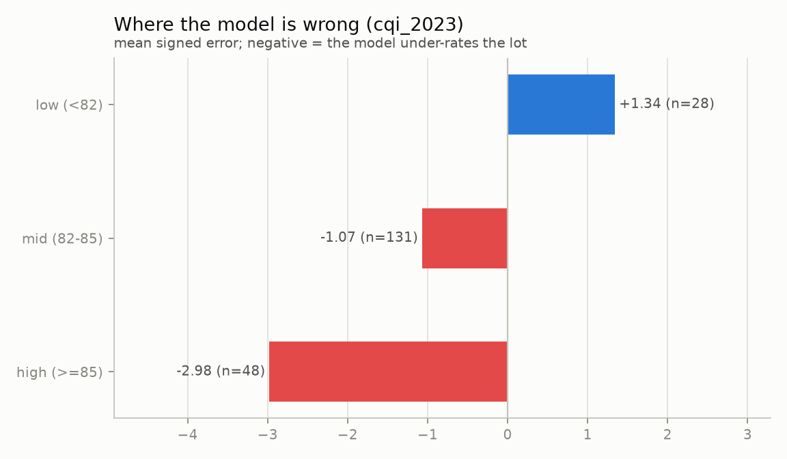

# Model card: `coffee-total-cup-points`

Predicts the SCA cupping score (`Total Cup Points`, 0-100) of a green coffee lot from
what is known **before** it is cupped.

| | |
|---|---|
| Version described | v1 (`champion`) |
| Type | LightGBM regressor inside a scikit-learn pipeline |
| Training data | CQI arabica reviews graded 2010-2018 (1,309 lots) |
| Evaluation data | CQI arabica reviews graded 2022-2023 (207 lots) |
| Tracking | MLflow experiment `coffee`, tagged with the git commit that produced it |

## What it is for

Estimating the likely cup score of a lot from its origin and physical attributes:
ranking candidate lots, sanity-checking a price, exploring what altitude or process are
worth. It is a **portfolio and teaching artifact**, not a substitute for cupping.

Do not use it to price or reject a real lot. The interval around a single prediction is
wider than the differences most buyers care about.

## Inputs

Categorical: `country`, `variety`, `processing_method`, `color`.
Numeric: `altitude_m`, `moisture_pct`, `category_one_defects`, `category_two_defects`,
`quakers`, plus the origin country's market context for the **previous** market year
(`ctx_production`, `ctx_arabica_share`, `ctx_export_share`, `ctx_domestic_consumption`).

The ten sensory scores — `aroma`, `flavor`, `aftertaste`, `acidity`, `body`, `balance`,
`uniformity`, `clean_cup`, `sweetness`, `overall` — are **excluded by contract**: the
target is exactly their sum, so using them would be memorising the answer. The domain
config declares them as leaking, a config validator refuses to accept them as features,
and a Dagster asset check fails if one ever reaches the feature table.

## Performance

| Test (2023 snapshot, n=207) | Value |
|---|---|
| MAE | 1.648 (95% CI 1.496 - 1.806) |
| RMSE | 2.015 |
| R² | -0.363 |
| Bias | -1.185 |
| Paired difference vs best baseline | -0.246 (95% CI -0.346 to -0.147) |
| MAE after recalibration | 1.359 (from 1.710 on the same rows) |

Read those numbers together, not separately:

- The model beats the "predict the training mean" baseline, and the paired bootstrap
  says so with certainty.
- **R² is negative** because the 2023 lots vary little (sd 1.73) and sit about 1.5 points
  above the training period. A model can rank well and still miss a level shift.
- **A constant equal to the 2023 mean scores 1.349**, better than the model's 1.648.
  Once the level is known, the features add about 0.07 MAE, which 207 rows cannot
  establish (95% CI -0.153 to +0.017). The honest reading is that the useful signal
  here is small and the level shift is what dominates.
- Recalibrating from the first 30 lots of the new period recovers most of that gap.

### Where the error concentrates



| Group | n | Bias |
|---|---|---|
| Lots scoring ≥85 | 48 | -2.98 |
| Lots scoring 82-85 | 131 | -1.07 |
| Lots scoring <82 | 28 | +1.34 |

The model compresses toward the mean, as a weak-signal regressor does: it under-rates
excellent coffees and over-rates poor ones.

## Limitations and bias

- **The training data is not a sample of world coffee.** It is what was submitted to CQI
  for grading, which favours producers seeking certification.
- **The two snapshots are different populations.** Taiwan is 5.7% of training and 29.5%
  of test, so the temporal evaluation mixes drift with composition. Per-group metrics
  are logged with each run for this reason.
- **The 2023 snapshot is truncated**: no lot below 78 points, while training goes down
  to 59.8. Error on poor coffee is therefore untested on recent data.
- **The data ends in May 2023** and no newer public CQI snapshot exists.
- Missing values are common (altitude 19.8%, moisture 16.7%, variety 13.6%) and are fed
  to LightGBM as missing rather than imputed.

## Alternatives tried

**Predicting a within-period percentile instead of points**
(`experiments/percentile_target.py`). If the level shift is the problem, a target with
no level should rank better. It does not: Spearman on the 2023 lots is 0.277 against
0.264 for the points model. The ranking signal in these features is weak either way, so
the level shift is not hiding a better model — there is simply little to extract.

**Dropping `country` and `variety`** (`experiments/feature_ablation.py`). The analysis
pipeline measures *negative* permutation importance for both: shuffling them makes the
champion better on 2023 data. An ablation decided on time-ordered cross-validation
inside the training period agreed, and on the test split the gap looked decisive —
MAE 1.808 to 1.560, paired bootstrap certain.

It did not survive tuning. Those numbers come from one fixed hyperparameter setting for
every candidate; once the reduced model gets the same Optuna budget the champion had, it
scores **1.656 against 1.648**, a difference of +0.008 with a 95% CI of -0.048 to +0.062
and 38% confidence. The gate refused to promote it, and the features stayed.

The lesson is about method, not coffee: **a fixed-hyperparameter ablation measures the
features and the hyperparameters together**, and a tuner can absorb a noisy feature
(here by grouping rare categories away). An ablation is a hypothesis; the gate is the
test.

**Dropping the market-context features.** They correlate ~0 with the score yet take 49%
of the tree splits, which looked like the model memorising country-year identifiers.
Removing them made it worse (test MAE 1.779 vs 1.648, paired bootstrap certain), so they
stay. Registered as version 2 and correctly refused by the gate.

## Promotion and monitoring

A new version replaces the champion only if a paired bootstrap says it beats both the
best baseline and the current champion in at least 95% of resamples. Re-training the
same configuration produces a tie and is correctly rejected.

Nothing monitors drift in production yet: that is stage 4. The recalibration metric
logged with every run is the measurement that justifies building it.

## Keeping this honest

`make analysis` recomputes the evidence behind every number here, including the
per-feature recommendation used to revise the model spec. Residuals are reported per
period on purpose: the batch job scores training rows too, and error on data the model
learned from flatters it.

## Reproducing

```bash
make data && make services-up PROFILE=ml && make ml
```

The run records the feature partition and the git commit it came from.
